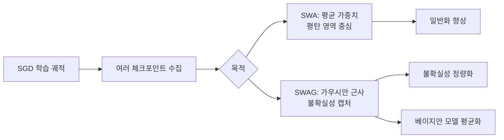

# SWAG와 SWA - 확률적 가중치 평균화

## 정의와 배경

확률적 가중치 평균화(Stochastic Weight Averaging, SWA)와 그 확장인 SWAG(Stochastic Weight Averaging Gaussian)는 SGD (Stochastic Gradient Descent) 학습 궤적을 활용해 모델 앙상블 효과와 베이지안 추론을 근사하는 기법이다.

전통적인 딥러닝 학습은 단일 손실 최솟값에 수렴하는 것을 목표로 한다. 그런데 손실 지형(loss landscape)에는 수많은 "평탄한 최솟값(flat minima)"이 존재하며, 이 영역의 모델들은 날카로운 최솟값(sharp minima)보다 일반화 성능이 뛰어난 경향이 있다. SWA/SWAG는 이 직관을 직접 활용한다.

### 왜 중요한가

- **일반화 향상**: 단일 체크포인트 모델 대비 테스트 정확도가 일관되게 향상된다.
- **불확실성 정량화**: SWAG는 추가 학습 없이 베이지안 딥러닝에 준하는 불확실성 추정을 제공한다.
- **구현 단순성**: 기존 학습 루프에 체크포인트 평균화 로직만 추가하면 된다.

---

## SWA: 가중치 평균화

SWA는 학습 후반부에 주기적으로 저장한 모델 가중치를 산술 평균하는 방법이다.

### 알고리즘

```
1. 표준 학습으로 초기 수렴 달성 (에폭 T_0까지)
2. 에폭 T_0 이후부터:
   - 사이클 학습률(cyclic LR) 또는 상수 학습률 사용
   - 매 c 에폭마다 현재 가중치를 SWA 가중치에 누적 평균
3. 배치 정규화(BN) 통계 재계산 (최종 SWA 가중치로 1회 순전파)
```

수식으로 표현하면:

$$\theta_{SWA} = \frac{1}{K} \sum_{i=1}^{K} \theta_i$$

여기서 $\theta_i$는 $i$번째 체크포인트의 가중치, $K$는 총 수집 개수다.

### PyTorch 구현 예시

```python
from torch.optim.swa_utils import AveragedModel, SWALR, update_bn

# SWA 모델 래퍼 생성
swa_model = AveragedModel(base_model)
swa_scheduler = SWALR(optimizer, swa_lr=0.05)

for epoch in range(total_epochs):
    train_one_epoch(base_model, optimizer)
    if epoch >= swa_start_epoch:
        swa_model.update_parameters(base_model)
        swa_scheduler.step()

# 배치 정규화 통계 업데이트
update_bn(train_loader, swa_model)
```

`torch.optim.swa_utils`는 PyTorch 1.6 이후 공식 지원한다.

---

## SWAG: 가우시안 근사 사후 분포

SWAG(Maddox et al., 2019)는 SWA를 확장해 가중치 공간에서 가우시안 사후 분포를 근사한다.

### 핵심 아이디어

SGD 궤적의 마지막 $K$개 체크포인트를 수집해 두 가지 통계를 계산한다:

1. **평균** $\bar{\theta}$: SWA와 동일
2. **공분산 근사**: 대각 공분산 $\Sigma_{diag}$와 저랭크(low-rank) 공분산 $\hat{\Sigma}_{low}$의 합

$$\Sigma \approx \Sigma_{diag} + \hat{\Sigma}_{low}$$

저랭크 성분은 편차 행렬(deviation matrix) $D$로 표현된다:

$$D = \frac{1}{\sqrt{K-1}} \begin{bmatrix} \theta_1 - \bar{\theta} & \cdots & \theta_K - \bar{\theta} \end{bmatrix}$$

### 베이지안 모델 평균화 근사

SWAG 사후 분포에서 여러 가중치 $\theta$를 샘플링해 예측값을 평균한다:

$$p(y|x, \mathcal{D}) \approx \frac{1}{S} \sum_{s=1}^{S} p(y|x, \theta_s), \quad \theta_s \sim \mathcal{N}(\bar{\theta}, \Sigma)$$

이는 완전 베이지안 추론(full Bayesian inference)의 근사로, MCMC나 변분 추론보다 훨씬 저렴하게 불확실성을 정량화한다.

---

## SWA vs SWAG 비교

| 항목 | SWA | SWAG |
|------|-----|------|
| 목적 | 일반화 향상 | 일반화 + 불확실성 정량화 |
| 추가 비용 | 거의 없음 | 저랭크 행렬 저장 필요 |
| 출력 | 단일 예측 | 분포 / 앙상블 예측 |
| 베이지안 해석 | 간접적 | 직접적 (가우시안 근사) |

---

## 평탄 최솟값과의 관계



SGD의 마지막 학습 단계에서 가중치는 넓은 평탄 최솟값 주변을 순환한다. SWA는 이 궤적의 중심(평균)을 취하고, SWAG는 그 분포 전체를 캡처한다.

---

## 실무 활용

### 하이퍼파라미터 지침

- **SWA 시작 에폭**: 전체 학습의 75-80% 이후 시작 권장
- **사이클 학습률**: 초기 학습률의 1/5 ~ 1/10 수준
- **체크포인트 주기 c**: 에폭 단위(c=1) 또는 이터레이션 단위 모두 가능
- **SWAG 저랭크 K**: 20-40 체크포인트가 일반적

### 적용 분야

- **출력 불확실성이 중요한 의료/과학 도메인**: 모델 예측의 신뢰 구간 제공
- **분포 이탈(OOD) 탐지**: SWAG 엔트로피로 OOD 샘플 식별
- **소규모 데이터셋**: 학습 데이터가 적을 때 과적합 완화 효과가 뚜렷

### 주의 사항

- 배치 정규화 레이어가 있으면 반드시 BN 통계 재계산 필요
- SWAG 예측 시 추론 비용이 샘플 수에 비례해 증가
- SWA 가중치는 단일 체크포인트이므로 표준 추론 속도와 동일

---

## 관련 문서

- [[bayesian-inference]] - 베이지안 추론 기초
- [[deep-ensembles]] - 앙상블 기반 불확실성 정량화
- [[sgd-convergence-theory]] - SGD 수렴 이론과 손실 지형
- [[gaussian-process]] - 비모수 베이지안 불확실성 모델
- [[variational-inference-deep]] - 변분 추론으로 근사하는 사후 분포
