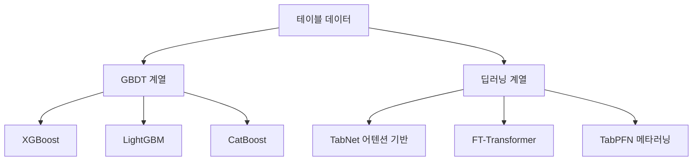

# 테이블 데이터 ML

정형(tabular) 데이터에서의 머신러닝. 이미지/텍스트와 달리 테이블 데이터에서는 **딥러닝이 GBDT(Gradient Boosted Decision Trees)를 일관되게 이기지 못한다**는 것이 2024년까지의 결론이었으나, Transformer 기반 접근이 격차를 좁히고 있다.

## GBDT vs 딥러닝

| 접근 | 장점 | 단점 |
|------|------|------|
| **XGBoost/LightGBM** | 튜닝 쉬움, 해석 가능, 빠름 | 임베딩/전이학습 어려움 |
| **TabNet** | 인스턴스별 특성 선택 어텐션 | 학습 불안정, GBDT 대비 미미한 이점 |
| **FT-Transformer** | 특성별 토큰 + 어텐션 | 중소 데이터에서 과적합 |
| **TabPFN** | 제로샷 분류 (1000행 미만) | 대규모 데이터 미지원 |

## 왜 딥러닝이 어려운가

1. **이질적 특성**: 범주형 + 수치형 혼합
2. **회전 불변 부재**: 특성 순서가 의미 없음
3. **규칙적 패턴**: 트리가 축 정렬 분할에 강함
4. **데이터 규모**: 테이블 데이터는 보통 소-중규모

## 관련 문서

- [[decision-trees-random-forests]] -- 결정 트리와 랜덤 포레스트
- [[ensemble-methods]] -- 앙상블 방법론
- [[feature-engineering]] -- 특성 공학
- [[transformer-architecture]] -- Transformer
