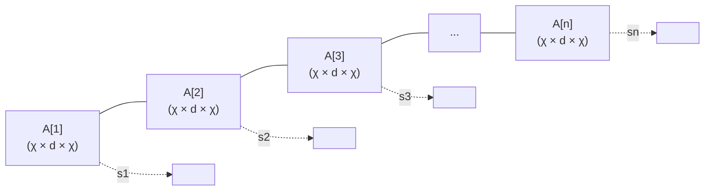

# 텐서 네트워크와 ML (Tensor Networks & Machine Learning)

## 정의

**텐서 네트워크(Tensor Networks)**는 고차원 텐서를 소규모 텐서들의 수축(contraction) 네트워크로 표현하는 수학 프레임워크다. 원래 양자 다체 시스템(quantum many-body systems)의 파동 함수를 효율적으로 표현하기 위해 개발되었으며, ML에서는 **모델 압축**, **고차원 특징 맵 표현**, **생성 모델** 등에 활용된다.

## 텐서의 기본 개념

텐서는 다차원 배열이다:
- 스칼라: 차수 0 텐서
- 벡터: 차수 1 텐서 ($n$ 요소)
- 행렬: 차수 2 텐서 ($n \times m$)
- 고차 텐서: 차수 $d$ 텐서 ($n^d$ 요소)

$d$개의 변수를 가진 완전 텐서는 지수적 메모리를 요구하므로, 텐서 네트워크는 이를 작은 텐서들의 수축으로 분해하여 **지수 공간을 다항식 공간으로** 압축한다.

## 주요 텐서 네트워크 구조

### MPS (Matrix Product State) / 텐서 트레인 (Tensor Train)

1차원 체인 구조. 각 위치 $i$에 3차원 텐서 $A^{[i]} \in \mathbb{R}^{\chi \times d \times \chi}$를 배치:

$$\Psi(s_1, s_2, ..., s_n) = A^{[1]}_{s_1} \cdot A^{[2]}_{s_2} \cdots A^{[n]}_{s_n}$$

- $\chi$: 결합 차원(bond dimension), 텐서 네트워크 표현 능력 제어
- $\chi = 1$: 완전 분리 가능 표현 (MF 근사)
- $\chi = d^{n/2}$: 완전 표현 (지수 메모리)



MPS/Tensor Train 구조: 사슬 연결된 텐서들의 행렬 곱으로 고차원 텐서를 표현한다.

### PEPS (Projected Entangled Pair States)

2차원 격자 구조. MPS를 2D로 확장:
- 각 격자 위치에 5차원 텐서 (위/아래/왼/오른/물리 인덱스)
- 이미지 등 2D 구조 데이터에 적합
- 수축 계산이 MPS보다 훨씬 복잡 (일반적으로 #P-hard)

### MERA (Multi-scale Entanglement Renormalization Ansatz)

계층적 실공간 재정규화군 구조:
- 단위 변환(isometry) + 얽힘 해소(disentangler) 계층
- 임계 시스템, 공형 장이론 묘사에 적합

### Tucker 분해

고차 SVD(Higher-Order SVD, HOSVD)의 일반화:

$$\mathcal{T} \approx \mathcal{G} \times_1 U^{(1)} \times_2 U^{(2)} \times_3 U^{(3)}$$

- $\mathcal{G}$: 코어 텐서
- $U^{(k)}$: 각 모드의 인자 행렬
- 완전 다차원 분해, MPS보다 표현력 높지만 메모리 요구 증가

## ML에서의 응용

### 신경망 가중치 압축

대형 가중치 행렬을 텐서 네트워크로 분해하여 파라미터 수 절감:

```python
# PyTorch + tensorly로 FC 레이어 MPS 분해
import tensorly as tl
from tensorly.decomposition import tensor_train

# 원본 가중치 텐서 [1024, 1024]를 재구성
W = model.fc.weight.data.reshape(4, 4, 4, 4, 4, 4, 4, 4, 4, 4)
# Tensor Train 분해
W_tt = tensor_train(W, rank=[1, 8, 8, 8, 8, 8, 8, 8, 8, 8, 1])
```

- 합성곱 필터를 CPD/Tucker로 분해: 메모리 4-8배 절감 가능
- Tensor Train으로 FC 레이어: 100배 이상 압축 가능

### 텐서 네트워크 생성 모델

텐서 네트워크를 직접 생성 모델로 사용:
- **Born Machine**: MPS를 확률 진폭으로 해석, 양자 역학적 생성 모델
- 이진/이산 데이터에서 자기회귀 샘플링 가능
- DMRG(Density Matrix Renormalization Group) 알고리즘으로 학습

### 고차원 특징 맵 (Tensor Kernel)

입력 $\mathbf{x}$를 고차원 특징 공간으로 매핑:

$$\phi(\mathbf{x}) = \phi(x_1) \otimes \phi(x_2) \otimes \cdots \otimes \phi(x_n)$$

MPS 구조를 적용하면 지수 차원 특징 맵을 다항식 비용으로 처리 가능.

### Attention의 텐서 분해

트랜스포머 어텐션 행렬을 저랭크 텐서 분해로 근사하여 속도 향상.

## 텐서 수축 최적화

텐서 네트워크의 수축 순서(contraction order)에 따라 계산 비용이 크게 달라진다:

- **최적 수축 순서 찾기**: NP-hard 문제
- 실용적 방법: 트리 분해(treewidth) 기반, 탐욕 알고리즘
- `opt_einsum`, `cotengra` 라이브러리: GPU 가속 + 최적 수축 경로 탐색

```python
# opt_einsum으로 효율적 텐서 수축
import opt_einsum as oe

# 3개 텐서 수축: i,j,k -> 최적 경로 자동 선택
result = oe.contract('ij,jk,kl->il', A, B, C)
```

## 언어: 에인슈타인 합산 표기 (Einstein Summation)

텐서 수축은 `einsum` 표기로 간결하게 표현:

```python
import torch

# 행렬 곱
torch.einsum('ij,jk->ik', A, B)

# 배치 어텐션 스코어
torch.einsum('bhi,bhj->bhij', Q, K)  # b=배치, h=헤드, i/j=시퀀스
```

## 한계와 현재 위치

- **수축 비용**: PEPS 등 2D 이상 네트워크는 정확한 수축이 지수 비용
- **최적 결합 차원 선택**: 태스크별 최적 $\chi$ 사전 결정 어려움
- **학습 알고리즘**: DMRG, Riemannian gradient 등 특수화 필요
- **실용성**: 범용 딥러닝 대비 적용 범위 제한

양자 컴퓨팅 알고리즘 시뮬레이션, 통계 물리 모델링, 특정 ML 압축 시나리오에서 강점을 보인다.

## 관련 도구

| 라이브러리 | 특징 |
|-----------|------|
| TensorLy | 텐서 분해 Python 라이브러리, PyTorch/NumPy 백엔드 |
| quimb | 양자 텐서 네트워크, DMRG 구현 |
| opt_einsum | 최적 수축 경로 탐색 |
| cotengra | GPU 가속 텐서 수축, 양자 회로 시뮬레이션 |

## 관련 문서

- [[quantum-machine-learning]] - QML의 수학적 기반, 텐서 네트워크와 긴밀히 연결
- [[equivariant-neural-networks]] - 대칭 구조 내재화의 또 다른 형태
- [[optimization-theory]] - 텐서 분해 최적화
- [[autoencoders-vae]] - 차원 축소와의 비교
- [[universal-approximation-theorem]] - 텐서 네트워크의 표현력 이론
