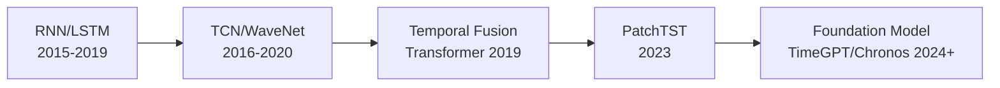

# 시계열 예측 딥러닝

시계열 데이터의 미래 값을 예측하는 딥러닝 접근법. [[rnn-lstm-gru|RNN/LSTM]] 시대를 거쳐 현재는 **Transformer 기반 모델**과 **Foundation Model** 접근이 주류.

## 아키텍처 진화

## 주요 모델

| 모델 | 핵심 아이디어 |
|------|-------------|
| **Temporal Fusion Transformer** | 게이팅 + 멀티헤드 어텐션 + 정적/동적 변수 분리 |
| **PatchTST** | ViT 스타일 패치 분할 + 채널 독립 |
| **iTransformer** | 변수를 토큰으로, 시점을 특성으로 전치 |
| **TimeGPT/Chronos** | 대규모 사전학습 시계열 Foundation Model |

## Foundation Model 접근

NLP의 GPT처럼 대규모 시계열 데이터로 사전학습한 범용 예측 모델:
- **TimeGPT** (Nixtla): API 서비스형, 제로샷 예측
- **Chronos** (Amazon): T5 기반, 양자화된 시계열 토큰
- **Moirai** (Salesforce): 다변량 + 가변 빈도 지원

## 관련 문서

- [[rnn-lstm-gru]] -- RNN/LSTM
- [[transformer-architecture]] -- Transformer
- [[self-supervised-learning]] -- 자기지도 학습 (시계열 사전학습)
