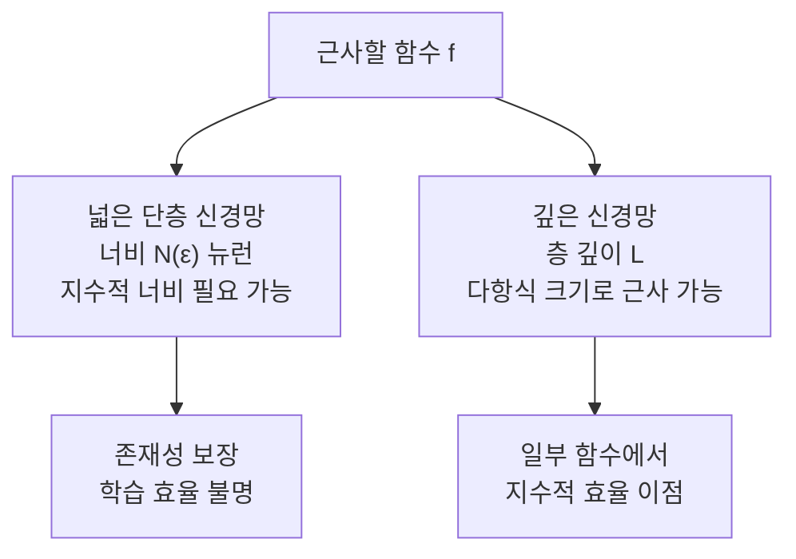

# 범용 근사 정리 심화 (Universal Approximation Theorem)

## 정의

**범용 근사 정리(Universal Approximation Theorem, UAT)**는 "충분히 넓거나 깊은 신경망이 임의의 연속 함수를 원하는 정확도로 근사할 수 있다"는 신경망 이론의 핵심 정리다. 이 정리는 신경망의 이론적 표현력(expressive power)의 존재를 보장하지만, **어떻게 학습하는지**나 **일반화**에 대해서는 언급하지 않는다.

## 고전적 정리들

### Cybenko (1989) - 최초 증명

> 시그모이드 함수를 활성화로 가진 단층 신경망은 컴팩트 부분집합 위의 임의의 연속 함수를 균등하게 근사할 수 있다.

$$f(\mathbf{x}) \approx \sum_{j=1}^{N} \alpha_j \sigma(\mathbf{w}_j^\top \mathbf{x} + b_j)$$

단, 충분히 큰 $N$에 대해 성립. $N$이 얼마나 커야 하는지는 보장하지 않는다.

### Hornik, Stinchcombe & White (1989)

Cybenko와 독립적으로:
- 단층 신경망이 임의의 **보렐 측도 가능 함수**를 근사할 수 있음을 증명
- 시그모이드뿐 아니라 **임의의 비선형 활성화 함수**로 일반화

### Hornik (1991) - 완전 일반화

활성화 함수가 **상수가 아니고 유계이며 연속**이면 충분하다는 것을 증명하여 활성화 함수 조건 크게 완화.

## 깊이의 역할: 깊이 vs 너비 트레이드오프

초기 UAT는 단층(shallow) 신경망에 관한 것이었다. 이후 연구들은 **깊이**의 표현력 이점을 탐구했다.

### 너비 vs 깊이 표현력

### Barron의 경계 (1993)

단층 신경망으로 근사 시 필요한 뉴런 수:

$$\|f - f_N\|^2 \leq \frac{C_f^2}{N}$$

- $C_f$: 함수의 "복잡도" 측도 (푸리에 계수의 1차 모멘트)
- 차원에 무관하게 $O(1/N)$ 근사 오차 달성 가능

### Montufar et al. (2014) - 깊이의 지수적 이점

ReLU 네트워크에서:
- 깊이 $L$, 너비 $n$인 네트워크의 선형 영역 수: $O(n^{(L-1)d} (n/d)^d)$
- 같은 파라미터 수를 가진 단층 네트워크보다 지수적으로 많은 선형 영역

### 깊이 분리 (Depth Separation)

일부 함수들은 얕은 네트워크로 근사하려면 지수적으로 많은 뉴런이 필요하지만, 깊은 네트워크로는 다항식 크기로 표현 가능:

$$\exists f : \text{depth-2 requires } 2^{\Omega(n)} \text{ neurons, depth-3 needs } O(n^2)$$

## ReLU 네트워크에서의 UAT

ReLU는 비유계이므로 기존 Cybenko 조건을 만족하지 않는다. 하지만:

**Leshno et al. (1993)**: 활성화 함수가 "국소적으로 유계이지 않은" 임의의 비다항식 함수이면 범용 근사가 가능함을 증명.

ReLU 단층 네트워크:
- 다항식 수의 유닛으로 연속 함수 근사 가능
- 단, 함수가 충분히 부드러운 경우 (고주파 성분에서 한계)

## 고차원에서의 차원의 저주

UAT는 이론적 존재성은 보장하지만, 실용적 문제가 있다:

- $d$차원 입력에서 균등 $\epsilon$-근사를 위한 단층 네트워크 너비: $O\left(\epsilon^{-d}\right)$
- **차원의 저주**: 차원이 높아질수록 필요한 뉴런 수가 지수적으로 증가

깊은 네트워크는 **계층적 합성(compositional functions)**을 활용하여 이를 완화:

$$f(\mathbf{x}) = f_L(f_{L-1}(\cdots f_1(\mathbf{x}) \cdots))$$

각 층이 저차원 부분 구조를 포착하면 필요 파라미터가 다항식 수준으로 줄어들 수 있다.

## 표현력과 학습 가능성의 괴리

UAT는 **표현력(expressibility)**만 보장한다. 학습 가능성(learnability)은 별개 문제다:

| 질문 | UAT 답변 | 현실 |
|------|----------|------|
| 신경망이 f를 표현할 수 있는가? | 예 (충분한 크기라면) | 이론 보장 |
| SGD로 f를 학습할 수 있는가? | 알 수 없음 | NP-hard 일반 경우 |
| 학습된 모델이 일반화하는가? | 알 수 없음 | 암묵적 정규화 필요 |

### 과매개변수화 체제 (Overparameterized Regime)

현대 딥러닝은 데이터보다 훨씬 많은 파라미터를 사용한다. 이 체제에서:

- **이중 하강(Double Descent)**: 모델 크기 증가 시 처음에는 과적합, 충분히 크면 다시 일반화
- **암묵적 정규화**: SGD가 최솟값들 중 "단순한" 해를 선호하는 경향
- **뉴럴 탄젠트 커널(NTK)**: 무한 너비 한계에서 선형 모델로 수렴 [[neural-tangent-kernel]]

## 활성화 함수별 비교

| 활성화 | UAT | 기울기 | 실용성 |
|--------|-----|--------|--------|
| sigmoid | 초기 증명 기반 | 포화 문제 | 레거시 |
| tanh | 유사 | 포화 문제 | RNN에서 사용 |
| ReLU | Leshno 일반화로 | 음의 영역 죽음 | 현재 표준 |
| GELU | 유사 | 부드러운 | Transformer 표준 |
| SiLU/Swish | 유사 | 단조 아님 | 일부 우위 |

## 무한 너비 이론: 가우시안 프로세스 대응

$$\text{무한 너비 단층 신경망} \overset{d}{\rightarrow} \text{가우시안 프로세스}$$

Neal(1994), Williams(1997): 무한 너비 한계에서 신경망의 사전 분포가 특정 커널 함수를 가진 가우시안 프로세스(GP)가 됨.

이 결과는 [[neural-tangent-kernel]]로 이어진다.

## 실무적 함의

1. **아키텍처 설계**: UAT는 "어떤 함수도 표현 가능하다"는 안심을 주지만, 실제로 학습 가능한 구조를 설계해야 함
2. **표현력 과잉 경고**: 표현력이 넘쳐도 학습 알고리즘이 맞는 해를 찾지 못할 수 있음
3. **깊이의 효율**: 동일 파라미터라면 깊은 네트워크가 일반적으로 더 나은 실용적 성능 달성
4. **활성화 선택**: 어떤 비다항식 활성화도 범용 근사 가능, 실용적 고려는 기울기 흐름

## 관련 문서

- [[neural-tangent-kernel]] - 무한 너비 신경망 이론의 현대적 발전
- [[optimization-theory]] - 표현 가능한 해를 실제로 찾는 최적화 이론
- [[perceptron-mlp]] - 범용 근사 정리의 주체인 다층 퍼셉트론
- [[equivariant-neural-networks]] - 대칭 제약을 가진 신경망의 표현력
- [[sgd-convergence-theory]] - 학습 가능성 이론과의 연결
