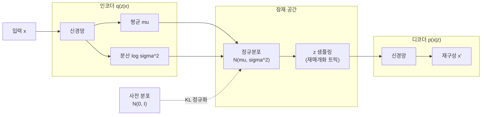
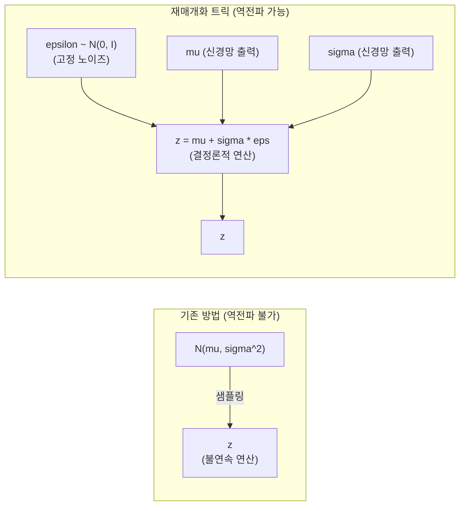
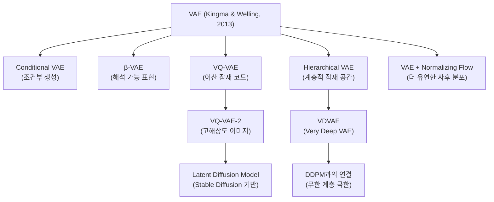

# 변분 오토인코더 (Variational Autoencoder, VAE)

## 개요

**변분 오토인코더(VAE, Variational Autoencoder)**는 Diederik Kingma와 Max Welling이 2013년 "Auto-Encoding Variational Bayes" 논문에서 제안한 생성 모델이다. VAE는 **변분 추론(variational inference)**을 신경망으로 근사하여 고차원 데이터의 압축된 잠재 표현(latent representation)과 생성 능력을 동시에 학습한다.

기존 오토인코더(AE)가 결정론적 인코더-디코더 구조로 압축만 학습하는 것과 달리, VAE는 잠재 공간을 **확률 분포**로 표현하여 새로운 샘플을 생성할 수 있다. 이는 GAN(Generative Adversarial Network)과 함께 딥러닝 기반 생성 모델의 양대 원조이며, 이후 Diffusion Model, VQVAE, Hierarchical VAE 등 다양한 변형의 기반이 된다.

## 기본 직관: 왜 잠재 공간이 분포여야 하는가

일반 오토인코더는 입력 $x$를 잠재 벡터 $z$로 **결정론적으로** 인코딩한다.

- 문제 1: 잠재 공간에 "구멍(hole)"이 생겨 특정 $z$ 값에서 디코더가 의미 없는 출력을 생성
- 문제 2: $z$ 공간이 불연속적이어서 보간(interpolation)이 어색

VAE는 잠재 공간을 **가우시안 분포 $q_\phi(z|x) = \mathcal{N}(\mu, \sigma^2)$**로 표현함으로써 이 문제를 해결한다. 인코더는 평균($\mu$)과 분산($\sigma^2$)을 출력하고, 이 분포에서 샘플링하여 디코더에 전달한다.



위 다이어그램은 VAE의 전체 정보 흐름을 보여준다. 인코더가 분포 파라미터를 출력하고, 재매개화 트릭으로 샘플링하여 디코더에 전달한다.

## 수학적 기반: ELBO

### 목표: 로그 가능도 최대화

VAE의 궁극적 목표는 데이터의 로그 가능도 $\log p_\theta(x)$를 최대화하는 것이다.

$$\log p_\theta(x) = \log \int p_\theta(x|z) p(z) dz$$

이 적분은 고차원에서 직접 계산 불가능하다(intractable). 이를 해결하기 위해 **변분 추론**을 사용한다.

### ELBO (Evidence Lower Bound)

$$\log p_\theta(x) \geq \mathcal{L}(\theta, \phi; x) = \underbrace{\mathbb{E}_{q_\phi(z|x)}[\log p_\theta(x|z)]}_{\text{재구성 손실}} - \underbrace{D_{KL}(q_\phi(z|x) \| p(z))}_{\text{KL 정규화 항}}$$

$\mathcal{L}$을 **ELBO(Evidence Lower Bound)**라 부르며, VAE는 이 하한을 최대화한다.

- **재구성 손실(Reconstruction Loss)**: 인코딩 후 디코딩한 $x'$이 원본 $x$와 얼마나 유사한가. 이미지의 경우 MSE 또는 BCE.
- **KL 발산(KL Divergence)**: 인코더의 사후 분포 $q_\phi(z|x)$가 사전 분포 $p(z) = \mathcal{N}(0, I)$와 얼마나 가까운가.

KL 항은 잠재 분포를 표준 정규분포로 당기는 **정규화(regularization)** 역할을 한다. 이 덕분에 잠재 공간이 연속적이고 의미 있는 구조를 가지게 된다.

### 가우시안 사후 분포의 KL 해석해

$q_\phi(z|x) = \mathcal{N}(\mu, \text{diag}(\sigma^2))$이고 $p(z) = \mathcal{N}(0, I)$일 때, KL 발산은 해석해를 가진다:

$$D_{KL}(q_\phi \| p) = -\frac{1}{2} \sum_{j=1}^{J} \left(1 + \log \sigma_j^2 - \mu_j^2 - \sigma_j^2\right)$$

이 해석해 덕분에 역전파 중 KL 항을 수치 적분 없이 정확히 계산할 수 있다.

## 재매개화 트릭 (Reparameterization Trick)

VAE의 핵심 기여 중 하나. 샘플링 연산은 미분 불가능하므로 역전파가 불가능하다.

**해결책**: 샘플링을 결정론적 연산으로 분리한다.

$$z = \mu + \sigma \odot \epsilon, \quad \epsilon \sim \mathcal{N}(0, I)$$



- **이전**: 분포에서 직접 $z$를 샘플링 → 미분 불가
- **이후**: 결정론적 변환($z = \mu + \sigma \odot \epsilon$)으로 표현 → $\mu$, $\sigma$에 대해 미분 가능

$\epsilon$은 표준 정규분포에서 샘플링하지만 이는 신경망 파라미터가 아니므로 역전파에 영향 없다.

## 구현 코드

```python
import torch
import torch.nn as nn
import torch.nn.functional as F


class VAE(nn.Module):
    """기본 VAE 구현 (MNIST 스케일)"""

    def __init__(self, input_dim: int = 784, hidden_dim: int = 400, latent_dim: int = 20):
        super().__init__()
        # 인코더
        self.fc1 = nn.Linear(input_dim, hidden_dim)
        self.fc_mu = nn.Linear(hidden_dim, latent_dim)    # 평균
        self.fc_logvar = nn.Linear(hidden_dim, latent_dim)  # log 분산

        # 디코더
        self.fc3 = nn.Linear(latent_dim, hidden_dim)
        self.fc4 = nn.Linear(hidden_dim, input_dim)

    def encode(self, x: torch.Tensor) -> tuple[torch.Tensor, torch.Tensor]:
        """x → (mu, log_var)"""
        h = F.relu(self.fc1(x))
        return self.fc_mu(h), self.fc_logvar(h)

    def reparameterize(self, mu: torch.Tensor, log_var: torch.Tensor) -> torch.Tensor:
        """재매개화 트릭: z = mu + sigma * epsilon"""
        if self.training:
            std = torch.exp(0.5 * log_var)
            eps = torch.randn_like(std)
            return mu + eps * std
        return mu  # 추론 시 평균 사용

    def decode(self, z: torch.Tensor) -> torch.Tensor:
        """z → x'"""
        h = F.relu(self.fc3(z))
        return torch.sigmoid(self.fc4(h))  # [0, 1] 범위로 정규화

    def forward(self, x: torch.Tensor) -> tuple[torch.Tensor, torch.Tensor, torch.Tensor]:
        mu, log_var = self.encode(x.view(-1, 784))
        z = self.reparameterize(mu, log_var)
        x_recon = self.decode(z)
        return x_recon, mu, log_var


def vae_loss(x_recon: torch.Tensor, x: torch.Tensor, mu: torch.Tensor, log_var: torch.Tensor) -> torch.Tensor:
    """ELBO 손실 = 재구성 손실 + KL 발산"""
    # 재구성 손실 (BCE for binary images)
    recon_loss = F.binary_cross_entropy(x_recon, x.view(-1, 784), reduction="sum")

    # KL 발산 해석해: -0.5 * sum(1 + log_var - mu^2 - var)
    kl_loss = -0.5 * torch.sum(1 + log_var - mu.pow(2) - log_var.exp())

    return recon_loss + kl_loss
```

## 생성 및 샘플링

훈련 후 새 샘플 생성:

```python
@torch.no_grad()
def generate(model: VAE, n_samples: int = 16) -> torch.Tensor:
    """표준 정규분포에서 z를 샘플링하여 새 이미지 생성"""
    z = torch.randn(n_samples, 20)  # latent_dim=20
    return model.decode(z)

@torch.no_grad()
def interpolate(model: VAE, x1: torch.Tensor, x2: torch.Tensor, steps: int = 10) -> torch.Tensor:
    """두 이미지 사이 잠재 공간 보간"""
    mu1, _ = model.encode(x1)
    mu2, _ = model.encode(x2)
    alphas = torch.linspace(0, 1, steps)
    z_interp = torch.stack([alpha * mu2 + (1 - alpha) * mu1 for alpha in alphas])
    return model.decode(z_interp)
```

## VAE vs 오토인코더 vs GAN 비교

| 특성 | 오토인코더 (AE) | VAE | GAN |
|------|--------------|-----|-----|
| 잠재 공간 | 결정론적 벡터 | 확률 분포 | 없음 (암시적) |
| 생성 품질 | 불가 (생성 목적 아님) | 보통 (흐릿함) | 높음 (날카로움) |
| 학습 안정성 | 매우 안정 | 안정 | 불안정 (mode collapse) |
| 잠재 공간 해석성 | 낮음 | 높음 | 낮음 |
| 표현 학습 | 강력 | 강력 | 약함 |
| 확률 모델 | 아님 | O (명시적 가능도) | 아님 |

## VAE의 한계와 극복

### 주요 한계

1. **흐릿한 생성물 (Blurry Output)**: MSE/BCE 기반 재구성 손실이 픽셀별 평균화 효과를 내어 생성 이미지가 흐릿하다.
2. **잠재 공간 붕괴 (Posterior Collapse)**: KL 항의 강한 정규화로 인해 인코더가 입력을 무시하고 $z \approx \mathcal{N}(0, I)$로 수렴하는 현상.
3. **표현력 한계**: 단순한 가우시안 사후 분포가 복잡한 데이터 분포를 근사하기 어려움.

### 극복 방법

| 문제 | 해결 기법 |
|------|---------|
| 흐릿한 생성물 | 지각 손실(Perceptual Loss), VQ-VAE 이산 잠재, 생성 목적 함수 개선 |
| Posterior Collapse | KL Annealing (초반 KL 가중치 낮춤), Free Bits, β-VAE |
| 표현력 한계 | Hierarchical VAE (VDVAE), Normalizing Flows, IAF |

## 생성 모델 계보에서의 위치



특히 VQ-VAE → Latent Diffusion Model의 계보가 중요하다. Stable Diffusion은 픽셀 공간이 아닌 VAE의 잠재 공간에서 Diffusion을 수행하여 계산 비용을 대폭 절감한다.

관련: [[vq-vae]], [[hierarchical-vae]], [[ddpm-original-paper]]

## 실무 응용

1. **이상 탐지(Anomaly Detection)**: 정상 데이터로 훈련 후, 높은 재구성 오차를 가진 샘플을 이상 탐지
2. **데이터 보강(Data Augmentation)**: 잠재 공간에서 보간하여 새 훈련 데이터 생성
3. **표현 학습**: 레이블 없이 의미 있는 특성 추출 (β-VAE의 해석 가능 잠재 표현)
4. **이미지 편집**: 잠재 벡터 산술 연산으로 속성 조작 (예: $z_\text{안경} + z_\text{남성} - z_\text{남성 안경}$)
5. **분자 설계**: 화학 구조를 잠재 공간에 임베딩하여 새 분자 생성 (Gómez-Bombarelli et al., 2018)

## 관련 문서

- [[autoencoders-vae]] - 오토인코더 전체 계열 개요
- [[hierarchical-vae]] - 계층적 VAE (NVAE, VDVAE)
- [[vq-vae]] - 이산 잠재 코드 VAE
- [[ddpm-original-paper]] - VAE와 연결되는 Diffusion Model
- [[generative-models-overview]] - 생성 모델 전체 계보
