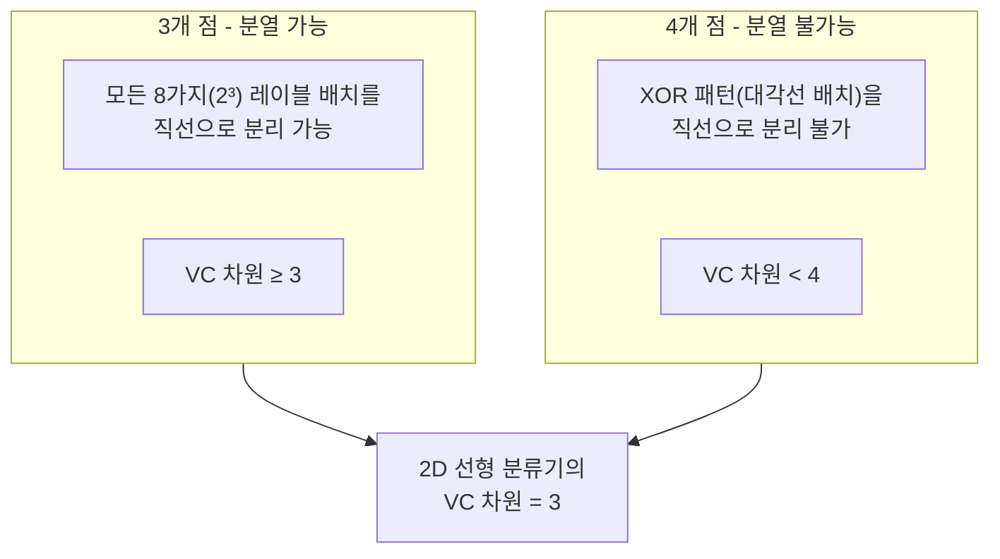
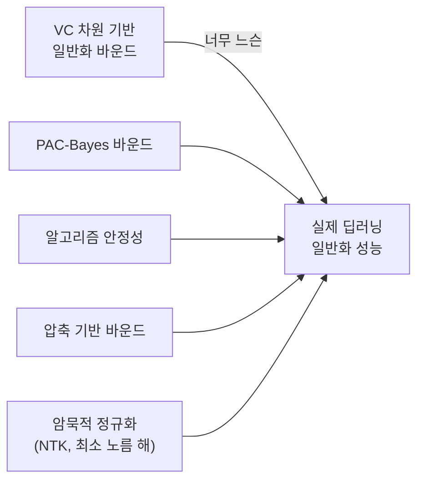

# VC 차원 (Vapnik-Chervonenkis Dimension)

## 개요

VC 차원(Vapnik-Chervonenkis Dimension)은 가설 클래스(hypothesis class)의 표현 복잡도를 측정하는 수학적 도구다. Vladimir Vapnik과 Alexey Chervonenkis(1971)가 도입했으며, [[pac-learning]] 이론에서 무한 가설 클래스가 PAC 학습 가능한지 판단하는 핵심 개념이다. VC 차원이 유한하면 일반화가 보장되고, 무한이면 어떤 분포에서도 학습이 실패할 수 있다.

## 핵심 개념: 분열 (Shattering)

가설 클래스 $H$가 점 집합 $S = \{x_1, ..., x_m\}$을 **분열(shattering)**한다는 것은, $S$의 모든 $2^m$가지 이진 레이블 할당에 대해 그것을 정확히 분류하는 가설이 $H$ 내에 존재한다는 의미다.

**VC 차원**: $H$가 분열할 수 있는 최대 점 집합의 크기

$$d_{VC}(H) = \max\{m : \exists S \subseteq X, |S| = m, H \text{ shatters } S\}$$

## 직관적 예시: 2차원 선형 분류기

2차원 반공간(halfspace, 선형 분류기)의 VC 차원은 3이다. $d$차원 반공간의 VC 차원은 $d+1$이다.

## 주요 가설 클래스의 VC 차원

| 가설 클래스 | VC 차원 |
|-------------|---------|
| $d$차원 선형 분류기 | $d + 1$ |
| 구간 $[a, b]$ (1차원) | 2 |
| 축 정렬 직사각형 (2차원) | 4 |
| $k$-NN 분류기 | 무한 |
| 임의 부울 함수 | 무한 |
| 깊이 $d$ 결정 트리 | $O(2^d)$ |
| $h$개 은닉 유닛 신경망 | $O(h^2)$ |

## 신경망의 VC 차원

신경망의 VC 차원은 구조에 따라 다르지만, 일반적으로:

- **ReLU 네트워크**: 파라미터 수가 $W$, 레이어 수가 $L$이면 VC 차원은 $O(WL \log W)$ (Bartlett et al., 2019)
- **과잉 파라미터화된 심층망**: VC 차원이 훈련 데이터 수를 크게 초과하므로, 고전 PAC 이론으로는 일반화를 설명할 수 없다

이것이 [[bias-variance-tradeoff]]의 고전 이론이 딥러닝에서 깨지는 이유이며, [[double-descent]] 현상의 이론적 배경이기도 하다. VC 차원 기반 일반화 바운드는 실제 딥러닝에서 너무 느슨(loose)하여 실용적 예측력이 낮다는 한계가 있다.

## Sauer의 보조정리와 성장 함수

VC 차원 $d$인 가설 클래스가 $m$개 점을 얼마나 다양하게 분류할 수 있는지를 **성장 함수(growth function)**로 표현한다:

$$\Pi_H(m) = \max_{S \subseteq X, |S|=m} |\{h|_S : h \in H\}|$$

**Sauer의 보조정리**: VC 차원 $d$이면 $\Pi_H(m) \leq \sum_{i=0}^{d}\binom{m}{i} = O(m^d)$

이는 VC 차원이 유한하면 성장 함수가 지수적이 아닌 다항식으로 증가함을 보여준다. 이것이 유한 VC 차원 = 학습 가능성의 수학적 핵심이다.

## VC 차원 기반 일반화 바운드

VC 차원 $d$인 가설 클래스 $H$에서, $m$개 훈련 샘플로 ERM(Empirical Risk Minimization)을 수행하면:

$$\text{error}(h) \leq \hat{\text{error}}(h) + O\left(\sqrt{\frac{d\log(m/d) + \log(1/\delta)}{m}}\right)$$

확률 $1 - \delta$로 성립한다. 이 바운드가 의미하는 것:

- 훈련 오차가 낮아도 VC 차원이 너무 크면 일반화가 나쁠 수 있다
- 훈련 샘플 수가 늘수록 일반화 갭이 $1/\sqrt{m}$ 속도로 줄어든다
- 이것이 [[pac-learning]]에서 샘플 복잡도가 VC 차원에 비례하는 이유다

## VC 차원의 현대적 한계와 대안

VC 차원은 가설 클래스의 최악 경우를 측정하므로, 특정 알고리즘(SGD)이나 데이터 분포의 구조를 반영하지 못한다. 현대 이론은 알고리즘-데이터 상호작용을 반영하는 방향으로 발전하고 있다.

## 실무적 함의

- **모델 선택**: 데이터 수에 비해 VC 차원이 너무 크면 과적합 위험 증가
- **특성 차원 축소**: 입력 차원 $d$를 줄이면 선형 모델의 VC 차원도 줄어 일반화 개선
- **정규화의 역할**: 명시적 정규화는 사실상 유효 VC 차원을 줄이는 효과

## 관련 문서

- [[pac-learning]] - VC 차원이 핵심 역할을 하는 학습 이론 프레임워크
- [[bias-variance-tradeoff]] - VC 차원과 편향-분산의 이론적 연결
- [[double-descent]] - VC 차원이 데이터 수를 초과할 때 발생하는 역설적 현상
- [[neural-tangent-kernel]] - 과잉 파라미터화 신경망의 현대적 이론적 분석
