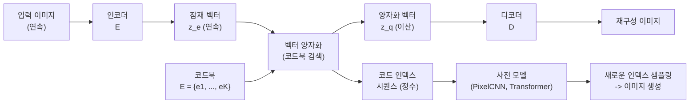

# VQ-VAE / VQ-GAN (벡터 양자화 변분 오토인코더)

## 개요

VQ-VAE(Vector Quantized Variational AutoEncoder)는 DeepMind의 van den Oord et al.(2017)이 제안한 모델로, 연속적인 잠재 공간(continuous latent space) 대신 이산 잠재 코드(discrete latent code)를 학습하는 오토인코더 구조다. 이미지, 오디오, 비디오를 유한한 코드북(codebook)의 토큰 시퀀스로 표현하여, 언어 모델처럼 이산 생성 모델을 연속 데이터에 적용할 수 있게 만든다.

[[autoencoders-vae|VAE]]가 연속 가우시안 잠재 변수를 사용하는 데 반해, VQ-VAE는 정수 인덱스 시퀀스로 잠재 표현을 나타내므로 언어 모델의 어휘 개념을 비언어 도메인에 직접 적용할 수 있다.

## 핵심 구성 요소

### 코드북 (Codebook)

코드북 $E = \{e_1, ..., e_K\} \in \mathbb{R}^{K \times D}$는 $K$개의 임베딩 벡터로 구성된다. 인코더 출력 $z_e$는 코드북에서 가장 가까운 벡터로 대체(양자화)된다:

$$z_q = e_k, \quad k = \arg\min_j \|z_e - e_j\|_2$$

### 스트레이트-스루 추정자 (Straight-Through Estimator)

양자화($\arg\min$)는 미분 불가능 연산이므로 역전파가 끊긴다. 스트레이트-스루 추정자(STE)는 순전파에서는 양자화된 값을 사용하고, 역전파에서는 그래디언트를 양자화 연산을 건너뛰고 그대로 통과시키는 트릭이다:

$$\frac{\partial \mathcal{L}}{\partial z_e} \approx \frac{\partial \mathcal{L}}{\partial z_q}$$

## VQ-VAE 아키텍처

## 손실 함수

$$\mathcal{L} = \underbrace{\|x - \hat{x}\|_2^2}_{\text{재구성 손실}} + \underbrace{\|\text{sg}[z_e] - z_q\|_2^2}_{\text{코드북 손실}} + \beta\underbrace{\|z_e - \text{sg}[z_q]\|_2^2}_{\text{commitment 손실}}$$

- `sg[·]`: stop-gradient 연산자 (그래디언트 차단)
- 코드북 손실: 코드북 임베딩이 인코더 출력에 가까워지도록
- commitment 손실: 인코더 출력이 코드북에 수렴하도록 (계수 $\beta$는 보통 0.25)

## VQ-GAN: 고해상도 이미지 토크나이저

Esser et al.(CVPR 2021)의 VQ-GAN은 VQ-VAE에 적대적 손실(adversarial loss)과 퍼셉추얼 손실(perceptual loss)을 추가하여 고해상도 이미지의 압축 코드북을 학습한다:

$$\mathcal{L}_{VQ-GAN} = \mathcal{L}_{VQ} + \lambda_{adv}\mathcal{L}_{adv} + \lambda_{perc}\mathcal{L}_{perc}$$

| 비교 | VQ-VAE | VQ-GAN |
|------|--------|--------|
| 손실 | 픽셀 MSE | MSE + 판별기 + 퍼셉추얼 |
| 재구성 품질 | 흐릿함 (low freq 편향) | 선명, 고주파 디테일 보존 |
| 코드북 이용률 | 코드 붕괴(codebook collapse) 문제 | GAN 손실로 완화 |
| 응용 | DALL-E 1, Jukebox | LlamaGen, MAGVIT, Stable Diffusion |

## DALL-E와 GPT-4V의 연결

OpenAI DALL-E(2021)는 VQ-VAE로 이미지를 1024개의 이산 토큰으로 압축한 뒤, GPT-3와 동일한 트랜스포머 구조로 텍스트-이미지 토큰 시퀀스를 자기회귀(autoregressive) 방식으로 생성한다. 즉, VQ-VAE는 이미지를 "언어화"하는 브리지 역할을 한다.

더 최근에는 MAGVIT-v2, LlamaGen 등이 코드북 크기를 크게 늘리고(16K~256K), Lookup-Free Quantization(LFQ) 등 개선된 양자화 방법을 적용하여 [[gans]] 기반 생성 모델에 필적하는 품질을 달성하고 있다.

## 코드북 붕괴 (Codebook Collapse)

VQ-VAE의 주요 학습 문제로, 인코더 출력이 코드북의 일부 벡터에만 집중되어 나머지 코드는 전혀 사용되지 않는 현상이다. 해결 방법:

- **지수 이동 평균(EMA) 업데이트**: 코드북을 그래디언트 없이 온라인으로 업데이트
- **재설정(reset)**: 오래 사용되지 않은 코드를 무작위로 재초기화
- **엔트로피 정규화**: 코드 사용 분포의 엔트로피를 최대화하는 보조 손실 추가

## 관련 문서

- [[autoencoders-vae]] - VQ-VAE의 기반이 되는 연속 잠재 변수 모델
- [[gans]] - VQ-GAN의 적대적 훈련 구성 요소
- [[diffusion-models]] - VQ-GAN 코드북이 잠재 확산 모델의 토크나이저로 활용
- [[self-supervised-learning]] - 이산 토큰 표현을 이용한 자기지도 학습
