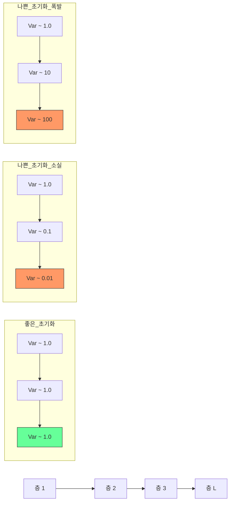

## 개요

가중치 초기화(Weight Initialization)는 신경망 학습을 시작하기 전 파라미터의 초기값을 설정하는 단계다. 초기화 전략은 수렴 속도, 활성화 값의 스케일, 역전파 기울기의 크기, 그리고 최종 모델 품질에 직접적인 영향을 미친다. 잘못된 초기화는 기울기 소실(vanishing gradient)이나 기울기 폭발(exploding gradient)을 유발하여 학습 자체를 불가능하게 만들 수 있다. [[activation-functions]] 종류에 따라 최적의 초기화 방법이 달라지며, [[batch-norm-layer-norm]]과 함께 깊은 네트워크 학습의 안정성을 보장하는 핵심 요소다.

## 왜 초기화가 중요한가

### 영 초기화의 문제

모든 가중치를 0으로 초기화하면 **대칭 문제(symmetry problem)**가 발생한다. 같은 층의 모든 뉴런이 동일한 입력을 받아 동일한 기울기를 계산하고, 동일하게 갱신된다. 결과적으로 모든 뉴런이 같은 특징을 학습하여 네트워크의 표현력이 단일 뉴런 수준으로 붕괴한다.

### 분산 보존 원칙

이상적인 초기화는 순전파에서 활성화 값의 분산과 역전파에서 기울기의 분산을 층 간에 일정하게 유지해야 한다. 분산이 층을 거칠수록 기하급수적으로 증가하면 기울기 폭발, 감소하면 기울기 소실이 발생한다.



## 주요 초기화 방법

### Xavier / Glorot 초기화 (2010)

Glorot & Bengio가 제안한 방법으로, Sigmoid와 Tanh 같은 대칭 활성화 함수에 최적화되었다. 순전파의 활성화 분산과 역전파의 기울기 분산을 동시에 보존하는 절충안이다.

**균등분포 버전:**
```
W ~ U(-sqrt(6 / (n_in + n_out)), +sqrt(6 / (n_in + n_out)))
```

**정규분포 버전:**
```
W ~ N(0, 2 / (n_in + n_out))
```

n_in은 입력 뉴런 수, n_out은 출력 뉴런 수다. 입출력 크기의 균형을 고려하여 분산을 결정한다.

### He 초기화 (2015)

He 등이 ReLU 네트워크를 위해 설계했다. ReLU는 음수 입력을 0으로 만들어 출력 분산을 절반으로 줄이므로, Xavier 초기화의 분산을 2배로 키워 이를 보상한다.

```
W ~ N(0, 2 / n_in)
```

Glorot 초기화는 ReLU에서 성능이 떨어지므로, ReLU 계열 [[activation-functions]]를 사용하는 네트워크에서는 He 초기화가 사실상 표준이다. ResNet 등 깊은 CNN의 학습을 가능하게 한 핵심 기법이다.

### LSUV (Layer-Sequential Unit-Variance, 2015)

Mishkin & Matas가 제안한 데이터 의존적(data-dependent) 초기화 방법이다.

1. 각 층의 가중치를 직교 행렬(orthonormal matrix)로 초기화
2. 무작위 미니배치를 순전파하여 각 층의 출력 표준편차를 측정
3. 출력 표준편차로 가중치를 나누어 단위 분산(unit variance)으로 조정
4. 모든 층에 대해 순차적으로 반복

Xavier/He가 이론적 가정(선형 활성화, 독립 입력)에 기반하는 반면, LSUV은 실제 데이터를 사용하여 경험적으로 분산을 맞추므로 다양한 아키텍처에 범용적으로 적용된다.

## 활성화 함수별 초기화 매핑

| 활성화 함수 | 권장 초기화 | 이유 |
|------------|-----------|------|
| Sigmoid, Tanh | Xavier / Glorot | 대칭 활성화의 분산 보존 |
| ReLU | He | 음수 절단에 의한 분산 감소 보상 |
| Leaky ReLU | He (수정 버전) | 음수 기울기 비율 고려 |
| GELU, SiLU/Swish | He 또는 LSUV | ReLU 유사 특성 |
| 범용 | LSUV | 데이터 기반 경험적 조정 |

## 편향(Bias) 초기화

편향은 보통 0으로 초기화한다. 대칭 문제는 가중치에만 해당되며, 편향은 각 뉴런에 하나씩 존재하여 대칭을 깨뜨리지 않는다. 일부 경우 ReLU 네트워크에서 작은 양수(0.01)로 초기화하여 초기 활성화를 보장하기도 하지만, He 초기화를 사용하면 불필요하다.

## 정규화 기법과의 관계

[[batch-norm-layer-norm]]은 각 층의 활성화를 명시적으로 정규화하므로, 초기화의 중요성을 상당 부분 줄여준다. BatchNorm 적용 시 Xavier와 He의 성능 차이가 줄어드는 것이 관찰된다. 그러나 정규화 기법이 초기화를 완전히 대체하지는 못하며, 특히 학습 초기 단계에서는 좋은 초기화가 빠른 수렴을 보장한다.

## 관련 문서

- [[activation-functions]] - 초기화 전략을 결정하는 핵심 요소
- [[perceptron-mlp]] - 초기화가 적용되는 네트워크 구조
- [[batch-norm-layer-norm]] - 초기화 민감도를 줄이는 정규화 기법
- [[gradient-descent-backpropagation]] - 기울기 소실/폭발의 원인과 해결
- [[dropout]] - 초기화와 함께 사용되는 정규화
- [[loss-functions]] - 초기화가 손실 표면 탐색에 미치는 영향
