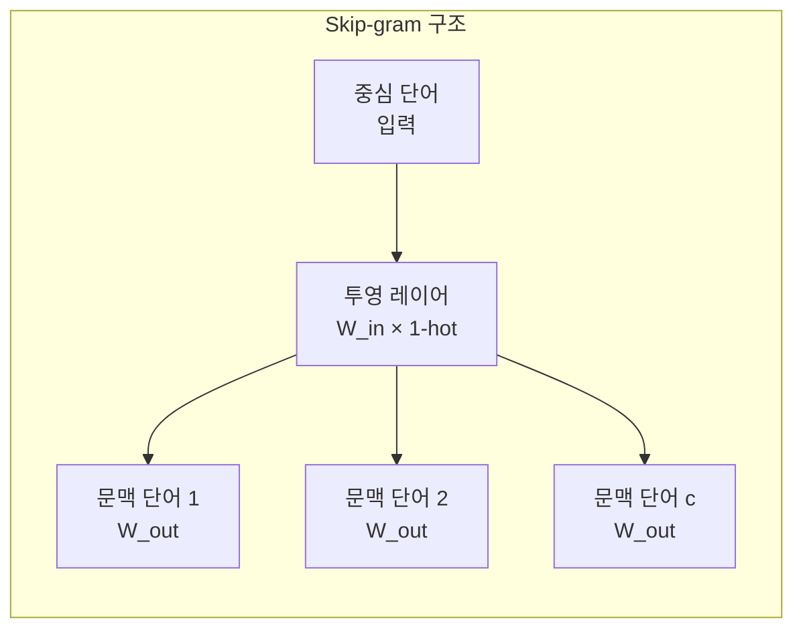

# Word2Vec과 FastText (Word Embeddings)

단어를 밀집 벡터(dense vector)로 표현하는 단어 임베딩(word embedding) 기법. "비슷한 맥락에 등장하는 단어는 비슷한 의미를 가진다(Distributional Hypothesis)"는 가설에 기반한다.

## CBOW vs Skip-gram

Word2Vec(Mikolov et al., 2013)은 두 가지 학습 목표 함수를 제공한다.

**CBOW (Continuous Bag of Words)**: 주변 문맥 단어로 중심 단어를 예측

$$P(w_t \mid w_{t-c}, \ldots, w_{t+c}) \text{ 최대화}$$

**Skip-gram**: 중심 단어로 주변 문맥 단어를 예측

$$P(w_{t-c}, \ldots, w_{t+c} \mid w_t) \text{ 최대화}$$

| 항목 | CBOW | Skip-gram |
|------|------|-----------|
| 입력 | 문맥 단어들 | 중심 단어 |
| 출력 | 중심 단어 예측 | 문맥 단어 예측 |
| 학습 속도 | 빠름 | 느림 |
| 드문 단어 품질 | 낮음 | 높음 (더 많은 학습 기회) |
| 소규모 데이터 | 유리 | 불리 |

실용적으로는 **Skip-gram + Negative Sampling**이 가장 많이 사용된다.

## Negative Sampling (부정 샘플링)

원래 목표는 전체 어휘에 대한 Softmax 계산이지만, 어휘 크기 $|V|$가 수만~수십만이면 병목이 된다:

$$P(w_O \mid w_I) = \frac{\exp(v_{w_O}'^T v_{w_I})}{\sum_{w=1}^{|V|} \exp(v_w'^T v_{w_I})}$$

Negative Sampling은 정답 단어 1개 + 무작위 비정답 단어 $k$개(보통 5~20개)에 대한 이진 분류로 문제를 단순화한다:

$$\mathcal{L} = \log \sigma(v_{w_O}'^T v_{w_I}) + \sum_{i=1}^{k} \mathbb{E}_{w_i \sim P_n(w)}[\log \sigma(-v_{w_i}'^T v_{w_I})]$$

비정답 단어는 빈도의 $3/4$ 제곱에 비례하는 분포 $P_n(w) \propto f(w)^{3/4}$에서 샘플링하여 드문 단어도 충분히 선택될 기회를 준다.

## GloVe와의 비교

GloVe(Global Vectors, Pennington et al., 2014)는 전체 코퍼스의 단어 공동 출현(co-occurrence) 행렬의 PMI(Pointwise Mutual Information)를 분해하는 방식이다.

$$\mathcal{L} = \sum_{i,j} f(X_{ij})(w_i^T \tilde{w}_j + b_i + \tilde{b}_j - \log X_{ij})^2$$

| 항목 | Word2Vec | GloVe |
|------|---------|-------|
| 학습 방식 | 로컬 문맥 예측 (sliding window) | 전역 공동 출현 행렬 분해 |
| 속도 | 빠름 (온라인 학습) | 느림 (행렬 구성 선행 필요) |
| 전역 통계 활용 | 제한적 | 직접 활용 |
| 유추 태스크 | 우수 | 유사 수준 |

## FastText (서브워드 모델)

Facebook(현 Meta) AI Research에서 개발. Word2Vec의 핵심 한계인 **미등록어(OOV, Out-of-Vocabulary) 문제**를 서브워드(subword) 단위로 해결한다.

각 단어를 문자 n-gram의 집합으로 표현한다. 예: "where" (n=3)

$$\text{where} \to \{<\text{wh}, \text{whe}, \text{her}, \text{ere}, \text{re>}, \text{<where>}\}$$

단어 임베딩은 해당 n-gram 벡터들의 합:

$$v_w = \sum_{g \in G_w} z_g$$

- 훈련 중 본 적 없는 새 단어도 n-gram 분해 후 임베딩 생성 가능
- 형태론적으로 풍부한 언어(터키어, 핀란드어, 한국어 등)에서 특히 효과적
- 오타나 신조어에도 강건(robust)

## 단어 유추 (Word Analogy)

임베딩 공간의 선형성을 검증하는 대표 예시:

$$\text{king} - \text{man} + \text{woman} \approx \text{queen}$$

이는 "왕"과 "왕비"의 차이가 "남자"와 "여자"의 차이와 유사하다는 의미적 관계가 벡터 연산으로 표현됨을 보여준다. 국가-수도 관계, 시제 관계(walk-walked, swim-swam) 등에서도 성립한다.

## 현대 NLP에서의 위치

Word2Vec/GloVe는 문맥에 독립적인(context-independent) 임베딩이다. 동일 단어가 어떤 문장에 나타나든 같은 벡터를 가진다. BERT, GPT 등 문맥 의존적(contextual) 임베딩이 등장한 이후 하위 태스크 성능에서는 밀렸지만, 경량 환경, 추천 시스템 ID 임베딩, 비 언어 도메인(상품 임베딩 등)에서는 여전히 활발히 사용된다.

## 관련 문서

- [[embedding-layers]]
- [[transfer-learning]]
- [[self-supervised-learning]]
