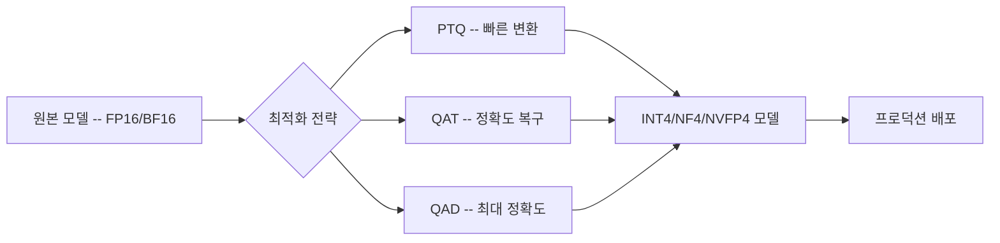

# AI 추론 양자화 (INT4/NF4) -- 2026년 기법

INT4로 75% 메모리 절감, [[knowledge-distillation|지식 증류]](Knowledge Distillation)로 90% 비용 절감. 양자화와 증류를 결합한 QAD(Quantization-Aware Distillation)가 2026년 프로덕션 표준으로 자리잡고 있다.

## 개요

LLM의 가중치와 활성화를 FP16/BF16에서 INT4, NF4, NVFP4 등 저정밀도(Low-Precision) 포맷으로 변환하여 메모리 사용량과 추론 비용을 대폭 줄이는 기법이다. 2026년에는 단순 양자화를 넘어 **양자화 + 증류 결합(QAD)** 이 주류가 됐으며, 초저정밀도(Ultra-Low Precision)에서도 정확도 손실을 최소화하는 것이 핵심 과제다. 이 기법들은 서로 스택하여 복합 효과를 달성할 수 있으며, 엣지 디바이스 배포부터 데이터센터 비용 최적화까지 전 범위에 적용된다.

## 핵심 개념

### 3단계 양자화 기법 스펙트럼

#### 1. Post-Training Quantization (PTQ)
- 학습 완료된 모델을 FP16/BF16에서 FP8, INT4, NVFP4 등으로 변환
- 캘리브레이션 데이터셋만 필요하며 재학습 불필요
- **가장 빠른 최적화 경로** -- "대규모 파운데이션 모델에서도 즉각적인 지연시간 및 처리량 개선"
- 대표 기법: GPTQ, AWQ (HuggingFace에서 1,900만+ 다운로드)

#### 2. Quantization-Aware Training (QAT)
- 학습 과정에서 양자화 노이즈를 시뮬레이션
- "순방향 루프에서 양자화 노이즈를 시뮬레이션하면서 [[lora-qlora-finetuning|역전파]]는 고정밀도로 기울기를 계산"
- PTQ만으로 부족할 때 정확도 손실을 복구하는 타겟 파인튜닝 단계

#### 3. Quantization-Aware Distillation (QAD)
- QAT와 지식 증류(Knowledge Distillation) 원리를 결합
- 소형 양자화 학생 모델이 풀 프리시전 교사 모델로부터 양자화 조건에 적응하며 학습
- 정밀도 손실에 민감한 다운스트림 태스크에서 **"최고 수준의 정확도 복구"** 달성
- 초저정밀도(FP4 이하) 시나리오의 필수 기법

### 정밀도 포맷 비교

| 포맷 | 비트 수 | 메모리 절감 (vs FP16) | 주요 특징 |
|------|---------|----------------------|-----------|
| FP8 | 8 | ~2x | 범용, Blackwell/Hopper 지원 |
| INT4 | 4 | ~4x (75%) | 가중치 양자화에 주로 사용 |
| NF4 | 4 | ~4x | QLoRA에서 도입, 정규분포 최적화 |
| NVFP4 | 4 | ~3.5x (vs FP16) | NVIDIA Blackwell 전용, 이중 스케일링 |

## 기술 상세

### 정밀도 포맷 표현 범위

| 포맷 | 표현 범위 | 비고 |
|------|----------|------|
| FP16 | -65,504 ~ +65,504 | 최대 범위, 고정밀도 |
| FP8 | -448 ~ +448 | 중간, Hopper/Blackwell 지원 |
| FP4/NVFP4 | -6 ~ +6 | 최소 범위, KV 캐시 최적화 특화 |

### 혼합 정밀도 (Mixed-Precision) 접근

실무에서는 단일 정밀도로 전체 모델을 양자화하지 않는다. KV 캐시([[kv-cache|KV Cache]])는 NVFP4로 양자화하여 롱 컨텍스트(Long-Context) 시나리오의 메모리 병목을 해결하고, 어텐션 연산은 FP8로 유지하는 등 레이어별 혼합 정밀도 전략이 일반적이다.

### 양자화 + 증류 파이프라인

1. 고정밀도 교사 모델(Teacher) 준비
2. PTQ로 학생 모델 초기 양자화
3. QAT로 양자화 노이즈 적응
4. QAD로 교사의 지식을 전달하며 최종 정확도 복구
5. 프로덕션 배포 ([[vllm-v1-engine|vLLM]]/TensorRT-LLM 통합)

### 보조 최적화 기법

양자화와 함께 적용하여 복합 효과를 달성하는 기법들:

**스페큘레이티브 디코딩 ([[eagle-3-speculative-decoding|Speculative Decoding]])**

소형 드래프트 모델이 여러 토큰을 제안하고, 메인 모델이 병렬로 검증한다. 모델 가중치 수정 없이 "순차적 지연시간을 단일 스텝으로 축소"한다. Medusa는 바닐라 디코딩 대비 2.2-3.6배 속도 향상을 달성하며, EAGLE-3는 타겟 모델 파인튜닝 없이 동작한다.

**구조적 프루닝 + 지식 증류 (Pruning + KD)**

구조적으로 가중치/레이어를 제거한 후, 작은 모델이 큰 모델의 행동을 재현하도록 학습시킨다. "영구적이고 구조적인 비용 절감"을 제공하며, 양자화와 결합하면 최적 순서는 Pruning -> KD -> Quantization (P-KD-Q)이다.

### TCO(Total Cost of Ownership) 영향

정밀도 축소는 단순히 메모리만 줄이는 것이 아니라 처리량(Throughput) 향상, 토큰당 비용(Cost per Token) 절감, 서빙 인프라 규모 축소로 이어진다. 양자화와 증류를 결합하면 동일 품질 대비 **최대 90% 추론 비용 절감**이 가능하다. 이들 기법은 NVIDIA GPU 배포 환경에서 즉시 적용 가능하며, 서로 스택하여 복합 효과를 누릴 수 있다.

### 엣지 배포 양자화 실측

| 양자화 수준 | 메모리 절감 | 품질 손실 | 적합 환경 |
|------------|-----------|----------|----------|
| 8-bit (FP8/INT8) | ~2x | <1% | 서버 배포 |
| 4-bit (INT4/NF4) | ~4x (75%) | 1-3% | 모바일/엣지 표준 |
| Sub-4-bit (2-3비트) | 4-8x | 3%+ | 극한 엣지 케이스 |

활성화 아웃라이어(activation outlier) 처리를 위한 기법:

- **SmoothQuant**: 양자화 난이도를 활성화에서 가중치로 이전하여 균일한 분포 생성
- **SpinQuant**: 회전 행렬(rotation matrix)을 사용한 아웃라이어 처리, 가중치/활성화/KV 캐시 모두 4비트 양자화에서 3% 미만 정확도 손실

KV 캐시는 3비트까지 양자화해도 품질 저하가 거의 없으며(TurboQuant: KV 캐시 3비트 + 정확도 손실 제로 + 재학습 불필요), H100에서 최대 8배 성능 향상이 보고되었다.

## 관련 문서
- [[litert-lm]]

- [[nvfp4-quantization]] -- NVIDIA Blackwell 전용 NVFP4 포맷 상세
- [[on-device-llm]] -- 엣지 배포에서의 양자화 활용
- [[kv-cache-compression]] -- KV 캐시 양자화
- [[meta-adaptive-ranking]] -- 선택적 FP8 양자화 적용 사례
- [NVIDIA 모델 최적화 5대 기법](https://developer.nvidia.com/blog/top-5-ai-model-optimization-techniques-for-faster-smarter-inference/)
- [NVIDIA Model-Optimizer GitHub](https://github.com/NVIDIA/Model-Optimizer)
