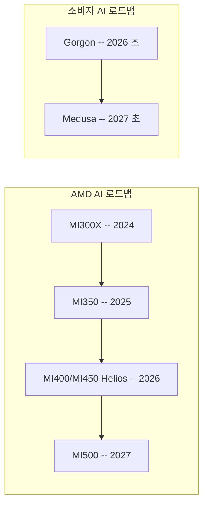

# AMD MI400/MI450 Helios

AMD의 차세대 데이터센터 AI 가속기 시리즈. HBM4 메모리 기반 19.6 TB/s 대역폭을 제공하며, 2026년 배포 예정. 소비자 시장의 Gorgon 아키텍처에서 목표하는 온디바이스 AI 10배 성능 향상과 병행하여, 데이터센터 AI 추론/학습 시장에서 NVIDIA와의 경쟁을 본격화한다.

## 개요

AMD Instinct MI400/MI450 "Helios"는 MI300 시리즈의 후속으로, NVIDIA Vera Rubin 및 Google TPU Ironwood와 직접 경쟁하는 데이터센터 AI 가속기다. HBM4 메모리를 채택하여 메모리 대역폭을 대폭 확장했으며, 이는 대규모 LLM 추론과 학습에서 핵심 병목인 메모리 대역폭 문제를 정면으로 공략한다.

## 핵심 특징

### CDNA 5 아키텍처 + TSMC 2nm
MI400 시리즈는 AMD의 **CDNA 5** 아키텍처를 기반으로 하며, **TSMC N2(2nm급)** 공정으로 제조되는 최초의 [[blackwell-ultra-b300|GPU]] 제품군이다. 이전 세대 CDNA 3(MI300X) 대비 에너지 효율과 트랜지스터 밀도가 대폭 개선되었다.

### HBM4 메모리 -- 432GB / 19.6 TB/s 대역폭
MI450 시리즈 GPU는 개당 **432GB HBM4** 메모리와 **19.6 TB/s** 메모리 대역폭을 제공한다. MI350의 288GB HBM3E 대비 **50% 용량 증가**이며, MI300X의 5.3 TB/s 대비 약 **3.7배** 대역폭 향상이다. 이는 LLM 추론에서 메모리 바운드(Memory-Bound) 워크로드의 성능을 직접 결정하는 핵심 지표다.

### 컴퓨트 성능
- **FP4**: 최대 40 PFLOPS
- **FP8**: 최대 20 PFLOPS
- FP32/FP64 지원은 MI430X 변형에서 제공 (HPC 워크로드용)

### MI400 제품 라인업

| 변형 | 핵심 용도 | 정밀도 지원 |
|------|----------|-----------|
| **MI455X** | AI 추론/학습 최대 성능 | FP4, FP8, BF16 |
| **MI440X** | AI 워크로드 범용 | FP4, FP8, BF16 |
| **MI430X** | AI + HPC 겸용 | FP4, FP8, BF16, FP32, FP64 |

### AMD AI 칩 로드맵

| 시리즈 | 세대 | 핵심 혁신 | 시기 |
|--------|------|-----------|------|
| MI300X | CDNA 3 | HBM3 192GB, 5.3 TB/s | 2024 |
| MI350 | CDNA 4 | MI300 대비 35x 추론 성능, HBM3E 288GB | 2025 |
| MI400/MI450 Helios | CDNA 5 | HBM4 432GB, 19.6 TB/s, TSMC 2nm | 2026 |
| MI500 | 차차세대 | MI300 대비 1,000x 성능 목표 | 2027 |

## 기술 상세

### 데이터센터 vs 소비자 아키텍처

AMD는 데이터센터와 소비자 시장에 별도 AI 아키텍처를 운영한다.

| 시장 | 아키텍처 | 제품 | 목표 |
|------|----------|------|------|
| 데이터센터 | Helios | MI400/MI450 | 클라우드/엔터프라이즈 AI |
| 소비자 (2026 초) | Gorgon | PC/모바일 | 온디바이스 AI 10x 성능 |
| 소비자 (2027 초) | Medusa | 차세대 PC | Gorgon 후속 |

### Helios 랙 스케일 플랫폼

Helios는 MI400 시리즈를 랙 단위로 통합하는 AI 전용 아키텍처다. Meta의 2025 OCP(Open Compute Project) 디자인을 기반으로 구축되었으며, 2026년 Q3 출시 예정이다.

| 항목 | 사양 |
|------|------|
| GPU 수 | 72x MI455X (더블 와이드 랙) |
| 총 HBM4 메모리 | 31 TB |
| 총 메모리 대역폭 | 1.4 PB/s |
| FP4 추론 성능 | **2.9 ExaFLOPS** |
| FP8 학습 성능 | **1.4 ExaFLOPS** |
| 스케일업 인터커넥트 | UALink (최초 지원 GPU) |
| 스케일아웃 네트워크 | Ultra Ethernet |

### 메모리 대역폭 경쟁 구도

| 가속기 | 메모리 | 대역폭 | 컴퓨트 (FP8) |
|--------|--------|--------|-------------|
| AMD MI455X Helios | HBM4 432GB | 19.6 TB/s | 20 PFLOPS |
| NVIDIA Rubin GPU | HBM4 | 22 TB/s | 미공개 |
| Google TPU v7 Ironwood | - | 미공개 | 미공개 |
| AMD MI300X | HBM3 192GB | 5.3 TB/s | - |

### 주요 파트너십

- **OpenAI**: 6GW 규모 GPU 공급 계약 체결. 2026년 하반기부터 1GW 데이터센터에 MI450 칩 배치 예정
- **Meta**: AMD와의 AI 칩 딜, Helios 랙이 Meta OCP 디자인 기반

### NVIDIA 대비 전략적 차별화

AMD는 NVIDIA의 CUDA 소프트웨어 생태계 독점에 대응하여 ROCm(Radeon Open Compute) 소프트웨어 스택을 강화하고 있다. [[vllm-rocm-platform]]과 같은 오픈소스 추론 엔진의 ROCm 지원 확대가 AMD 하드웨어 채택의 핵심 동력이다. UALink과 Ultra Ethernet 같은 개방형 인터커넥트 표준 채택으로 NVIDIA NVLink/NVSwitch의 독점적 생태계에 대한 대안을 제시한다.

## 관련 문서

- [[nvidia-vera-rubin]] -- 경쟁 플랫폼: NVIDIA Vera Rubin (22 TB/s HBM4)
- [[google-tpu-ironwood]] -- 경쟁 플랫폼: Google TPU v7
- [[custom-ai-chips-asic]] -- 커스텀 AI 칩 경쟁 전체 지형
- [[vllm-rocm-platform]] -- AMD ROCm 기반 vLLM 플랫폼
- [Leading AI Hardware Companies (BigDataSupply)](https://bigdatasupply.com/leading-ai-hardware-companies/)
