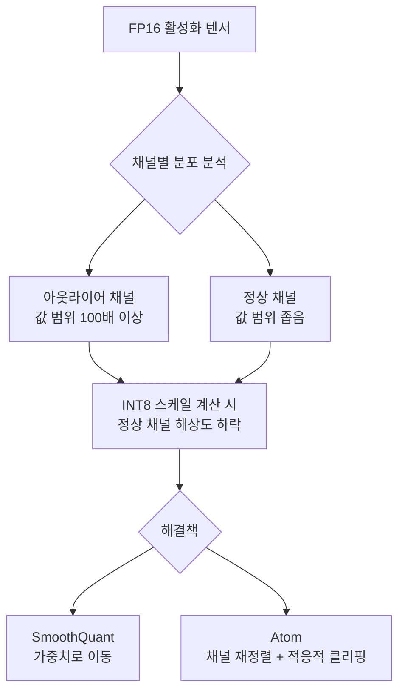
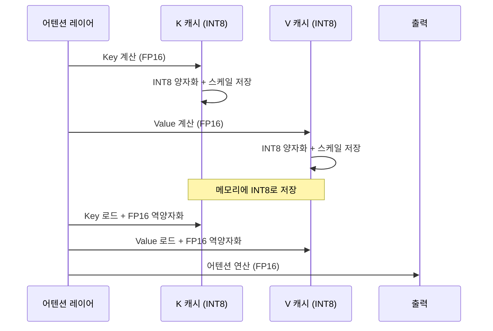
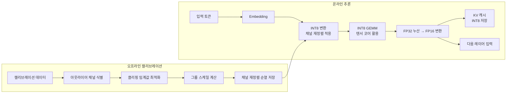

# Atom INT8 LLM 추론

## 개요

Atom은 LLM 추론에서 가중치(Weight), 활성화(Activation), KV 캐시를 모두 INT8로 양자화하는 통합 프레임워크다. 기존 INT8 양자화 방식이 활성화값 아웃라이어(outlier) 문제로 정확도 손실이 컸던 것을 해결하기 위해, 채널 재정렬(channel reordering)과 적응적 클리핑(adaptive clipping) 등 아웃라이어 처리 기법을 도입했다.

W8A8 (가중치 8비트, 활성화 8비트) 전 레이어 양자화를 실현함으로써 FP16 대비 **1.5-2x** 메모리 절감과 처리량 향상을 달성한다.

## 배경: LLM 활성화의 아웃라이어 문제

[[smoothquant|SmoothQuant]] 연구에서 밝혀졌듯, LLM(특히 OPT, LLaMA 계열)의 활성화값은 특정 채널에 매우 큰 값(아웃라이어)이 집중되는 현상을 보인다. 이 특성이 INT8 양자화를 어렵게 만든다.



**아웃라이어가 INT8에 미치는 영향**
- 클리핑 없이 INT8 변환 시: 아웃라이어에 맞춘 스케일 → 나머지 값 정밀도 붕괴
- 단순 클리핑 시: 아웃라이어 값 손실 → 모델 출력 품질 저하
- Atom의 접근: 아웃라이어 채널을 분리해 별도 처리

## Atom의 핵심 기법

### 1. 채널 재정렬 (Channel Reordering)

아웃라이어가 집중된 채널을 식별하고, 해당 채널들을 그룹의 끝으로 재정렬한다. 이후 아웃라이어 그룹에는 FP16 또는 더 넓은 범위의 INT8 클러스터를 적용한다.

```python
# 채널 재정렬 (개념적 코드)
import torch

def reorder_channels_by_outlier(activation: torch.Tensor, threshold: float = 6.0):
    """아웃라이어 채널을 식별하고 재정렬"""
    channel_max = activation.abs().max(dim=0).values  # 채널별 최댓값
    outlier_mask = channel_max > threshold * channel_max.median()

    # 정상 채널 인덱스, 아웃라이어 채널 인덱스 분리
    normal_idx = (~outlier_mask).nonzero().squeeze()
    outlier_idx = outlier_mask.nonzero().squeeze()

    # 재정렬: 정상 채널 먼저, 아웃라이어 채널 나중
    perm = torch.cat([normal_idx, outlier_idx])
    return activation[:, perm], perm
```

### 2. 적응적 클리핑 (Adaptive Clipping)

각 레이어와 그룹에 맞춰 최적의 클리핑 임계값을 캘리브레이션 데이터 기반으로 계산한다. 고정 클리핑보다 정확도를 크게 향상시킨다.

최적 클리핑 임계값 $\alpha^*$는 다음을 최소화한다:

$$\alpha^* = \arg\min_\alpha \mathbb{E}\left[\|W - Q_\alpha(W)\|_F^2\right]$$

여기서 $Q_\alpha$는 클리핑 임계값 $\alpha$를 사용하는 양자화 함수다.

### 3. 혼합 정밀도 KV 캐시 양자화

KV(Key-Value) 캐시는 배치 크기와 시퀀스 길이에 비례해 메모리를 차지한다. Atom은 KV 캐시를 INT8로 압축하되, 어텐션 연산의 정밀도를 보존하기 위해 헤드(head)별 적응적 스케일을 적용한다.



### 4. 그룹 양자화 (Group Quantization)

행렬을 소규모 그룹으로 나눠 그룹별 스케일과 제로포인트를 계산한다. 그룹 크기 128이 정확도/오버헤드 균형에 적합하다.

$$W_{q,g} = \text{clamp}\left(\text{round}\left(\frac{W_g}{s_g}\right) + z_g, -128, 127\right)$$

여기서 $s_g$는 그룹 $g$의 스케일, $z_g$는 제로포인트다.

## 전체 시스템 아키텍처



## 성능 비교

### 처리량 (A100 80GB 기준)

| 설정 | 처리량 (토큰/초) | 메모리 사용 |
|------|-----------------|-------------|
| FP16 기준 | 1.0x | 100% |
| W8A8 naive | 0.9x | 55% |
| SmoothQuant W8A8 | 1.3x | 55% |
| **Atom W8A8** | **1.7x** | **52%** |
| INT4 (AWQ) | 2.1x | 35% |

Atom은 INT4보다는 느리지만 정확도가 중요한 작업에서 합리적인 선택이다.

### 정확도 (Llama-2-7B PPL on Wikitext-2)

| 방법 | PPL | 정확도 손실 |
|------|-----|------------|
| FP16 | 5.47 | 기준 |
| SmoothQuant W8A8 | 5.73 | +0.26 |
| **Atom W8A8** | **5.58** | **+0.11** |
| AWQ W4A16 | 5.68 | +0.21 |

활성화 아웃라이어 처리로 SmoothQuant 대비 PPL 손실을 절반 수준으로 줄인다.

## 실무 적용 지침

**Atom이 유리한 경우**
- INT8 추론을 사용하고 싶으나 기존 W8A8 방식의 정확도 저하가 문제인 경우
- KV 캐시 메모리 압박이 심한 긴 컨텍스트 서빙 환경
- 배치 처리 위주의 오프라인 추론 파이프라인

**한계**
- 캘리브레이션 데이터가 필요 - 도메인 미스매치 시 정확도 저하 가능
- 채널 재정렬 과정에서 행렬 레이아웃 변경 → 커스텀 커널 의존
- 디코딩 단계보다 프리필(prefill) 단계에서 효과가 더 큼

```python
# Atom INT8 추론 예시 (개념적)
from atom import AtomQuantizer

quantizer = AtomQuantizer(
    weight_bits=8,
    act_bits=8,
    group_size=128,
    kv_cache_bits=8,
    outlier_threshold=6.0,
)

# 캘리브레이션 (오프라인)
quantizer.calibrate(model, calibration_dataloader)

# INT8 모델로 변환
int8_model = quantizer.quantize(model)

# 추론 (일반 모델과 동일 인터페이스)
output = int8_model.generate(input_ids, max_new_tokens=512)
```

## 관련 문서

- [[smoothquant]] - 활성화-가중치 공동 양자화, Atom의 선행 연구
- [[kv-cache-quantization]] - KV 캐시 압축 기법 일반
- [[gptq-quantization]] - 보정 기반 INT4 양자화
- [[awq-quantization]] - 활성화 인식 INT4 양자화
- [[ai-inference-quantization-2026]] - 2026년 추론 양자화 동향
- [[fp6-llm-quantization]] - FP6 부동소수점 양자화 (같은 큐)
- [[omniquant-calibration]] - 학습 가능 양자화 (같은 큐)
- [[spqr-sparse-quantized]] - 희소+양자화 혼합 표현 (같은 큐)
