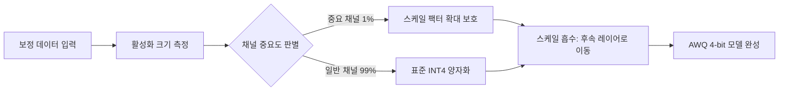

# AWQ 양자화 (Activation-Aware Weight Quantization)

## 개요

**AWQ(Activation-Aware Weight Quantization)**는 MIT의 Ji Lin et al.이 2023년 제안한 4-bit PTQ(사후 학습 양자화) 기법이다. 핵심 통찰은 "모든 가중치가 동등하게 중요하지 않다"는 것이다. 활성화(activation) 분포를 분석해 **소수의 중요한 가중치**를 식별하고, 이들을 보호함으로써 양자화 오차를 최소화한다. [[gptq-quantization|GPTQ]]와 함께 GPU 4-bit 추론의 양대 표준이며, Marlin 커널을 통해 특히 배치 처리에서 뛰어난 성능을 발휘한다.

## 핵심 원리: 활성화 기반 가중치 중요도

LLM 가중치를 동일한 방식으로 양자화하면 일부 채널에서 심각한 정밀도 손실이 발생한다. AWQ의 발견은 다음과 같다:

> "가중치의 약 1%에 해당하는 채널이 모델 성능에 불균형적으로 큰 영향을 미친다. 이 채널들은 활성화 분포에서 큰 크기(magnitude)를 가진 채널과 일치한다."



이 다이어그램은 AWQ가 활성화 분포를 기반으로 중요 채널을 선별 보호하는 과정을 나타낸다.

## 스케일 팩터와 스케일 흡수

중요한 가중치를 직접 FP16으로 유지하면 메모리 절감 효과가 줄어든다. AWQ는 대신 **스케일 팩터(scale factor)**를 사용한다:

- 중요 채널의 가중치를 스케일 팩터 $s$로 나누어 크기를 줄인 뒤 양자화
- 동시에 해당 채널을 통과하는 활성화에 $s$를 곱해 수학적 동치 유지
- 이 스케일 변환은 인접한 레이어의 행렬 연산에 **흡수(absorb)**되어 런타임 오버헤드가 없음

$$\hat{W} = \text{Quant}(W / s), \quad \hat{X} = X \cdot s$$

결과적으로 모든 가중치를 INT4로 저장하면서도, 중요 채널의 상대적 정밀도를 높이는 효과를 얻는다.

## Marlin 커널: 배치 추론의 강자

AWQ의 실용적 강점 중 하나는 **Marlin 커널**과의 통합이다. Marlin은 vLLM 프로젝트에서 개발된 고성능 CUDA 커널로, AWQ 4-bit 가중치에 특화되어 있다.

| 시나리오 | FP16 대비 AWQ+Marlin 속도 |
|----------|--------------------------|
| 배치 크기 1 (디코딩) | 약 1.5-2x 빠름 |
| 배치 크기 16 | 약 2.5-3x 빠름 |
| 배치 크기 64 | 약 3-4x 빠름 |

배치 크기가 클수록 이점이 커지는 이유는 Marlin이 행렬-행렬 곱셈(GEMM)을 tensor core에 맞게 최적화했기 때문이다. 단일 요청 디코딩보다 배치 서빙에 특히 유리하다.

## GPTQ와의 비교

| 항목 | AWQ | [[gptq-quantization\|GPTQ]] |
|------|-----|------|
| 핵심 방법 | 활성화 기반 스케일 보호 | Hessian 오차 보정 |
| 칼리브레이션 데이터 | 소량(512개 이내) 충분 | 512-1024개 필요 |
| 정밀도(평균) | GPTQ와 유사 또는 우위 | AWQ와 유사 |
| 커널 생태계 | Marlin(vLLM), TinyChat | AutoGPTQ, ExLlamaV2 |
| 배치 효율 | 우수 (Marlin) | 보통 |
| 칼리브레이션 시간 | 빠름 | 느림 (레이어별 역행렬) |

## 실용적 적용

```python
# llm-awq를 이용한 AWQ 양자화
from awq import AutoAWQForCausalLM
from transformers import AutoTokenizer

model_path = "meta-llama/Llama-3-8B-Instruct"
quant_config = {
    "zero_point": True,  # 비대칭 양자화
    "q_group_size": 128, # 그룹 크기
    "w_bit": 4,          # 4-bit
    "version": "GEMM",   # 커널 타입
}

model = AutoAWQForCausalLM.from_pretrained(model_path)
tokenizer = AutoTokenizer.from_pretrained(model_path)
model.quantize(tokenizer, quant_config=quant_config)
model.save_quantized("llama-3-8b-awq")
```

vLLM과 통합 시에는 `--quantization awq` 플래그 하나로 Marlin 커널이 자동 활성화된다.

## 하드웨어 친화성

AWQ의 스케일 흡수 방식은 하드웨어 친화적이다. 런타임에 특수한 역양자화 연산이 최소화되며, 표준 INT4 GEMM 연산에 가깝게 실행된다. 이로 인해 NVIDIA GPU 외에도 엣지 디바이스(Apple Silicon의 Core ML, Qualcomm AI 스택)에서도 지원되는 사례가 늘고 있다.

## 한계

- **아키텍처 민감성**: 활성화 분포가 특이한 일부 모델(MoE 아키텍처의 일부 변종 등)에서는 효과가 낮을 수 있다.
- **W4A16 한정**: GPTQ와 마찬가지로 가중치만 양자화하며, 활성화는 FP16을 유지한다.
- **동적 범위 모델**: 활성화가 시퀀스에 따라 크게 변하는 경우 고정 스케일 팩터의 정밀도가 저하될 수 있다.

## 관련 문서

- [[quantization-model-compression]] - 양자화 기법 전반 개요
- [[gptq-quantization]] - Hessian 기반 대안적 4-bit 양자화
- [[ai-inference-quantization-2026]] - 2026년 양자화 트렌드
- [[model-serving]] - 양자화 모델의 서빙 인프라
- [[nvfp4-quantization]] - NVIDIA 차세대 부동소수점 양자화
