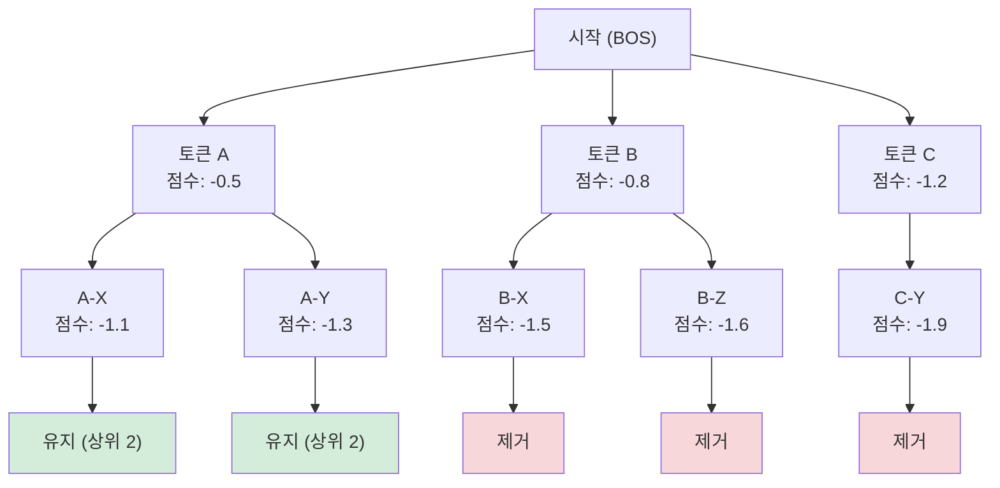

# 빔 서치와 디코딩 전략

## 개요

언어 모델(language model)이 텍스트를 생성할 때, 모델이 출력하는 것은 다음 토큰에 대한 확률 분포다. 이 분포에서 실제 토큰을 선택하는 과정을 **디코딩(decoding)** 이라 한다. 디코딩 전략은 출력 품질, 다양성, 속도에 직접적인 영향을 미친다.

## 탐욕 디코딩 (Greedy Decoding)

가장 단순한 방식으로, 매 스텝마다 확률이 가장 높은 토큰을 선택한다.

- **장점**: 구현 간단, 추론 빠름
- **단점**: 지역 최적(local optimum)에 빠지기 쉬움. "나는 오늘" 다음에 "밥을"을 선택하면, 이후 선택지가 제한됨
- **실패 패턴**: 반복 루프(repetition loop) 발생 빈번

탐욕 디코딩은 각 스텝에서 $\hat{y}_t = \arg\max_y P(y \mid y_{<t}, x)$를 선택한다. 시퀀스 전체의 최적 해를 보장하지 않는다.

## 빔 서치 (Beam Search)

빔 서치는 탐욕 디코딩을 일반화한 방법으로, 한 번에 **빔 너비(beam width)** $k$개의 후보 시퀀스를 유지한다.

### 동작 원리

1. 초기 스텝에서 확률 상위 $k$개 토큰을 후보로 선택
2. 각 후보에서 다음 스텝 $k$개를 확장 -> $k \times V$개 후보 생성 (V: 어휘 크기)
3. 전체 시퀀스 점수 기준 상위 $k$개만 유지
4. EOS 토큰이나 최대 길이에서 종료

위 다이어그램은 빔 너비 2인 빔 서치에서, 각 스텝마다 확장 후 상위 2개 시퀀스만 유지하는 과정을 나타낸다.

### 시퀀스 점수 (Sequence Score)

단순 로그 확률 합산은 길이가 긴 시퀀스에 불리하다. 이를 보정하기 위해 **길이 패널티(length penalty)** 를 적용한다:

$$\text{score}(Y) = \frac{1}{|Y|^\alpha} \sum_{t=1}^{|Y|} \log P(y_t \mid y_{<t}, x)$$

- $\alpha = 0$: 패널티 없음 (짧은 시퀀스 선호)
- $\alpha = 1$: 평균 로그 확률
- $\alpha > 1$: 긴 시퀀스 선호

### 빔 너비 트레이드오프

| 빔 너비 | 품질 | 속도 | 메모리 |
|---------|------|------|--------|
| 1 (탐욕) | 낮음 | 가장 빠름 | 최소 |
| 4-5 | 균형 | 보통 | 보통 |
| 10-20 | 높음 | 느림 | 큼 |
| 50+ | 수익 감소 | 매우 느림 | 매우 큼 |

실제로 번역 시스템에서는 빔 너비 4-6이 일반적이다. 이를 초과하면 품질 향상이 미미해진다.

## 샘플링 전략 (Sampling Strategies)

번역처럼 정답이 하나인 작업과 달리, 창의적 생성에서는 **샘플링(sampling)** 이 더 다양하고 자연스러운 출력을 만든다.

### 온도 샘플링 (Temperature Sampling)

소프트맥스(softmax) 온도 $T$로 분포의 뾰족함을 조절한다:

$$P_T(y_i) = \frac{\exp(\text{logit}_i / T)}{\sum_j \exp(\text{logit}_j / T)}$$

- $T \to 0$: 탐욕 디코딩에 수렴 (가장 확률 높은 토큰만)
- $T = 1$: 모델 원래 분포
- $T > 1$: 분포가 평탄해져 더 다양한 출력

### Top-k 샘플링

확률 상위 $k$개 토큰만 후보로 유지하고, 나머지는 0으로 마스킹한 뒤 샘플링.

- $k = 50$이 일반적 기본값
- 문제: 분포 형태가 변해도 $k$가 고정됨. 분포가 넓을 때 불량 토큰 포함, 좁을 때 좋은 토큰 제외 가능

### Top-p (뉴클리어스) 샘플링

누적 확률이 $p$에 도달할 때까지 상위 토큰을 포함시키는 방식 (Holtzman et al. 2020).

$$\min S \text{ s.t. } \sum_{y_i \in S} P(y_i) \geq p$$

- $p = 0.9$~$0.95$가 일반적
- 분포가 뾰족하면 소수 토큰, 평탄하면 다수 토큰 포함 -> 동적 후보 집합
- Top-k보다 실용적으로 더 나은 결과를 내는 경우 많음

### Min-p 샘플링

최고 확률 토큰 대비 일정 비율(예: 5%) 미만인 토큰을 제거하는 방식. Top-p의 대안으로 연구되고 있다.

## 전략 비교표

| 전략 | 결정론적 | 다양성 | 품질 보장 | 주요 파라미터 |
|------|----------|--------|-----------|---------------|
| 탐욕 | 예 | 없음 | 지역 최적 | - |
| 빔 서치 | 예 | 제한적 | 빔 내 최적 | beam_width, length_penalty |
| 온도 샘플링 | 아니오 | 높음 | 낮음 | temperature |
| Top-k | 아니오 | 중간 | 중간 | k |
| Top-p | 아니오 | 중간~높음 | 중간 | p |
| 빔 + Top-p | 아니오 | 중간 | 높음 | 복합 |

## 실무 가이드라인

- **번역/요약**: 빔 서치 (beam=4, length_penalty=0.6~1.0)
- **창의적 글쓰기**: Top-p 0.9 + Temperature 0.8~1.0
- **코드 생성**: 낮은 온도 (0.2~0.4) + Top-p
- **다양성이 중요한 경우**: 높은 온도 + Top-p 0.95
- **사실 정확도 중요**: 낮은 온도, 탐욕 또는 빔 서치

대부분의 최신 LLM API에서 기본값은 Top-p 0.95 + Temperature 1.0 내외다.

## 관련 문서

- [[스펙큘러티브 디코딩]] - 디코딩 속도를 드라마틱하게 높이는 기법
- [[KV 캐시]] - 디코딩 시 어텐션 계산 재사용
- [[언어 모델 평가 지표]] - BLEU, ROUGE 등 생성 품질 측정
- [[할루시네이션]] - 잘못된 디코딩이 유발하는 대표적 문제
