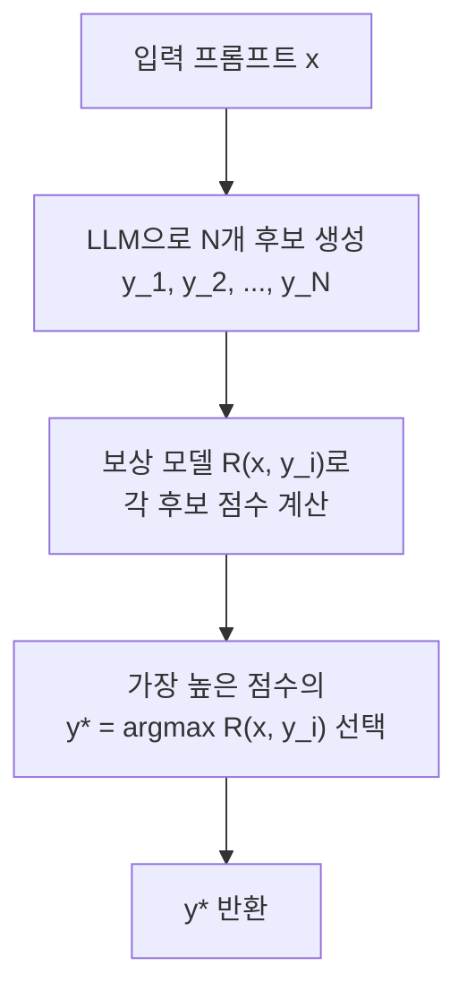
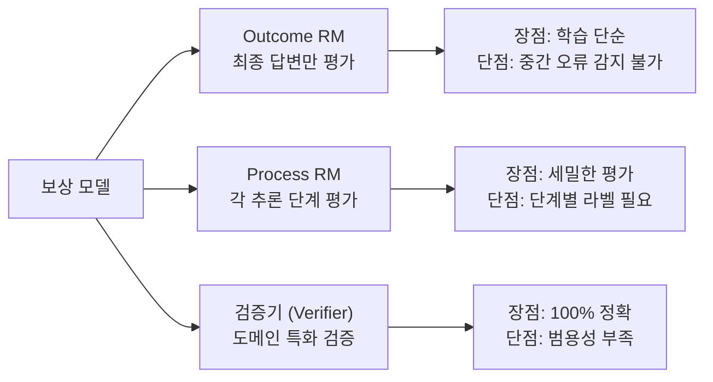
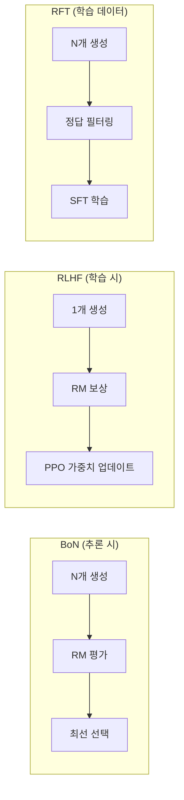

# Best-of-N Sampling (Rejection Sampling)

## 정의

**Best-of-N Sampling** (BoN, 또는 Rejection Sampling)은 LLM이 동일한 프롬프트에 대해 **N개의 후보 응답을 독립적으로 생성**한 뒤, **보상 모델(Reward Model) 또는 검증기(Verifier)**로 최선의 응답을 선택하는 추론 전략이다. 모델 가중치를 변경하지 않고 추론 시점에서 더 많은 컴퓨트를 투입하여 품질을 높이는, [[test-time-compute|테스트 타임 컴퓨트]] 스케일링의 가장 기본적인 형태다.

## 왜 중요한가

- RLHF의 가장 단순한 대안이다 -- 복잡한 PPO 학습 파이프라인 없이 보상 모델만으로 성능 향상
- 추론 비용을 N배로 올리면 성능이 log(N)에 비례하여 향상된다는 스케일링 법칙이 존재
- OpenAI o1/o3, DeepSeek-R1 등 [[ai-reasoning-models|추론 모델]]의 내부 탐색 메커니즘의 이론적 기반
- **Rejection Sampling Fine-tuning (RFT)**으로 확장하면 학습 데이터 품질을 증폭하는 데이터 증강 기법이 된다

## 기본 알고리즘

이 다이어그램은 Best-of-N Sampling의 기본 흐름을 보여준다. N개를 생성하고 보상 모델로 최선을 선택한다.

### 수학적 정의

입력 $x$에 대해 LLM 정책 $\pi$에서 N개를 독립 샘플링:

$$y_1, y_2, \ldots, y_N \sim \pi(\cdot | x)$$

보상 모델 $R$로 최선을 선택:

$$y^* = \arg\max_{i \in \{1, \ldots, N\}} R(x, y_i)$$

## 스케일링 법칙

### BoN의 이론적 성능

Best-of-N의 기대 보상은 N의 증가에 따라 **로그적으로** 향상된다:

$$\mathbb{E}[\max(R_1, \ldots, R_N)] \approx \mu + \sigma \cdot \sqrt{2 \ln N}$$

여기서 $\mu$는 보상 분포의 평균, $\sigma$는 표준편차다.

### 컴퓨트-성능 트레이드오프

| N (후보 수) | 상대 컴퓨트 | 기대 성능 향상 | 실무 판단 |
|-------------|-----------|--------------|----------|
| 1 | 1x | baseline | 기본 |
| 4 | 4x | +1.7$\sigma$ | 비용 효율 최적 구간 |
| 16 | 16x | +2.3$\sigma$ | 고품질 필요 시 |
| 64 | 64x | +2.9$\sigma$ | 수확 체감 시작 |
| 256 | 256x | +3.3$\sigma$ | 극단적 품질 요구 시에만 |

N=4에서 N=16으로 4배의 컴퓨트를 추가 투입해도 성능 향상은 0.6$\sigma$에 불과하다. 실무적으로 **N=4~16이 비용 효율적 구간**이다.

## 보상 모델의 역할

BoN의 성능은 **보상 모델의 품질**에 직결된다. 보상 모델이 잘못된 응답에 높은 점수를 주면 BoN도 잘못된 응답을 선택한다.

### 보상 모델 유형

이 다이어그램은 BoN에서 사용되는 세 가지 보상 모델 유형과 각각의 장단점을 보여준다.

| 유형 | 설명 | 예시 |
|------|------|------|
| **Outcome RM (ORM)** | 최종 답변에 대한 전체 점수 | RLHF 보상 모델 |
| **[[process-reward-models\|Process RM (PRM)]]** | 각 추론 단계에 대한 점수 | Math-Shepherd, PRM800K |
| **Verifier** | 도메인 특화 정답 검증기 | 단위 테스트, 수학 풀이 검산 |

### ORM vs PRM in BoN

Lightman et al. (2023)의 "Let's Verify Step by Step"에서 PRM이 ORM보다 BoN 성능이 우수함을 입증했다:

- MATH 벤치마크에서 PRM + BoN이 ORM + BoN 대비 **+8%p** 향상
- PRM은 중간 단계의 오류를 감지하여 "우연히 정답에 도달한" 응답을 필터링

## RLHF와의 관계

이 다이어그램은 BoN(추론), RLHF(학습), RFT(데이터 증강)가 보상 모델을 각기 다른 시점에서 활용하는 방식을 비교한다.

| 측면 | BoN | RLHF (PPO) |
|------|-----|------------|
| 적용 시점 | 추론 시 | 학습 시 |
| 가중치 변경 | 없음 | 있음 (정책 업데이트) |
| 보상 모델 사용 | 선택 기준 | 보상 신호 |
| 컴퓨트 비용 | 추론마다 N배 | 학습 1회, 추론은 1x |
| 성능 상한 | 기존 정책의 상위 분위 | 정책 자체가 개선 |

BoN은 기존 정책의 **상위 꼬리(upper tail)**에서 샘플을 선택하는 것이므로, 정책 자체를 개선하는 RLHF보다 성능 상한이 낮다. 하지만 구현이 압도적으로 단순하다.

## Rejection Sampling Fine-tuning (RFT)

BoN을 학습 데이터 증강에 적용한 변형이다. Yuan et al. (2023)의 "Scaling Relationship on Learning Mathematical Reasoning with Large Language Models"에서 제안했다.

### RFT 파이프라인

1. 학습 데이터의 각 문제에 대해 N개 응답을 생성
2. 정답과 일치하는 응답만 필터링 (rejection sampling)
3. 필터링된 고품질 데이터로 SFT (Supervised Fine-tuning) 수행

### RFT의 효과

- LLaMA 7B에 RFT를 적용하면 GSM8K 정확도가 **35% -> 50%** 향상
- 소량의 시드 데이터에서 대량의 고품질 학습 데이터를 생성하는 자가 증강 효과
- DeepSeek-Math가 RFT를 대규모로 적용하여 수학 벤치마크에서 경쟁력 있는 성능을 달성

## [[test-time-compute|테스트 타임 컴퓨트]] 전략 내 위치

BoN은 테스트 타임 컴퓨트 스케일링의 스펙트럼에서 가장 단순한 위치에 있다:

| 전략 | 복잡도 | 장점 | 단점 |
|------|--------|------|------|
| **BoN** | 낮음 | 구현 단순, 병렬화 용이 | N에 대해 로그적 개선 |
| CoT-SC (다수결) | 낮음 | 보상 모델 불필요 | 정답이 다수인 경우만 |
| Tree Search (ToT) | 중간 | 가지치기로 효율적 | 평가 함수 설계 필요 |
| MCTS + PRM | 높음 | 단계별 탐색 최적화 | 구현 복잡, PRM 필요 |
| 내재화 (o1/o3) | 최고 | 추론 시 1x 비용 | 특수 학습 파이프라인 필요 |

## 실무 적용 가이드

1. **N 선택**: 일반적으로 N=4~8에서 시작. 비용 대비 효과를 측정하며 조절
2. **보상 모델 선택**: 도메인에 맞는 검증기가 있으면 최우선 사용. 없으면 범용 RM
3. **병렬 생성**: N개 후보를 동시에 생성하면 지연 시간은 1개 생성과 동일 (처리량만 N배)
4. **temperature 조절**: temperature가 너무 낮으면 N개가 모두 비슷해서 BoN 효과가 감소. 0.7-1.0 권장
5. **[[decoding-strategies|디코딩 전략]]과 결합**: top-p/temperature 샘플링으로 다양성을 확보한 뒤 BoN으로 품질 필터링

## 관련 문서

- [[test-time-compute]] -- BoN이 속하는 추론 시간 컴퓨트 스케일링 패러다임
- [[process-reward-models]] -- BoN의 선택 품질을 결정하는 단계별 보상 모델
- [[decoding-strategies]] -- BoN과 결합되는 샘플링/디코딩 전략
- [[reward-model-training]] -- BoN에서 사용하는 보상 모델의 학습 방법
- [[ai-reasoning-models]] -- BoN의 원리를 내재화한 o1/o3 추론 모델
