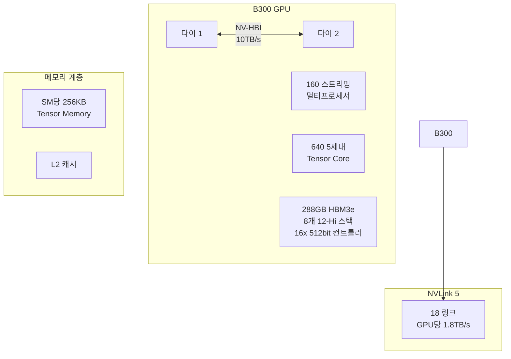
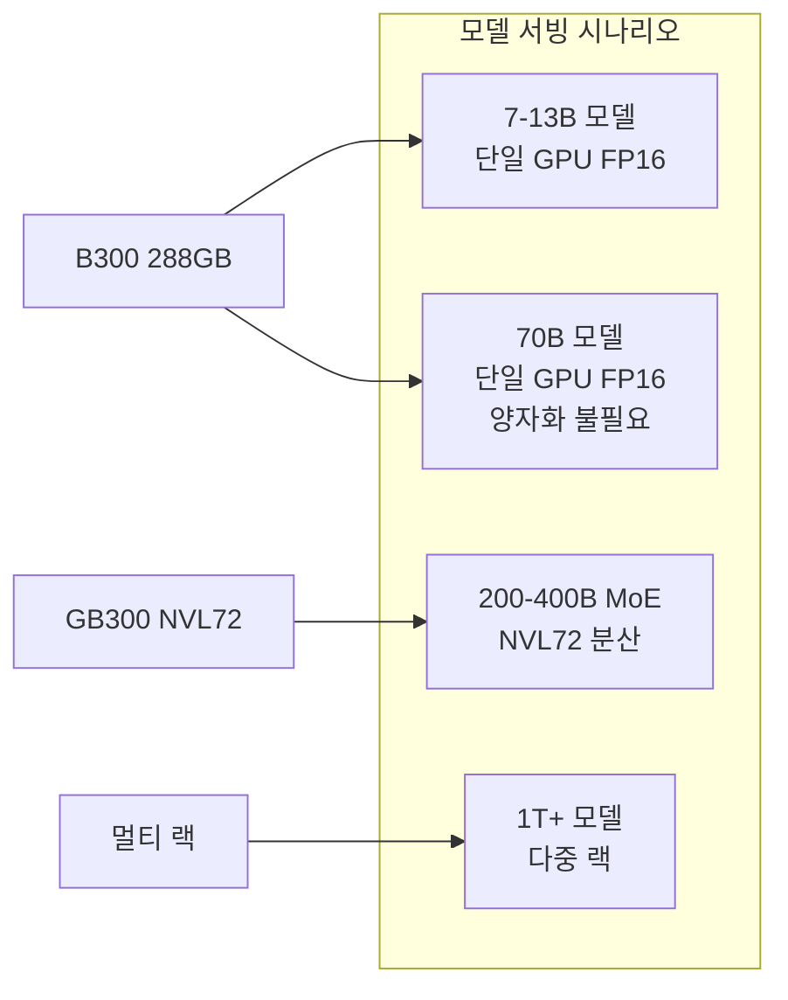

# Blackwell Ultra B300

NVIDIA Blackwell Ultra B300은 288GB HBM3e 메모리, 8TB/s 대역폭, 14 PFLOPS FP4 연산 성능을 갖춘 데이터센터용 AI GPU다. B200 대비 메모리 50% 증가, FP4 성능 55% 향상을 달성했으며, GB300 NVL72 랙 구성 시 1.1 ExaFLOPS FP4 연산이 가능하다. 2026년 1월 출시.

## 왜 지금 중요한가

AI 모델의 규모가 1T 파라미터를 넘어서고, 추론 워크로드가 학습을 압도하는 2026년에 B300은 세 가지 핵심 병목을 동시에 해결한다: (1) 288GB HBM3e로 70B 모델을 [[ai-inference-quantization-2026|양자화]] 없이 FP16으로 단일 GPU에서 구동, (2) NVFP4 일급 지원으로 추론 처리량 극대화, (3) NVLink 5로 최대 576 GPU 논-블로킹 토폴로지 구성. DeepSeek V4, Llama 4 Behemoth 같은 초대형 MoE 모델의 효율적 서빙을 가능하게 하는 인프라 기반이다.

## 핵심 사양

| 항목 | B300 (Blackwell Ultra) | B200 (Blackwell) | H200 (Hopper) |
|------|----------------------|------------------|---------------|
| HBM 용량 | 288GB HBM3e | 192GB HBM3e | 141GB HBM3e |
| 메모리 대역폭 | 8 TB/s | 8 TB/s | 4.8 TB/s |
| FP4 성능 | 14 PFLOPS | 9 PFLOPS | - |
| [[nvfp4-quantization|FP8]] 성능 | 7 PFLOPS | 4.5 PFLOPS | ~2 PFLOPS |
| FP16 성능 | 3.5 PFLOPS | 2.25 PFLOPS | ~1 PFLOPS |
| NVLink 대역폭 | 1.8 TB/s (NVLink 5) | 1.8 TB/s | 900 GB/s |
| 어텐션 가속 | 10.7 TExps/s | 5 TExps/s | 4.5 TExps/s |
| TDP | 1,400W | 1,000W | 700W |
| 공정 | TSMC 4NP | TSMC 4NP | TSMC 4NP |
| 트랜지스터 | 208B | 208B | 80B |

## 아키텍처 상세

### 듀얼 레티클 설계

B300은 TSMC 4NP 공정으로 제조된 두 개의 다이를 NV-HBI(NVIDIA High Bandwidth Interface) 10TB/s 인터페이스로 연결하는 듀얼 레티클 구조를 채택한다. 총 208B 트랜지스터, 160개 스트리밍 멀티프로세서(SM)를 탑재한다.

### 5세대 Tensor Core

SM당 4개, 총 640개의 5세대 Tensor Core를 내장한다. 핵심 개선점:

- **NVFP4 일급 지원**: FP4 정밀도에서 14 PFLOPS, FP8 대비 메모리 사용량 ~1.8배 절감하면서 거의 동등한 정확도 유지
- **이중 스레드 블록 MMA**: 매트릭스 곱-누적 연산의 병렬성 향상
- **SM당 256KB Tensor Memory (TMEM)**: 온-칩 메모리 증가로 레이턴시 감소

### 어텐션 메커니즘 가속

SFU(Special Function Unit) 처리량이 핵심 명령에서 2배 향상되었다. 소프트맥스 지연 시간 단축으로 어텐션 계층 연산 속도가 최대 2배 증가하며, 이는 LLM 추론에서 가장 큰 병목인 어텐션 연산을 직접 가속한다.

## 시스템 구성

### GB300 NVL72 랙

| 항목 | 사양 |
|------|------|
| GPU 수 | 72 (36 Grace Blackwell Ultra 슈퍼칩) |
| 총 FP4 성능 | 1.1 ExaFLOPS |
| 총 GPU 메모리 | ~20.7 TB |
| 인터커넥트 | NVLink 5 + NVLink Switching |
| 냉각 | 액체 냉각 |
| 최대 확장 | 576 GPU 논-블로킹 토폴로지 |

### DGX B300

| 항목 | 사양 |
|------|------|
| GPU | 8x B300 |
| CPU | Intel Xeon 6776P |
| 총 GPU 메모리 | 2.3 TB |
| 네트워킹 | ConnectX-8, 1.6T 대역폭 |

### HGX B300

8 GPU 표준 구성, CUDA 및 NVLink 완벽 호환.

## 가격 및 가용성

| 구성 | 가격 |
|------|------|
| B300 단일 GPU | ~$53,000 |
| DGX B300 시스템 | $400,000-500,000 |
| 클라우드 (스팟) | ~$2.90/시간 |
| 클라우드 (온디맨드) | ~$18/시간 |
| 출시 | 2026년 1월 |

## 실무 적용 의미

- **70B 모델 단일 GPU**: 288GB VRAM으로 70B 모델을 양자화 없이 FP16으로 단일 GPU에서 서빙 가능. H200(141GB)에서는 불가능했던 시나리오
- **FP4 추론 최적화**: NVFP4 일급 지원으로 추론 처리량이 FP8 대비 ~2배. [[ltx-2]] 같은 대형 생성 모델의 실시간 서빙에 핵심
- **전력 효율 과제**: 1,400W TDP는 B200(1,000W) 대비 40% 증가. 8GPU 시스템 기준 ~11.2kW로 액체냉각이 필수
- **어텐션 가속 2배**: LLM 추론에서 소프트맥스/어텐션이 차지하는 비율이 높은 만큼, 10.7 TExps/s 어텐션 가속은 토큰/초 처리량에 직접적 영향

## 관련 문서

- [[dgx-spark]] - Blackwell 아키텍처의 개인용 버전 (GB10)
- [[nemoclaw]] - B300에서 실행되는 에이전틱 AI 런타임
- [[ltx-2]] - B300의 NVFP4/NVFP8 양자화 최적화 대상 모델
