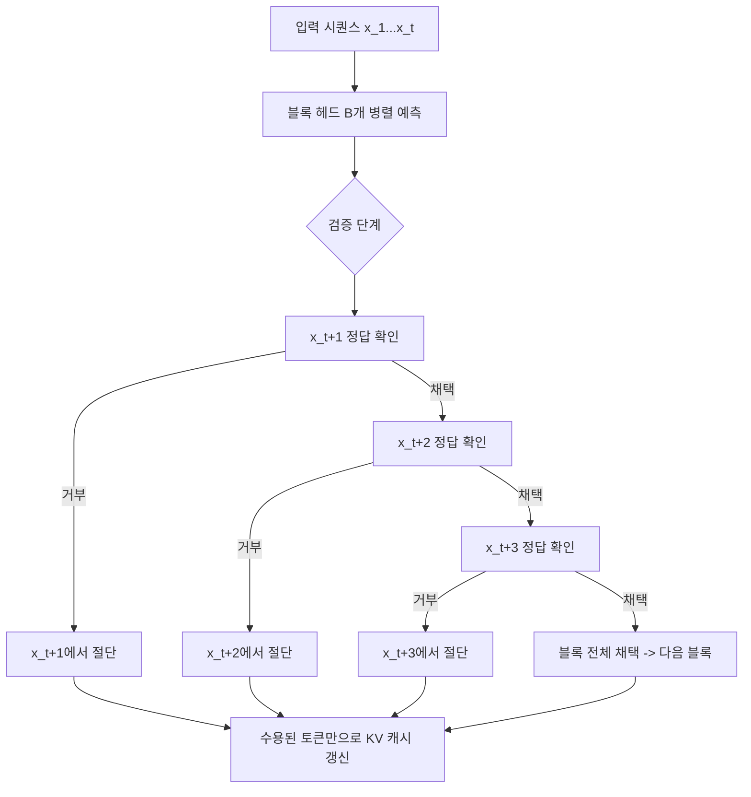

# 블록단위 병렬 디코딩 (Blockwise Parallel Decoding)

## 개요

블록단위 병렬 디코딩(Blockwise Parallel Decoding)은 자기회귀(autoregressive) LLM 추론의 순차적 병목을 완화하기 위해, 고정 크기 블록 단위로 여러 토큰을 동시에 예측한 뒤 정답 토큰만 수용하는 추론 가속 기법이다. [[speculative-decoding]]의 변형 중에서도 드래프트 구조가 가장 단순한 방식에 속한다.

핵심 아이디어: 한 번의 포워드 패스(forward pass)로 $B$개 위치의 토큰을 병렬로 예측하고, 실제 검증 단계에서 틀린 위치부터 잘라내어 채택(accept)한다.

## 왜 필요한가

표준 자기회귀 디코딩은 토큰을 하나씩 생성하므로 $N$개 토큰을 생성하는 데 $N$번의 순차적 GPU 포워드 패스가 필요하다. GPU는 대규모 병렬 연산에 최적화되어 있지만 이 패턴에서는 메모리 대역폭(memory-bandwidth) 병목이 지배적이 된다.

블록단위 병렬 디코딩은 다음을 목표로 한다:
- **배치 병렬화**: 여러 미래 위치를 동시에 계산
- **수용률 극대화**: 드래프트 모델 없이 본 모델만으로 자체 예측
- **구현 단순성**: 별도 모델이나 n-gram 캐시가 불필요

## 동작 원리



블록단위 병렬 디코딩의 동작 흐름: 블록 내 위치를 순서대로 검증하며, 첫 번째 거부 지점에서 절단한다.

### 단계별 설명

1. **병렬 예측**: 현재 시퀀스를 입력으로 $B$개 위치 각각에 대한 다음 토큰 확률 분포를 병렬로 계산한다. 이를 위해 모델에 보조 헤드(auxiliary head)를 추가하거나, 단일 포워드 패스의 중간 레이어를 재활용한다.

2. **순차 검증**: 블록 내 위치를 왼쪽부터 순서대로 검증한다. $i$번째 위치에서 예측 토큰이 실제 분포와 일치하면 채택하고 다음 위치로 이동한다.

3. **절단 및 복구**: 처음으로 거부된 위치까지의 토큰을 모두 채택하고, 해당 위치의 정확한 토큰으로 교체한 뒤 KV 캐시를 갱신한다.

4. **반복**: 다음 블록에 대해 동일 과정을 반복한다.

### 수용률과 속도 향상

블록 크기 $B$일 때 이론적 최대 속도 향상 배율은 $B$배이지만, 실제로는 수용률(acceptance rate) $\alpha$에 의존한다:

$$\text{유효 토큰/포워드패스} = \sum_{k=0}^{B-1} \alpha^k \approx \frac{1}{1-\alpha}$$

- $\alpha = 0.9$, $B = 4$이면 약 $2.6$배 가속
- $\alpha = 0.7$, $B = 4$이면 약 $1.8$배 가속

텍스트가 반복적이거나 예측 가능할수록 수용률이 높아진다.

## [[speculative-decoding]]과의 비교

| 구분 | 블록단위 병렬 | 표준 추측 디코딩 |
|------|-------------|----------------|
| 드래프트 생성 방식 | 보조 헤드 (병렬) | 소형 드래프트 모델 |
| 추가 모델 필요 | 없음 | 필요 |
| 검증 방법 | 왼쪽부터 순차 | 동시 (트리/선형) |
| 구현 복잡도 | 낮음 | 중간 |
| 수용률 의존 | 높음 | 중간 |

표준 추측 디코딩은 드래프트 모델의 품질이 수용률을 결정하는 반면, 블록단위 병렬 디코딩은 보조 헤드의 예측력에 의존한다.

## 보조 헤드 (Auxiliary Head) 구조

보조 헤드는 메인 디코더 레이어의 중간 표현을 재사용해 미래 위치를 예측하는 경량 모듈이다:

```python
# 개념 코드 - 실제 구현은 프레임워크별로 상이
class BlockwiseParallelHead(nn.Module):
    def __init__(self, hidden_size, vocab_size, block_size):
        super().__init__()
        self.block_size = block_size
        # 각 미래 위치에 대한 예측 헤드
        self.heads = nn.ModuleList([
            nn.Linear(hidden_size, vocab_size)
            for _ in range(block_size)
        ])

    def forward(self, hidden_states):
        # hidden_states: [batch, seq_len, hidden_size]
        # 각 위치에 대해 다음 k번째 토큰 예측
        logits = [head(hidden_states) for head in self.heads]
        return logits  # block_size개의 [batch, seq_len, vocab_size]
```

학습 시에는 각 위치에서 정답 토큰(ground-truth next token)에 대한 크로스 엔트로피를 보조 손실(auxiliary loss)로 추가한다.

## [[medusa-multi-head-decoding]]과의 관계

Medusa는 블록단위 병렬 디코딩의 정교한 변형으로 볼 수 있다. 주요 차이점:

- **Medusa**: 다수의 독립적 예측 헤드 + [[tree-attention-decoding]] 기반 트리 구조 검증
- **블록단위 병렬**: 선형(linear) 시퀀스 검증, 구현이 더 단순

Medusa가 더 높은 수용률을 달성하지만, 블록단위 방식은 기존 모델에 최소한의 수정으로 적용할 수 있다는 장점이 있다.

## 실무 적용 고려사항

### 적합한 상황
- 별도 드래프트 모델 서빙 인프라가 없는 환경
- 텍스트가 반복적이거나 공식적인 도메인 (코드, 번역, 요약)
- 모델 가중치를 수정(보조 헤드 추가 학습)할 수 있는 환경

### 부적합한 상황
- 수용률이 낮은 창의적 생성 태스크
- 보조 헤드 학습 데이터나 인프라가 없는 환경
- 레이턴시보다 출력 다양성이 중요한 경우

### KV 캐시 관리

블록단위 디코딩에서 KV 캐시 관리는 중요하다. 거부가 발생한 위치 이후의 KV 캐시 항목은 무효화되어야 하므로, [[paged-attention]] 기반 시스템에서는 페이지 단위 재할당이 필요하다.

## 한계

- **수용률 변동**: 도메인과 태스크에 따라 수용률이 크게 달라져 실제 가속 예측이 어렵다
- **학습 비용**: 보조 헤드를 효과적으로 학습하려면 추가 학습 단계가 필요하다
- **메모리 오버헤드**: 보조 헤드 파라미터와 블록 단위 중간 결과가 추가 메모리를 소비한다
- **엄격한 순차 검증**: [[tree-attention-decoding]]처럼 분기 후보를 동시에 검증하지 않아 수용률 활용이 제한적이다

## 관련 문서

- [[speculative-decoding]] - 추측 디코딩 일반 개념
- [[medusa-multi-head-decoding]] - 다중 헤드 추측 디코딩 (블록단위의 발전형)
- [[tree-attention-decoding]] - 트리 구조 동시 검증
- [[parallel-decoding-jacobi]] - 야코비 반복 기반 병렬 디코딩
- [[self-speculative-decoding]] - 동일 모델 레이어 스킵 기반 자기 드래프팅
- [[paged-attention]] - KV 캐시 관리 기법
- [[continuous-batching-internals]] - 연속 배치와의 상호작용
