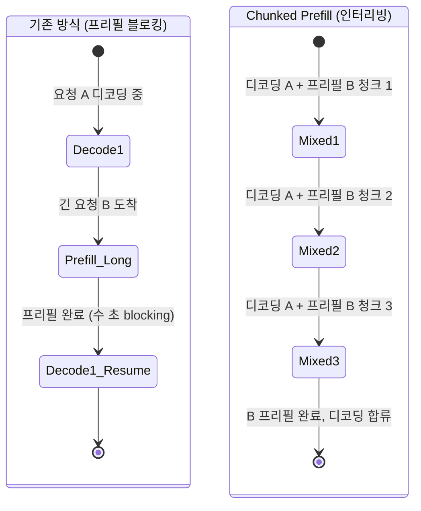

# Chunked Prefill (청크 단위 프리필 처리)

## 개요

**Chunked Prefill(청크 프리필)**은 긴 입력 시퀀스의 프리필(prefill) 연산을 고정 크기의 청크(chunk)로 분할하여, 디코딩(decoding) 작업과 인터리빙(interleaving)하는 추론 스케줄링 기법이다. 프리필과 디코딩이 같은 GPU 배치에서 경쟁하는 구조적 문제를 해결하여 **TTFT(Time-To-First-Token)**와 **ITL(Inter-Token Latency)** 모두를 개선한다.

## 문제: 프리필-디코딩 간의 자원 경쟁

LLM 추론은 두 단계로 구성된다:

- **프리필**: 입력 토큰 전체를 병렬 처리하여 KV 캐시 생성. 계산(compute) 바운드 연산
- **디코딩**: 한 번에 하나의 토큰을 자기회귀적으로 생성. 메모리 대역폭 바운드 연산

전통적인 서빙 시스템에서는 새로운 요청의 프리필이 시작되면 기존 요청들의 디코딩이 일시 중단된다. 긴 프롬프트(예: 32K 토큰)가 들어오면 해당 프리필이 GPU를 독점하는 동안, 이미 디코딩 중인 요청들의 응답이 수 초간 멈추는 **지연 급등(latency spike)**이 발생한다.



위 다이어그램은 기존 블로킹 방식과 Chunked Prefill 인터리빙 방식의 차이를 나타낸다.

## 작동 원리

### 청크 분할

프리필 시퀀스를 `chunk_size` 토큰 단위로 분할한다. 예를 들어 32K 토큰의 입력과 `chunk_size=2048`이라면, 16번의 청크로 나뉜다.

```
입력: [t1, t2, ..., t32768]
청크 1: [t1, ..., t2048]   → 배치에 삽입
청크 2: [t2049, ..., t4096] → 다음 배치에 삽입
...
청크 16: [t30721, ..., t32768] → 16번째 배치에 삽입
```

### 디코딩 토큰 혼합

각 배치(batch)는 청크 프리필 토큰과 진행 중인 디코딩 토큰을 함께 포함한다. 어텐션 연산에서 프리필 청크와 디코딩 토큰은 서로 다른 어텐션 마스크를 가지므로, Flash Attention 같은 커널이 이를 효율적으로 처리한다.

## TTFT와 ITL 동시 개선

| 지표 | 기존 방식 | Chunked Prefill |
|------|-----------|----------------|
| TTFT (짧은 요청) | 빠름 | 빠름 (동일) |
| TTFT (긴 요청) | 오래 걸림 | 개선 (청크로 분산) |
| ITL (기존 요청) | 긴 프리필 시 급등 | 안정적 (디코딩 유지) |
| GPU 활용률 | 프리필 집중 시 높음, 디코딩 시 낮음 | 균등하게 높음 |

긴 컨텍스트 요청이 많은 환경에서는 P99 ITL을 50% 이상 줄이는 효과가 보고된다.

## 청크 크기 선택

`chunk_size`는 핵심 하이퍼파라미터다:

- **너무 크면**: 긴 프리필이 디코딩을 여전히 지연시킴
- **너무 작으면**: GPU 활용률 저하 (오버헤드 증가)
- **권장 범위**: 512-4096 토큰 (모델, GPU, 배치 크기에 따라 조율)

```python
# vLLM에서 chunked prefill 설정
from vllm import LLM

llm = LLM(
    model="meta-llama/Llama-3-8B-Instruct",
    enable_chunked_prefill=True,  # 청크 프리필 활성화
    max_num_batched_tokens=8192,  # 배치당 최대 토큰 (청크 크기 상한)
)
```

## Prefix Caching과의 시너지

[[prefix-caching|Prefix Caching]]과 Chunked Prefill을 함께 사용하면 추가적인 이점이 있다. 캐시 히트된 블록은 청크로 분할할 필요가 없어 실질적인 계산 청크 수가 줄어든다. 캐시 미스된 부분만 청크 단위로 처리하므로 두 기법이 자연스럽게 결합된다.

## Prefill-Decode 분리와의 관계

Chunked Prefill이 동일한 GPU에서 두 작업을 인터리빙하는 기법이라면, [[prefill-decode-disaggregation|Prefill-Decode 분리(Disaggregation)]]는 두 작업을 별도의 GPU 집합으로 물리적으로 분리하는 더 급진적인 접근이다. 두 기법은 상호 보완적이며, 분리 서빙에서도 각 풀 내부에서 Chunked Prefill을 적용할 수 있다.

## 실무 적용 지침

1. **긴 컨텍스트가 많은 서비스**: 법률 문서 분석, 코드 리뷰, RAG 시스템 등에서 효과가 크다.
2. **레이턴시 SLA가 엄격한 서비스**: ITL 급등이 허용되지 않는 실시간 서비스에 필수적이다.
3. **모니터링**: 청크 크기를 바꾸며 TTFT/ITL P50, P99를 측정하고 서비스 프로파일에 맞게 조정한다.

## 관련 문서

- [[kv-cache-inference]] - KV 캐시 메모리 관리와 프리필의 관계
- [[model-serving]] - 서빙 시스템에서 스케줄링 전략
- [[prefix-caching]] - 청크 프리필과 결합 가능한 KV 재사용 기법
- [[prefill-decode-disaggregation]] - 프리필과 디코딩을 물리적으로 분리하는 고급 기법
- [[continuous-batching]] - Chunked Prefill의 기반이 되는 연속 배칭
