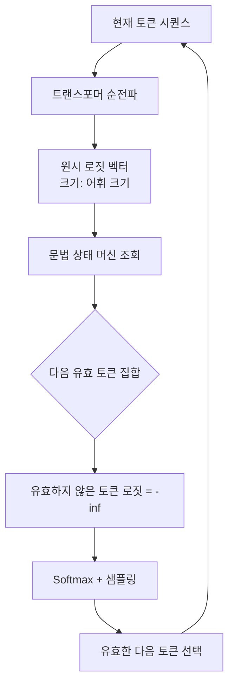
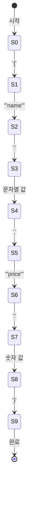

# 구조적 출력 제약 디코딩 (Constrained Decoding)

## 개요

**구조적 출력 제약 디코딩(Constrained Decoding)**은 LLM의 토큰 생성 과정에서 **로짓(logit) 마스킹**을 적용하여, 모델이 특정 형식(JSON, 정규식, 문맥 자유 문법 등)에 부합하는 출력만 생성하도록 강제하는 기법이다. 후처리(post-processing)로 JSON을 파싱하려다 실패하는 문제를 원천적으로 차단하며, API 응답이나 함수 호출 결과물의 신뢰성을 크게 높인다.

## 핵심 메커니즘: 로짓 마스킹

LLM은 매 디코딩 스텝마다 어휘(vocabulary) 전체에 대한 로짓 점수를 계산한다. 제약 디코딩은 이 로짓 벡터에 **마스크(mask)**를 적용하여, 현재 문맥에서 문법적으로 유효하지 않은 토큰의 로짓을 `-inf`로 설정한다. Softmax 이후 이들 토큰의 확률은 0이 되어 절대 샘플링되지 않는다.



이 루프가 반복되면서 모델은 항상 문법을 만족하는 토큰만 생성하게 된다.

## 문법 표현 방식

### 1. JSON 스키마 (JSON Schema)

가장 실용적인 사용 사례. Pydantic 모델이나 JSON Schema를 제공하면 라이브러리가 자동으로 문법 규칙을 생성한다.

```python
from pydantic import BaseModel
from outlines import models, generate

class Product(BaseModel):
    name: str
    price: float
    in_stock: bool
    tags: list[str]

model = models.transformers("mistralai/Mistral-7B-v0.1")
generator = generate.json(model, Product)

result = generator("다음 제품을 JSON으로 변환하세요: 파란색 펜, 1500원, 재고 있음, 문구류")
# 반드시 Product 스키마를 만족하는 JSON이 반환됨
```

### 2. 정규식 (Regular Expression)

전화번호, 날짜, 코드 등 패턴이 정해진 출력에 적합하다.

```python
import outlines

generator = generate.regex(model, r"\d{3}-\d{4}-\d{4}")
result = generator("내 번호는 010-1234-5678입니다. 번호만 추출하세요.")
# 반드시 010-XXXX-XXXX 형식으로만 출력
```

### 3. 문맥 자유 문법 (Context-Free Grammar, CFG)

SQL, JSON, 프로그래밍 언어 등 재귀적 구조를 가진 형식에 사용한다. EBNF 또는 Lark 문법으로 정의한다.

## 주요 구현체 비교

| 라이브러리 | 접근법 | 강점 | 약점 |
|-----------|--------|------|------|
| **Outlines** | FSM(유한 상태 머신) | 범용, Pydantic 통합 | 복잡한 문법에서 FSM 크기 증가 |
| **[[xgrammar-2\|XGrammar]]** | 컴파일된 문법 | 빠른 마스킹, 배치 효율 | 최근 개발 |
| **llama.cpp grammar** | GGUF 내장 문법 | CPU 추론에 내장 | 표현력 제한 |
| **vLLM guided decoding** | XGrammar/Outlines 통합 | 서빙 시스템 내장 | 설정 필요 |
| **Instructor** | 재시도 + 검증 | 기존 LLM API 호환 | 비결정적 (재시도 기반) |

## 상태 머신(FSM) 방식

Outlines가 사용하는 FSM 방식의 작동 원리:



각 상태에서 전이 가능한 토큰 집합이 마스크로 변환된다. 어휘 크기가 크면 FSM 전이 테이블이 커지므로 사전 컴파일이 성능의 핵심이다.

## JSON 모드 vs. 구조적 디코딩

OpenAI의 `response_format: {"type": "json_object"}` 같은 **JSON 모드**는 제약 디코딩과 구별된다:

- **JSON 모드**: 모델이 JSON을 생성하도록 지시하는 방식. 내부적으로 미세조정 또는 프롬프트 강화를 사용. 완벽한 JSON 보장은 아님.
- **구조적 제약 디코딩**: 로짓 수준에서 강제. 스키마를 완전히 만족하는 출력을 **수학적으로 보장**.

## 성능 오버헤드

마스킹 연산은 매 디코딩 스텝마다 수행되므로 오버헤드가 발생한다:

- FSM 테이블 사전 컴파일: 스키마당 0.1-2초 (일회성, 캐시 가능)
- 런타임 마스킹: 토큰당 0.1-1ms (어휘 크기, 구현에 따라 다름)
- 전체 추론 속도 저하: 일반적으로 5-15% 범위

XGrammar와 같은 최신 구현체는 런타임 마스킹 비용을 최소화하여 실용적인 수준으로 낮췄다.

## 에이전트 및 함수 호출과의 연계

제약 디코딩은 [[structured-output|구조적 출력]] 보장이 필요한 모든 에이전트 시나리오에서 핵심 기술이다. 함수 호출(function calling), 도구 사용(tool use), 데이터 추출 파이프라인 등에서 파싱 실패를 제거하고 시스템 신뢰성을 높인다.

## 관련 문서

- [[structured-output]] - 구조적 출력의 개념과 활용 패턴
- [[model-serving]] - 제약 디코딩이 통합되는 서빙 인프라
- [[xgrammar-2]] - 고성능 문법 컴파일 기반 제약 디코딩 라이브러리
- [[guided-constrained-decoding]] - 더 넓은 의미의 가이드 디코딩 개관
- [[beam-search-decoding]] - 빔 서치와 제약 조건의 결합
