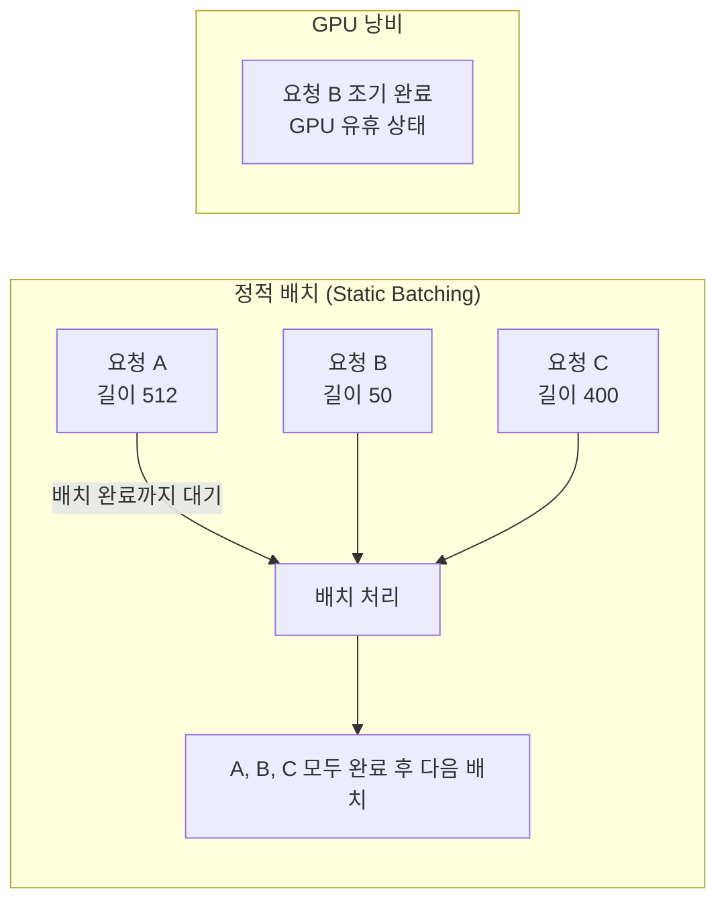
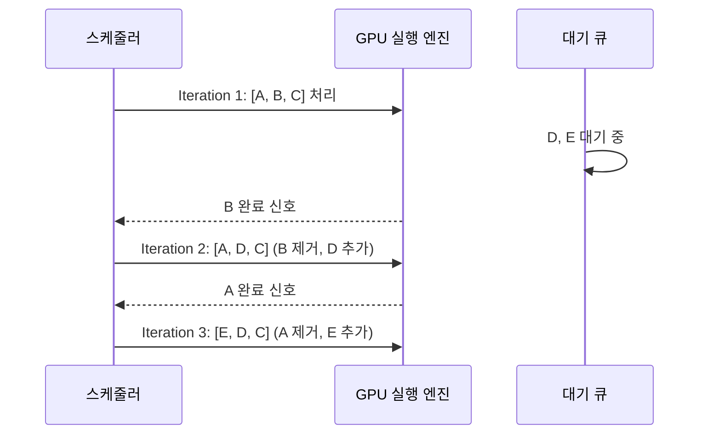
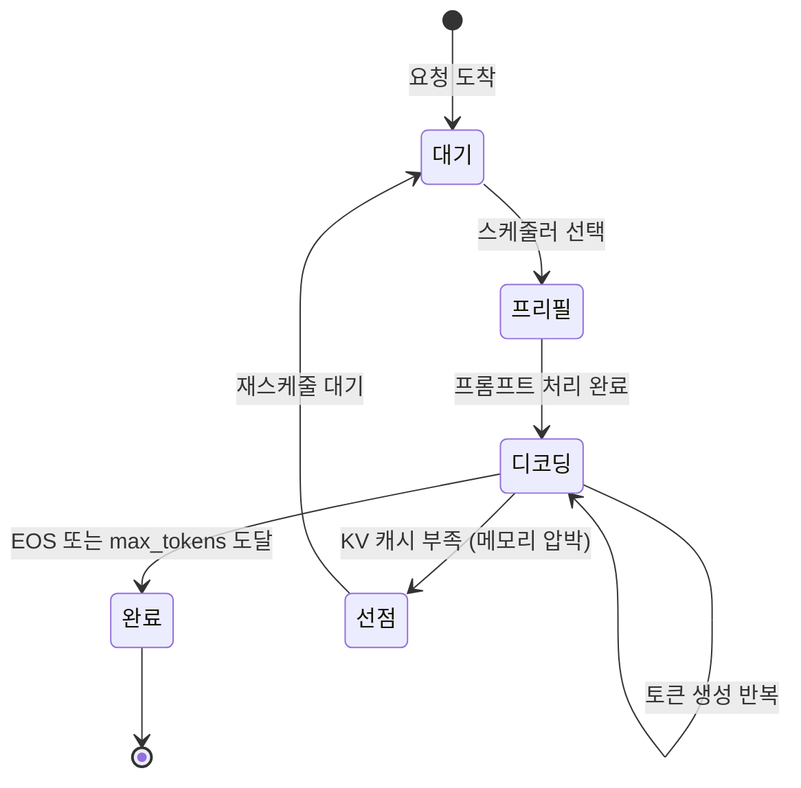

# 연속 배치 내부 구조 (Continuous Batching Internals)

## 개요

연속 배치(Continuous Batching, 또는 In-flight Batching)는 LLM 서빙 시스템에서 처리량(throughput)을 극대화하기 위한 핵심 스케줄링 기법이다. 기존의 정적 배치(static batching)와 달리, **반복(iteration) 단위로 요청을 동적으로 배치에 추가하거나 제거**한다. [[vllm-v1-engine]], [[sglang]], Text Generation Inference([[tensorrt-llm]]) 등 주요 LLM 서빙 시스템이 이 방식을 채택한다.

## 정적 배치 vs 연속 배치

### 정적 배치의 문제



정적 배치에서는 배치 내 가장 긴 시퀀스가 완료될 때까지 나머지 요청도 기다려야 한다. 짧은 요청은 일찍 완료되지만 GPU를 계속 점유한다.

### 연속 배치 구조



연속 배치: 각 반복(iteration)에서 완료된 요청을 제거하고 새 요청을 추가한다. GPU가 항상 포화 상태를 유지한다.

## 핵심 개념: Iteration-Level Scheduling

연속 배치의 핵심은 **반복 단위 스케줄링**이다. 각 Transformer 포워드 패스(iteration) 이후, 스케줄러는:

1. 완료된 요청(EOS 토큰 생성 또는 최대 길이 도달)을 배치에서 제거
2. 대기 큐에서 새 요청을 선택하여 배치에 추가
3. 새로 추가된 요청의 프리필 단계(prefill phase)를 처리
4. 기존 요청들의 디코딩 단계(decode phase)와 새 요청의 프리필을 혼합(chunked prefill)

이 방식으로 GPU는 거의 항상 포화(saturated) 상태를 유지할 수 있다.

## 요청 생명주기

각 요청은 연속 배치 시스템 내에서 다음 상태를 거친다:



### 선점(Preemption)

KV 캐시 메모리 압박 시, 낮은 우선순위 요청의 KV 캐시를 해제(swap)하고 해당 요청을 대기열로 되돌린다. 선점된 요청은 나중에 KV 캐시가 확보되면 재개된다. [[paged-attention]]은 이 선점 메커니즘을 페이지 단위로 효율적으로 구현한다.

## 프리필과 디코딩의 혼합 (Chunked Prefill)

연속 배치에서 가장 복잡한 부분은 프리필(prefill)과 디코딩(decode)을 같은 배치 내에서 혼합하는 것이다.

- **프리필**: 프롬프트 전체를 한 번에 처리. 연산 집약(compute-bound)
- **디코딩**: 토큰 하나씩 생성. 메모리 대역폭 집약(bandwidth-bound)

두 단계를 함께 실행할 때 성능 간섭이 발생한다. **Chunked Prefill**은 프리필을 청크(chunk) 단위로 나누어 디코딩과 섞는 방식으로 이 문제를 완화한다:

```python
# 개념적 스케줄러 로직
def schedule_iteration(waiting_queue, running_requests, kv_cache):
    batch = []
    token_budget = config.max_tokens_per_iteration

    # 1. 실행 중인 디코딩 요청 추가
    for req in running_requests:
        if has_kv_cache(req, kv_cache):
            batch.append(('decode', req, 1))
            token_budget -= 1

    # 2. 대기 중인 프리필 요청 추가 (청크 단위)
    for req in waiting_queue:
        chunk_size = min(req.remaining_prefill, token_budget)
        if chunk_size > 0:
            batch.append(('prefill', req, chunk_size))
            token_budget -= chunk_size
        if token_budget <= 0:
            break

    return batch
```

## vLLM의 구현

[[vllm-v1-engine]]에서 연속 배치는 `Scheduler` 클래스가 담당한다. 핵심 데이터 구조:

- **`SequenceGroup`**: 동일 프롬프트에서 파생된 여러 시퀀스(빔 서치 등)를 묶는 단위
- **`BlockManager`**: [[paged-attention]] 기반 KV 캐시 블록 관리
- **`SchedulerOutputs`**: 해당 이터레이션에서 처리할 요청 목록과 메타데이터

```
스케줄러 루프 (vLLM 내부):
1. 완료된 SequenceGroup 처리 및 결과 반환
2. 선점 가능한 요청 확인 (KV 캐시 부족 시)
3. waiting -> running 승격 (KV 캐시 할당)
4. 배치 구성 및 GPU 실행 엔진에 전달
```

## TGI(Text Generation Inference)의 구현

HuggingFace의 [[sglang]] 경쟁 서빙 시스템인 TGI도 유사한 구조를 가지나, Rust 기반 비동기 스케줄러를 사용한다. 주요 차이:

| 항목 | vLLM | TGI |
|------|------|-----|
| 스케줄러 언어 | Python | Rust |
| KV 캐시 관리 | PagedAttention | 연속 메모리 |
| 선점 전략 | Swap/Recompute | Abort + 재시작 |
| 배치 전략 | Chunked Prefill 지원 | 분리 처리 |

## 선점 전략 비교

선점 발생 시 두 가지 전략이 있다:

### 1. 스왑(Swap)
KV 캐시 데이터를 CPU 메모리로 이동시키고 나중에 GPU로 복원한다.
- 장점: 요청을 재처리할 필요 없음
- 단점: CPU-GPU 데이터 전송 비용

### 2. 재계산(Recompute)
KV 캐시를 버리고 해당 요청이 재스케줄될 때 프리필부터 재실행한다.
- 장점: CPU 메모리 불필요
- 단점: 재처리 비용 (프롬프트가 길수록 높음)

[[prefix-caching]]이 활성화된 경우, 공통 프리픽스의 KV 캐시는 재계산 없이 재사용할 수 있어 재계산 비용이 줄어든다.

## 배치 크기와 GPU 활용률

연속 배치의 효율은 GPU 활용률(GPU utilization)과 직결된다:

- **배치 너무 작음**: GPU 연산 자원 낭비 (메모리 대역폭 병목)
- **배치 너무 큼**: KV 캐시 메모리 부족, 선점 빈발
- **최적 배치 크기**: GPU 메모리가 허용하는 한에서 최대한 크게

[[flash-decoding]]과 같은 기법은 배치 내 긴 시퀀스의 어텐션 연산을 병렬화하여 대형 배치에서도 효율적인 연산이 가능하게 한다.

## 지연 시간 vs 처리량 트레이드오프

연속 배치는 처리량에 집중하므로 개별 요청의 지연 시간(latency)이 늘어날 수 있다. 이를 제어하는 매개변수:

- **`max_waiting_tokens`**: 대기 중인 요청이 수락되기 전 최대 기다리는 토큰 수
- **`priority_queue`**: 우선순위 기반 스케줄링으로 SLA(Service Level Agreement) 준수
- **`preemption_mode`**: 선점 전략 (swap vs recompute)

## 실무 활용

연속 배치는 다음 상황에서 특히 효과적이다:

- **다양한 길이의 요청이 혼합**: 짧은 요청과 긴 요청이 섞인 트래픽
- **높은 동시 접속**: 수백-수천 명의 동시 사용자
- **배치 추론**: 오프라인 처리에서는 정적 배치가 더 단순할 수 있음

SageMaker, GCP Vertex AI, Azure ML 등 클라우드 추론 서비스 대부분이 연속 배치를 기본 스케줄링 정책으로 채택하고 있다.

## 관련 문서

- [[paged-attention]] - KV 캐시 페이지 관리 (연속 배치의 핵심 의존)
- [[prefix-caching]] - 공통 프리픽스 KV 캐시 재사용
- [[selective-batching]] - 선택적 배치 처리 (연속 배치의 보완 기법)
- [[flash-decoding]] - 긴 시퀀스 어텐션 병렬화
- [[vllm-v1-engine]] - vLLM 서빙 엔진 구현
- [[sglang]] - SGLang 서빙 시스템
- [[dynamic-batching]] - 동적 배치 기초 개념
- [[continuous-batching]] - 연속 배치 개요
