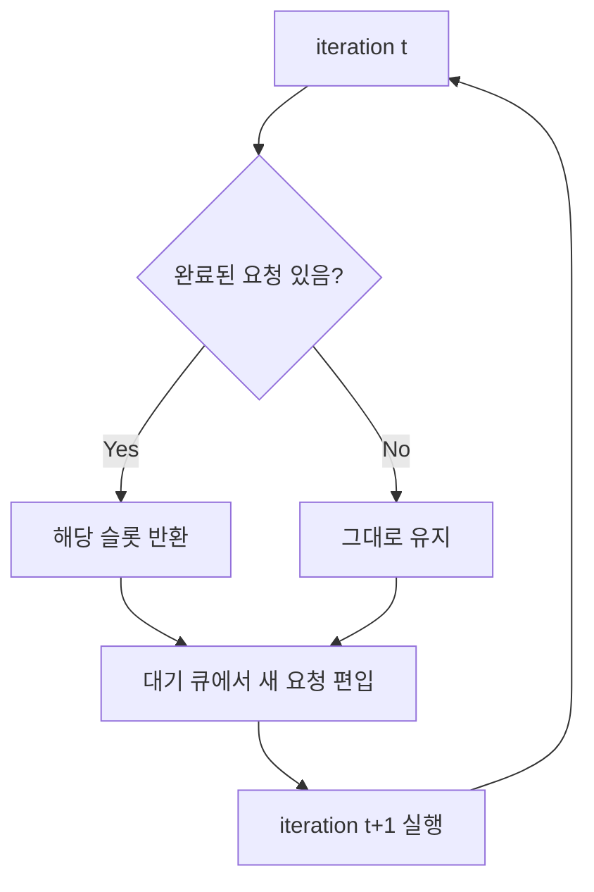
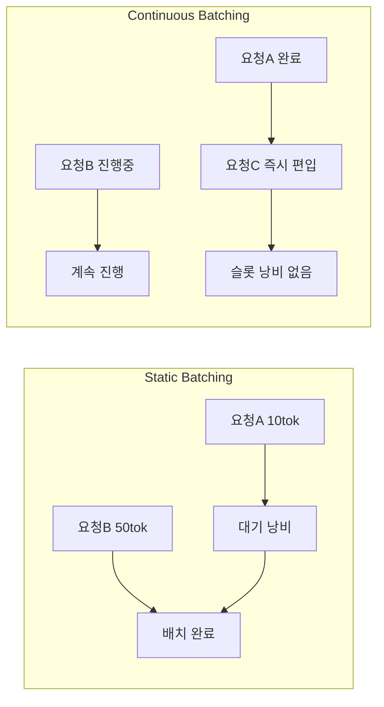

# 연속 배치 처리 (Continuous Batching)

## 개요

연속 배치 처리(Continuous Batching)는 LLM 추론 서버에서 GPU 유휴 시간을 제거하기 위한 스케줄링 기법이다. 기존 정적 배치(Static Batching)의 근본적인 비효율을 iteration 단위 스케줄링으로 해소한다.

## 정적 배치의 문제

Static Batching에서는 한 배치 안의 모든 요청이 완료되어야만 다음 배치를 시작할 수 있다. LLM 요청은 길이가 제각각이므로 짧은 요청이 먼저 완료되더라도 긴 요청이 끝날 때까지 GPU 슬롯이 낭비된다.

```
Static Batching 예시:
[요청A: 10토큰] ████░░░░░░░░  -- 완료 후 슬롯 낭비
[요청B: 50토큰] ████████████  -- 배치 완료 기준
[요청C: 대기]                  -- B가 끝날 때까지 못 들어옴
```

핵심 문제: 배치 내 최장 요청이 전체 배치의 사이클을 결정한다.

## Continuous Batching (Iteration-Level Scheduling)

Orca(Yu et al., 2022)가 제안한 방식. 매 iteration(토큰 생성 스텝)마다 완료된 요청을 내보내고 새 요청을 즉시 배치에 편입한다.



위 다이어그램은 매 iteration마다 배치 구성이 동적으로 변하는 과정을 보여준다.

## Static vs Continuous Batching 비교



## 구현: vLLM vs TensorRT-LLM

| 항목 | vLLM | TensorRT-LLM |
|------|------|---------------|
| 스케줄러 | 자체 AsyncLLMEngine | Executor + SchedulerConfig |
| 배치 단위 | iteration-level | iteration-level |
| KV 캐시 관리 | PagedAttention | 블록 단위 풀 |
| 프리필/디코드 분리 | Chunked Prefill 지원 | Disaggregated 지원 |

## GPU 유휴 제거 효과

- 처리량(throughput) 2-5배 향상 (워크로드 분포에 따라 다름)
- 평균 지연(latency)은 큰 변화 없거나 소폭 증가 (배치 크기 변동)
- GPU 활용률(utilization) 70-90%대 달성 가능

## 주의사항

- 메모리 관리 복잡도 증가: 배치 내 요청별 KV 캐시 크기가 다름
- Prefill이 큰 요청 편입 시 decode 지연 급증 가능 (Chunked Prefill로 완화)
- 공정성(fairness) 보장 어려움: 긴 요청이 계속 후순위로 밀릴 수 있음

## 관련 문서

- [[request-scheduling]] - 스케줄링 정책 (FCFS, Priority, SLA-aware)
- [[kv-cache]] - KV 캐시 메모리 관리
- [[vllm-v1-engine]] - vLLM v1 엔진 아키텍처
- [[disaggregated-serving]] - Prefill/Decode 분리 서빙
