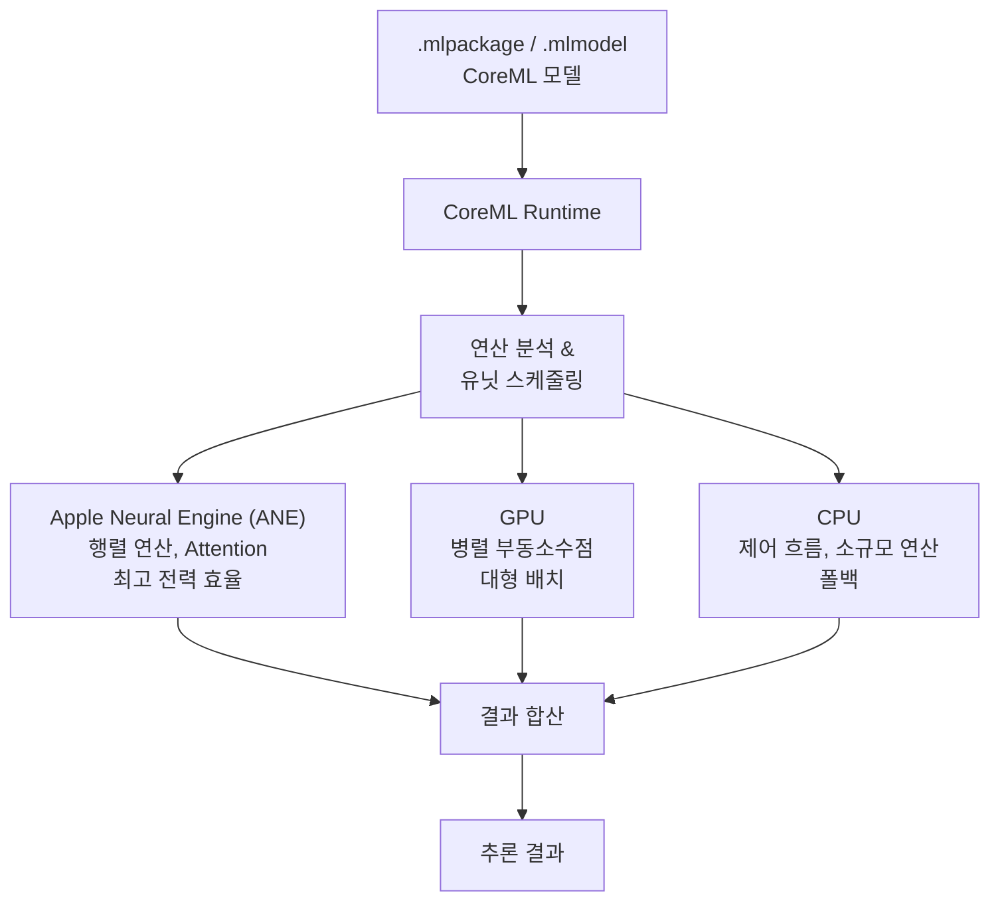
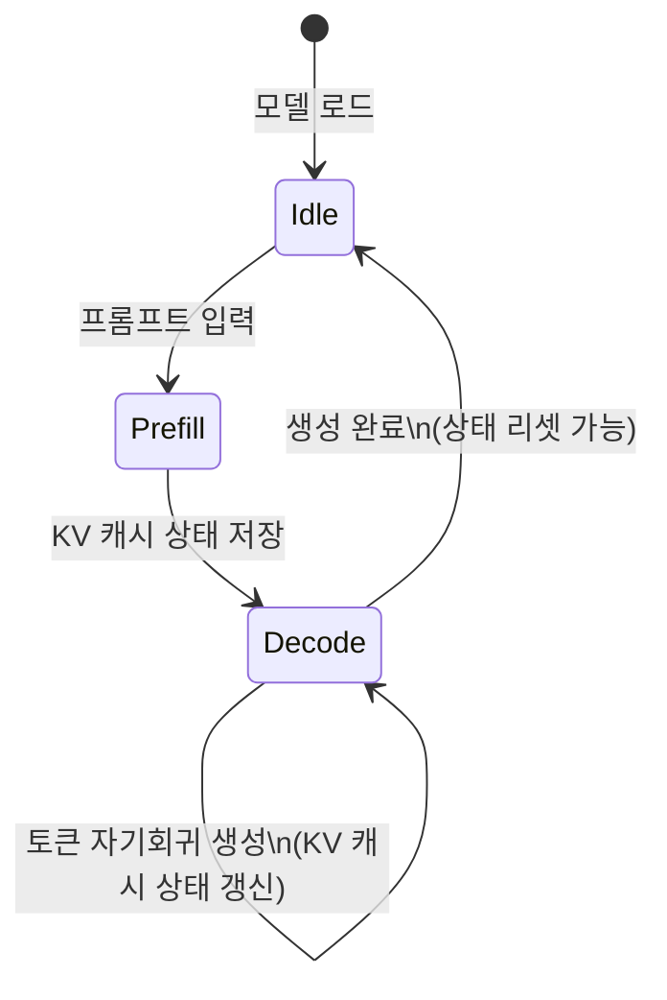

# CoreML (Apple 온디바이스 추론)

## 개요

**CoreML**은 Apple이 개발한 온디바이스 머신러닝 추론 프레임워크다. iOS, macOS, watchOS, tvOS 전반에 걸쳐 일관된 API를 제공하며, Apple 실리콘(M 시리즈, A 시리즈 칩)의 CPU, GPU, Apple Neural Engine(ANE)을 자동으로 조합하여 최적의 추론 성능을 이끌어낸다. 개발자가 하드웨어를 직접 선택할 필요 없이, CoreML이 모델과 입력 특성에 따라 연산 유닛을 자동 스케줄링한다.

## 핵심 특징: 자동 컴퓨팅 유닛 스케줄링

CoreML의 차별화 포인트는 **Compute Units** 추상화다. 개발자는 `MLComputeUnits` 열거형으로 힌트를 줄 수 있지만, 실제 연산 배치는 CoreML 런타임이 결정한다.



ANE는 행렬-벡터 곱셈(MVM)과 컨볼루션에 특화된 전용 하드웨어로, Attention 연산과 FFN 레이어를 처리하는 데 최적화되어 있다. ANE 활용 시 GPU 대비 5-10배의 전력 효율을 달성할 수 있어, 배터리 수명이 중요한 모바일 환경에서 핵심 이점이 된다.

## 모델 포맷: .mlpackage

CoreML 모델의 표준 포맷은 `.mlpackage`(디렉토리 기반 패키지)다. 내부 구조:

```
model.mlpackage/
  Data/
    com.apple.CoreML/
      model.mlmodel      # 프로토버프 스펙
      weights/           # 가중치 바이너리
  Manifest.json          # 버전/메타데이터
```

`.mlmodel`은 구형 단일 파일 포맷으로, 현재는 `.mlpackage`가 권장된다. Xcode의 CoreML 뷰어는 두 포맷 모두 시각적 미리보기를 지원한다.

## 모델 변환: coremltools

Python 패키지 `coremltools`가 변환의 표준 경로다:

```python
import coremltools as ct

# PyTorch 모델 변환
traced_model = torch.jit.trace(pytorch_model, example_input)
mlmodel = ct.convert(
    traced_model,
    inputs=[ct.TensorType(name="input", shape=example_input.shape)],
    compute_precision=ct.precision.FLOAT16,  # ANE 최적화
    compute_units=ct.ComputeUnit.ALL,
)
mlmodel.save("model.mlpackage")
```

`ct.precision.FLOAT16`은 ANE 활용을 위해 권장된다. ANE는 FP16/INT8 연산을 지원하며 FP32는 GPU/CPU로 폴백된다.

## LLM 온디바이스 지원: MLX vs CoreML

Apple 생태계에서 LLM을 실행하는 두 가지 주요 경로가 있다:

| 경로 | 프레임워크 | 특징 |
|------|-----------|------|
| CoreML 직접 | CoreML | ANE 활용, iOS 앱 통합, Xcode 빌드 |
| MLX | Apple MLX | 연구/프로토타입 친화, Metal 기반, Python 우선 |
| 하이브리드 | CoreML + MLX | 프로덕션 iOS 앱에서 일부 레이어 CoreML |

Apple은 Mistral, Llama 2/3, Phi 계열 모델의 CoreML 변환 버전을 공식 제공하며, Hugging Face에서 `apple/coreml-*` 이름 형식으로 배포된다.

## Stateful 모델: KV 캐시 내장

iOS 18 / macOS 15부터 CoreML이 **Stateful Model**을 공식 지원한다. LLM 추론에서 KV 캐시를 모델 상태(state)로 내장하여, 매 호출마다 KV를 전달하지 않아도 된다:



이 기능은 자기회귀 생성 루프를 iOS 앱 내에서 효율적으로 구현할 수 있게 해준다. [[onnx-runtime]]의 ORT GenAI와 유사한 역할을 Apple 생태계에서 담당한다.

## 배포 제약

CoreML은 Apple 플랫폼 전용이라는 근본적 제약이 있다. 크로스 플랫폼 배포가 필요하다면 [[onnx-runtime]]이나 서버 기반 [[model-serving]] 접근이 더 적합하다. 단, Apple 기기 사용자에게는 ANE의 전력 효율 덕분에 서버 API 호출보다 배터리 소모 없이 더 빠른 응답이 가능하다.

## 관련 문서

- [[model-serving]] - 서버 환경 배포 및 인프라
- [[onnx-runtime]] - 크로스 플랫폼 추론 런타임 (비교 대상)
- [[tflite-litert]] - Google의 온디바이스 추론 (비교 대상)
- [[on-device-inference-stack]] - 온디바이스 추론 전체 스택
