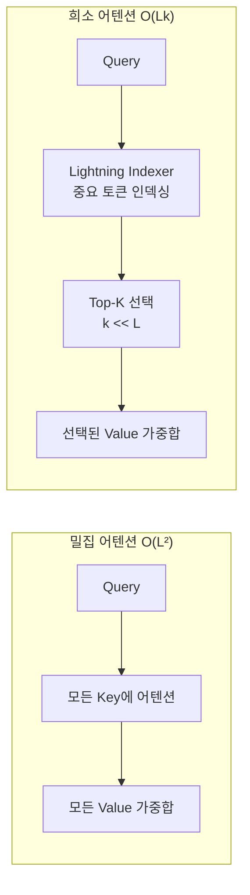

# DeepSeek Sparse Attention (DSA) for Long Context

Lightning Indexer와 Top-K 셀렉터로 토큰 단위 희소 어텐션(sparse attention)을 구현하는 방식. 표준 어텐션의 $O(L^2)$ 복잡도를 $O(Lk)$로 축소해 긴 컨텍스트 효율을 개선한다.

## 왜 중요한가

DeepSeek-V3.2에서 희소 어텐션 패턴을 도입하며 128k 토큰 이상의 장기 컨텍스트 학습과 추론 효율을 크게 개선했다. 2026년 초 SGLang이 NativeSparseAttnBackend를 추가했고, HISA·SALS 등 후속 arxiv 논문이 연이어 발표되며 장기 컨텍스트 LLM의 핵심 기법으로 자리잡았다.

## 표준 어텐션 vs 희소 어텐션



k가 L보다 훨씬 작을 때 (예: k=64, L=128,000) 연산량이 약 2,000배 감소한다.

## 핵심 구성 요소

| 구성 요소 | 역할 |
|---------|------|
| Lightning Indexer | 쿼리와 관련성 높은 키(key) 토큰을 고속으로 찾는 인덱싱 구조 |
| Top-K 셀렉터 | 인덱서가 후보로 올린 토큰 중 가장 유관한 k개 선택 |
| 지역 윈도우 어텐션 | 최근 토큰에 대한 슬라이딩 윈도우로 지역성 보장 |
| 전역 토큰 | 특수 전역 토큰([CLS] 유사)으로 전체 문맥 정보 유지 |

## HISA & SALS: 후속 연구

**HISA (Hierarchical Indexing for Sparse Attention)**
- 2단계 인덱싱: 청크(chunk) 수준 → 토큰 수준으로 계층화
- 세밀도(fine-grained)와 연산 효율의 균형 최적화

**SALS (Sparse Attention in Latent Space)**
- KV 캐시를 잠재 공간(latent space)으로 압축 후 희소 어텐션 적용
- KV 캐시 압축과 희소 어텐션을 동시에 달성

## SGLang NativeSparseAttnBackend

```python
# SGLang에서 희소 어텐션 활성화 예시 (개념)
server_args = ServerArgs(
    model_path="deepseek-ai/DeepSeek-V3-2",
    attention_backend="native_sparse_attn",
    sparse_attn_k=64,  # 선택할 Top-K 수
)
```

DeepSeek-V3.2 전용 최적화로, 일반 FlashAttention 백엔드 대비 128k 컨텍스트에서 약 40% 메모리 절감.

## 완전 어텐션 vs 희소 어텐션 트레이드오프

| 항목 | 완전 어텐션 | 희소 어텐션 |
|------|-----------|-----------|
| 복잡도 | $O(L^2)$ | $O(Lk)$ |
| 정확도 | 최고 | k에 따라 손실 가능 |
| 메모리 | 높음 | 낮음 |
| 구현 복잡도 | 낮음 | 높음 |
| 128k 컨텍스트 적합성 | 비실용적 | 실용적 |

## 실무 적용 관점

- **장기 컨텍스트 RAG**: 100k+ 토큰 문서 처리 시 희소 어텐션으로 GPU 메모리 요구량 대폭 절감
- **에이전트 히스토리**: 에이전트가 누적하는 긴 실행 히스토리를 희소 어텐션으로 효율적 처리
- **k 값 튜닝**: 태스크별 최적 k 탐색 필요. 일반적으로 k=32~128이 성능/효율 균형점
- **모델 호환성**: DeepSeek-V3.2 특화 구현. 범용 희소 어텐션 라이브러리는 별도 구현 필요

## 대표 레퍼런스

- [DeepSeek-V3.2: Pushing the Frontier of Open Large Language Models](https://arxiv.org/abs/2512.02556)
- [DeepSeek-V3.2-Exp GitHub repository](https://github.com/deepseek-ai/DeepSeek-V3.2-Exp)
- [HISA: Efficient Hierarchical Indexing for Fine-Grained Sparse Attention](https://arxiv.org/html/2603.28458)
- [SALS: Sparse Attention in Latent Space for KV cache Compression](https://arxiv.org/pdf/2510.24273)
- [DeepSeek-V3.2 Usage Guide (vLLM Recipes)](https://docs.vllm.ai/projects/recipes/en/latest/DeepSeek/DeepSeek-V3_2.html)

## 관련 문서

- [[ai-hot-topics-2026-04|2026년 4월 AI 개발 핫토픽 100선]]
- [[sglang|SGLang on GB300 NVL72 with NVFP4]]
- [[lmcache-kv-cache-layer|LMCache-Based Distributed KV Cache Offloading]]
- [[vllm-v1-engine|vLLM V1 Engine on Blackwell]]
- [[flashinfer|FlashInfer Kernel Library for LLM Serving]]
