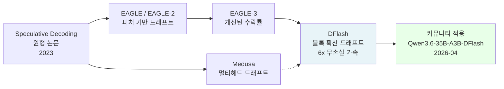

# DFlash - 블록 확산 기반 스펙울레이티브 디코딩 가속 기법

DFlash는 2026년 2월 발표된 논문(arXiv:2602.06036)에서 제안된 추론 가속 기법이다. 경량 블록 확산(block diffusion) 드래프트 모델로 여러 토큰을 병렬 생성하고, 타겟 모델이 한 번의 포워드 패스로 검증하는 [[speculative-decoding]] 방식을 발전시켰다. EAGLE-3 대비 2.5배 추가 속도 향상으로 총 6배 이상의 무손실(lossless) 가속을 달성한다. 2026년 4월 Qwen3.6-35B-A3B용 커뮤니티 버전(`z-lab/Qwen3.6-35B-A3B-DFlash`)이 공개되면서 오픈소스 커뮤니티에서 바이럴됐다.

## 핵심 아이디어

기존 스펙울레이티브 디코딩(speculative decoding)은 **소형 AR 드래프트 모델**이 여러 토큰을 순차 예측 후 대형 타겟 모델이 검증하는 구조다. DFlash는 이 드래프트 단계를 **블록 확산(block diffusion)** 으로 대체해 더 빠르고 품질 높은 드래프트를 생성한다.

```mermaid
flowchart TD
    subgraph Classic[기존 스펙울레이티브 디코딩]
        direction LR
        Draft1[AR 드래프트\n순차 토큰 생성\nt1→t2→t3→...] --> Verify1[타겟 모델\n병렬 검증]
        Verify1 --> Accept1[수락된 토큰\n일부 거부 가능]
    end

    subgraph DFlash[DFlash: 블록 확산 드래프트]
        direction LR
        BDraft[블록 확산 드래프트\n전체 블록 병렬 생성\n[t1,t2,...,tK] 동시] --> Verify2[타겟 모델\n병렬 검증]
        Verify2 --> Accept2[수락된 토큰\n더 높은 수락률]
    end

    Classic -.->|2.5배 느린\n드래프트 품질| Classic
    DFlash -.->|블록 병렬화로\n드래프트 효율 향상| DFlash
```

위 다이어그램은 기존 AR 드래프트 방식과 DFlash의 블록 확산 드래프트 방식을 비교한다. 블록 단위 병렬 생성으로 드래프트 속도와 품질을 동시에 높인다.

## 블록 확산 드래프트 모델

### 핵심 구조

DFlash의 드래프트 모델은 [[diffusion-models]] 원리를 텍스트 토큰 블록에 적용한다:

1. **블록 마스킹**: 생성할 K개 토큰 위치를 마스크로 초기화
2. **병렬 디노이징**: K개 토큰을 여러 확산 단계로 병렬 복원
3. **블록 제출**: 복원된 K개 토큰 블록을 타겟 모델에 한 번에 제출

이는 [[llada-2-uni]]의 이산 확산(discrete diffusion) 개념과 연결되지만, 전체 시퀀스가 아닌 **드래프트 블록 단위**에만 확산을 적용하는 점이 다르다.

### 수식적 표현

드래프트 블록 $[t_1, t_2, \ldots, t_K]$를 생성할 때:

$$p_{\text{draft}}(t_1, \ldots, t_K | x_{<n}) = \prod_{s=1}^{S} p_\theta(\mathbf{x}^{(s)} | \mathbf{x}^{(s-1)}, x_{<n})$$

여기서 $S$는 확산 단계 수, $\mathbf{x}^{(0)}$은 완전 마스크 상태, $\mathbf{x}^{(S)}$는 완전 복원 상태다.

## 성능 수치

| 비교 기준 | 속도 배율 |
|-----------|---------|
| 기준 AR 디코딩 (greedy) | 1x |
| EAGLE-2 | ~2.5x |
| EAGLE-3 | ~3x |
| DFlash | ~6x+ |
| DFlash vs EAGLE-3 | 2.5배 추가 향상 |

6배 이상 가속은 **무손실(lossless)** 이다. 스펙울레이티브 디코딩은 이론적으로 출력 분포가 타겟 모델과 동일함이 보장된다(거부 샘플링 기반 검증). 따라서 속도 향상이 품질 저하를 동반하지 않는다.

## EAGLE-3과의 비교

[[eagle-3-speculative-decoding]](EAGLE-3)은 DFlash 이전의 최신 스펙울레이티브 디코딩 방식이었다. DFlash는 EAGLE-3 위에 2.5배 추가 개선을 달성했다.

핵심 차이:

| 항목 | EAGLE-3 | DFlash |
|------|---------|--------|
| 드래프트 모델 | AR (순차) | 블록 확산 (병렬) |
| 드래프트 효율 | 좋음 | 더 좋음 |
| 타겟 모델 검증 | 1회 포워드 | 1회 포워드 (동일) |
| 속도 배율 | ~3x | ~6x+ |

## 스펙울레이티브 디코딩 전체 맥락

DFlash는 [[speculative-decoding]] 계보의 최신 발전이다:



## 서빙 프레임워크 통합

DFlash는 주요 LLM 서빙 프레임워크와 통합된다:

### vLLM 통합

```python
# vLLM + DFlash 스펙울레이티브 디코딩 설정 (개략)
from vllm import LLM, SamplingParams

llm = LLM(
    model="Qwen/Qwen3.6-35B-A3B",
    speculative_model="z-lab/Qwen3.6-35B-A3B-DFlash",  # 드래프트 모델
    num_speculative_tokens=8,   # 블록당 토큰 수
    use_v2_block_manager=True,
)
```

### SGLang 통합

```python
# SGLang + DFlash 설정 (개략, 공식 문서 확인 [교차검증 필요])
import sglang as sgl

runtime = sgl.Runtime(
    model_path="Qwen/Qwen3.6-35B-A3B",
    speculative_draft_model_path="z-lab/Qwen3.6-35B-A3B-DFlash",
    speculative_num_draft_tokens=8,
)
```

## 적용 가능 모델

이론적으로 DFlash 드래프트 모델은 모든 AR 타겟 모델에 적용 가능하다. 2026년 4월 기준 공개된 DFlash 드래프트 모델:

- `z-lab/Qwen3.6-35B-A3B-DFlash`: Qwen3.6-35B-A3B 전용

향후 커뮤니티에서 DeepSeek V4 Pro, Llama 계열 등 다른 모델용 DFlash 드래프트 모델이 공개될 것으로 예상된다.

## 기술적 상세: 거부 샘플링 검증

스펙울레이티브 디코딩의 무손실 보장은 **거부 샘플링(rejection sampling)** 기반 검증에서 온다:

드래프트 토큰 $t_i$에 대해:
- $p_{\text{target}}(t_i)$: 타겟 모델의 확률
- $p_{\text{draft}}(t_i)$: 드래프트 모델의 확률

수락 확률: $\min\left(1, \frac{p_{\text{target}}(t_i)}{p_{\text{draft}}(t_i)}\right)$

드래프트 품질이 높을수록 수락률이 높아져 더 많은 토큰이 한 번의 타겟 포워드 패스에서 확정된다. DFlash의 블록 확산은 드래프트 품질을 높여 수락률을 개선한다.

## 실무 중요성

DFlash가 실무에서 중요한 이유:

1. **6배 무손실 가속**: 동일 하드웨어에서 LLM API 처리량 6배 향상 = 운영 비용 6분의 1
2. **드롭인 교체**: 기존 vLLM/SGLang 기반 인프라에 드래프트 모델만 추가하면 됨
3. **품질 손실 없음**: 스펙울레이티브 디코딩의 이론적 무손실 보장 유지
4. **오픈소스 커뮤니티 수용**: Qwen3.6-35B-A3B-DFlash의 빠른 공개 및 바이럴은 실용성 입증

## 한계 및 고려사항

1. **드래프트 모델 필요**: 타겟 모델별 전용 DFlash 드래프트 모델을 별도 훈련/공개해야 함
2. **추가 메모리**: 드래프트 모델이 추가 VRAM을 차지
3. **배치 크기 의존성**: 배치 크기가 커지면 스펙디코딩의 효율이 감소할 수 있음 [교차검증 필요]
4. **확산 단계 오버헤드**: 블록 확산 드래프트의 다단계 디노이징이 초경량 AR 드래프트 대비 오버헤드 가능성

## 관련 문서

- [[speculative-decoding]] - 스펙울레이티브 디코딩 기반 개념
- [[diffusion-models]] - 블록 확산 드래프트의 기반 기법
- [[eagle-3-speculative-decoding]] - DFlash 이전 SOTA 스펙디코딩
- [[llada-2-uni]] - 이산 확산 LLM과의 연결 (확산 패러다임 공유)
- [[vllm]] - DFlash 통합 서빙 프레임워크
- [[qwen-3-6]] - DFlash 최초 커뮤니티 적용 대상 모델
