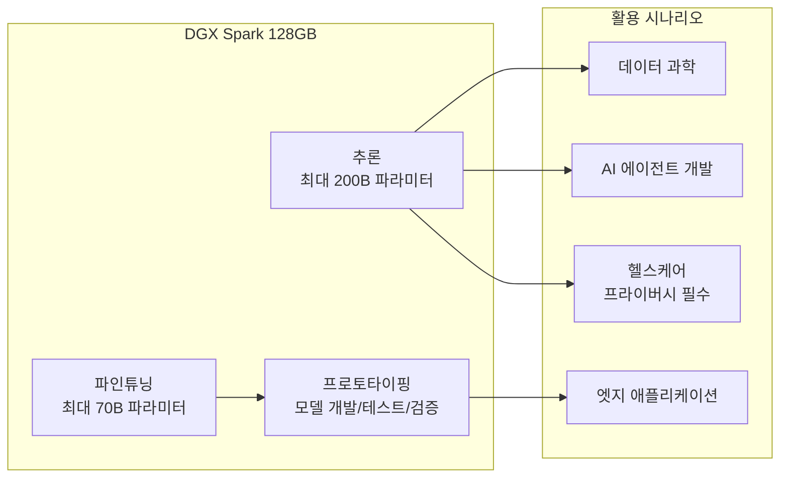
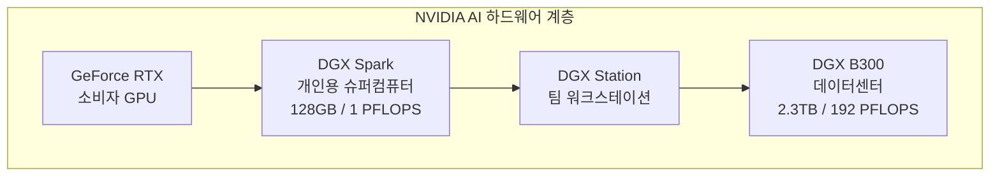

# DGX Spark

NVIDIA DGX Spark는 GB10 Grace Blackwell 슈퍼칩을 탑재한 데스크톱 폼팩터의 개인용 AI 슈퍼컴퓨터다. 128GB 통합 메모리, FP4 기준 1 PFLOPS 연산 성능으로 최대 200B 파라미터 모델의 로컬 추론을 지원한다. 2025년 10월 15일부터 주문 가능하며, NVIDIA AI 소프트웨어 스택이 사전 설치되어 출하된다.

## 왜 지금 중요한가

AI 개발의 핵심 병목 중 하나는 대형 모델을 로컬에서 실행할 수 있는 하드웨어의 부재였다. 클라우드 API 의존은 비용, 레이턴시, 데이터 프라이버시 문제를 수반한다. DGX Spark는 200B 파라미터 모델을 데스크톱에서 추론하고, 70B 모델을 파인튜닝할 수 있는 능력을 1.2kg 폼팩터에 담아, 개인 개발자와 소규모 팀의 AI 연구/개발 접근성을 근본적으로 변화시킨다.

## 핵심 사양

| 항목 | 내용 |
|------|------|
| 프로세서 | GB10 Grace Blackwell 슈퍼칩 |
| CPU | 20코어 Arm (Cortex-X925 x10 + Cortex-A725 x10) |
| GPU 아키텍처 | Blackwell |
| Tensor Core | 5세대 |
| CUDA Core | Blackwell 세대 |
| AI 연산 성능 | 1 PFLOPS (FP4) |
| 메모리 | 128GB LPDDR5x 통합 (CPU-GPU 일관성) |
| 메모리 대역폭 | 273GB/s |
| 인터커넥트 | NVLink-C2C (PCIe 5 대비 5배 대역폭) |
| 스토리지 | 4TB NVMe M.2 (자체 암호화) |
| 네트워크 | ConnectX-7 200Gbps, 10GbE |
| 무선 | WiFi 7, Bluetooth 5.4 |
| TDP | GB10 140W / 전체 240W PSU |
| 크기 | 150 x 150 x 50.5mm |
| 무게 | 1.2kg |
| 소음 | 작동 35dB / 대기 19dB |

## 모델 실행 능력

128GB 통합 메모리와 NVLink-C2C의 높은 대역폭 덕분에 대형 모델 추론 시 메모리 병목이 크게 완화된다. 다만 273GB/s 대역폭은 서버급 HBM3e(8TB/s)와 비교하면 약 30분의 1 수준으로, 토큰/초 처리량에는 한계가 있다.

### 추론 vs 파인튜닝 한계

| 작업 | 최대 모델 크기 | 비고 |
|------|---------------|------|
| 추론 | 200B 파라미터 | 양자화 적용 시 |
| 파인튜닝 | 70B 파라미터 | LoRA/QLoRA 기준 |
| 프로토타이핑 | 제한 없음 | 소형 모델 개발/테스트 |

## 소프트웨어 스택

NVIDIA AI 소프트웨어 스택이 사전 설치되어 출하된다:

- **NVIDIA NIM**: 최적화된 모델 서빙 마이크로서비스
- **[[nemoclaw]]**: 에이전틱 AI 런타임 (OpenClaw + 보안 제어)
- **CUDA 라이브러리**: cuDNN, cuBLAS 등 GPU 가속 라이브러리
- **Isaac/Metropolis**: 로봇공학, 컴퓨터 비전 프레임워크

## 구매 채널

| 채널 | 유형 |
|------|------|
| Amazon, Micro Center | 직접 구매 |
| Arrow, TD Synnex, Ingram Micro, PNY | 유통 채널 |
| Acer, ASUS, Dell, HP, Lenovo, MSI, GIGABYTE | OEM 커스텀 시스템 |

## 포지셔닝

DGX Spark는 소비자 GPU(24-48GB VRAM)와 데이터센터 DGX 시스템 사이의 간극을 메우는 제품이다. 128GB 통합 메모리로 70B-200B 모델을 로컬에서 다룰 수 있어, 클라우드 API에 의존하지 않는 독립적 AI 개발 환경을 구축할 수 있다.

## 실무 관점

- 200B 추론/70B 파인튜닝이 1.2kg 데스크톱에서 가능하다는 점은 개인 연구자/스타트업에게 의미가 크다
- 128GB 통합 메모리는 CPU-GPU 간 데이터 복사 오버헤드를 제거하지만, 대역폭(273GB/s)은 서버급 대비 제한적이라 배치 추론 처리량에 한계가 있다
- 헬스케어, 금융 등 데이터가 외부로 나가면 안 되는 환경에서 [[nemoclaw]]와 결합한 로컬 AI 에이전트 구축이 핵심 유스케이스
- 35dB 소음은 사무실 환경에서 상시 운용 가능한 수준이다
- 가격 정보는 공식 보도자료에 명시되지 않았으나, 일부 소스에서 $4,699로 언급된다 [교차검증 필요]

## 관련 문서

- [[blackwell-ultra-b300]] - DGX Spark의 기반 아키텍처의 데이터센터 버전
- [[nemoclaw]] - DGX Spark에서 실행되는 에이전틱 AI 런타임
- [[ltx-2]] - DGX Spark에서 로컬 실행 가능한 비디오 생성 모델
