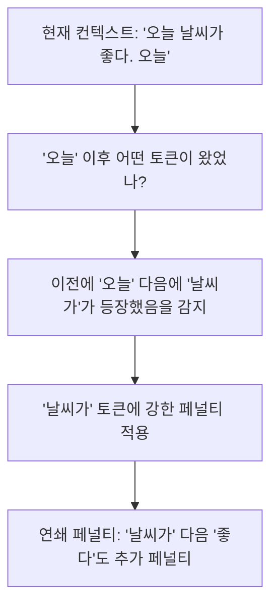
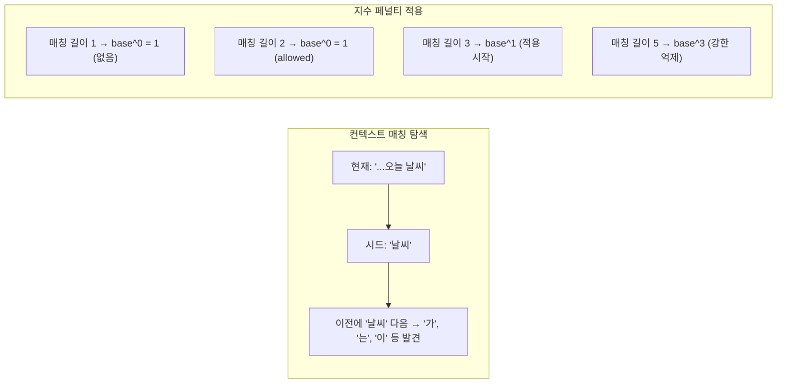

# DRY 반복 페널티 (Don't Repeat Yourself)

## 배경과 문제 의식

언어 모델의 반복 문제(repetition problem)는 오래된 고질적 현상이다. 기존 [[repetition-penalty-logit-bias|반복 페널티]] 방식은 개별 토큰 단위로 페널티를 가한다:

```
기존 방식: 이전에 등장한 토큰 ID에 스칼라 페널티 적용
```

이 방식의 한계:
1. **시퀀스 수준 반복을 잡지 못함**: "저는 학생입니다. 저는 학생입니다." 같은 구절 반복은 각 토큰 단위로는 분산되어 페널티가 약하다.
2. **중요한 단어 억제**: "I", "the", "is" 같은 필수 단어도 페널티를 받아 자연스러운 생성을 방해한다.
3. **지역적 컨텍스트 무시**: 먼 과거의 토큰과 최근 토큰을 동등하게 취급한다.

**DRY (Don't Repeat Yourself)**는 이름처럼 "같은 시퀀스를 반복하지 말라"는 원칙을 알고리즘화한 것이다. 최근 컨텍스트에서 **동일한 토큰 시퀀스가 이미 등장했을 때**, 그 뒤에 올 토큰에 강력한 페널티를 가한다.

## 핵심 아이디어: 시퀀스 매칭



**핵심 메커니즘**:
1. 현재 생성 위치 직전 몇 개 토큰을 "현재 시드(seed)"로 설정
2. 컨텍스트 전체에서 이 시드와 일치하는 구간을 찾음
3. 과거에 해당 시드 뒤에 어떤 토큰이 왔는지 확인
4. 그 토큰들에 매칭 길이에 비례하는 지수 페널티를 가함

## 알고리즘 상세

### 페널티 계산 수식

매칭 길이 $n$ (현재 위치와 과거 위치에서 일치하는 토큰 수)에 대해:

$$\text{penalty}(x) = \text{dry\_base}^{\max(0, n - \text{dry\_allowed\_length})}$$

- `dry_base`: 페널티 기저 (예: 1.75)
- `dry_allowed_length`: 반복을 허용하는 최소 시퀀스 길이 (예: 2)
- $n$: 현재 위치에서 역방향으로 매칭되는 토큰 수

**예시**:
- `dry_base=1.75`, `dry_allowed_length=2`
- 매칭 길이 3: $1.75^{3-2} = 1.75$ 페널티
- 매칭 길이 5: $1.75^{5-2} = 5.36$ 페널티 (지수적 증가!)

긴 시퀀스 반복일수록 페널티가 지수적으로 커지므로, 구절 단위 반복이 매우 효과적으로 억제된다.



## 코드 예시

```python
import torch
import torch.nn.functional as F
from collections import defaultdict

def apply_dry_penalty(
    scores: torch.Tensor,
    input_ids: torch.Tensor,
    dry_multiplier: float = 0.8,
    dry_base: float = 1.75,
    dry_allowed_length: int = 2,
    dry_range: int = 1024,
) -> torch.Tensor:
    """
    DRY 반복 페널티 적용.

    Args:
        scores: 로짓 스코어 (1, vocab_size)
        input_ids: 지금까지의 토큰 시퀀스 (1, seq_len)
        dry_multiplier: 전체 페널티 스케일 (0 = 비활성화)
        dry_base: 지수 페널티 기저 (1.75 권장)
        dry_allowed_length: 반복 허용 최소 길이 (2 권장)
        dry_range: 컨텍스트 탐색 범위 (0 = 전체)

    Returns:
        페널티 적용된 스코어
    """
    if dry_multiplier == 0:
        return scores

    seq = input_ids[0].tolist()

    # 탐색 범위 제한
    if dry_range > 0 and len(seq) > dry_range:
        seq = seq[-dry_range:]

    if len(seq) < dry_allowed_length:
        return scores

    # 현재 위치에서의 역방향 시드 구성
    # 마지막 토큰부터 시작하여 매칭 길이를 늘려가며 탐색
    seq_len = len(seq)
    last_token = seq[-1]

    # 토큰별 최대 매칭 길이 추적
    max_match_lengths = defaultdict(int)

    # 컨텍스트 내 모든 위치에서 매칭 탐색
    for i in range(seq_len - 1):
        if seq[i] == last_token:
            # 현재 위치에서 이미 어떤 토큰이 뒤따랐는가?
            if i + 1 < seq_len:
                next_token = seq[i + 1]
                # 매칭 길이 계산 (역방향으로 얼마나 일치하는가)
                match_len = 1
                j = i - 1
                k = seq_len - 2  # 현재 위치의 이전
                while j >= 0 and k >= 0 and seq[j] == seq[k]:
                    match_len += 1
                    j -= 1
                    k -= 1

                # 최대 매칭 길이 갱신
                if match_len > max_match_lengths[next_token]:
                    max_match_lengths[next_token] = match_len

    # 페널티 계산 및 적용
    for token_id, match_len in max_match_lengths.items():
        if match_len >= dry_allowed_length:
            penalty_exp = match_len - dry_allowed_length
            penalty = dry_multiplier * (dry_base ** penalty_exp)
            if 0 <= token_id < scores.shape[-1]:
                # 로짓에서 페널티 차감
                if scores[0, token_id] > 0:
                    scores[0, token_id] /= penalty
                else:
                    scores[0, token_id] *= penalty

    return scores


# HuggingFace LogitsProcessor로 래핑
from transformers import LogitsProcessor

class DRYLogitsProcessor(LogitsProcessor):
    def __init__(
        self,
        dry_multiplier: float = 0.8,
        dry_base: float = 1.75,
        dry_allowed_length: int = 2,
        dry_range: int = 1024,
    ):
        self.dry_multiplier = dry_multiplier
        self.dry_base = dry_base
        self.dry_allowed_length = dry_allowed_length
        self.dry_range = dry_range

    def __call__(
        self, input_ids: torch.LongTensor, scores: torch.FloatTensor
    ) -> torch.FloatTensor:
        for i in range(input_ids.shape[0]):
            scores[i:i+1] = apply_dry_penalty(
                scores[i:i+1],
                input_ids[i:i+1],
                self.dry_multiplier,
                self.dry_base,
                self.dry_allowed_length,
                self.dry_range,
            )
        return scores
```

## 기존 반복 페널티와의 비교

| 특성 | 기존 Repetition Penalty | DRY |
|------|------------------------|-----|
| 적용 단위 | 개별 토큰 | 토큰 시퀀스 |
| 페널티 강도 | 선형 (고정 스칼라) | 지수 (매칭 길이 비례) |
| 단어 억제 문제 | 있음 (필수 단어도 페널티) | 없음 (맥락 매칭 기반) |
| 구절 반복 탐지 | 약함 | 강함 |
| 계산 복잡도 | $O(V)$ | $O(L \cdot V)$ (L: 범위 길이) |
| 컨텍스트 활용 | 없음 | 있음 (dry_range 기반) |

## 하이퍼파라미터 가이드

| 파라미터 | 권장값 | 역할 |
|----------|--------|------|
| `dry_multiplier` | 0.8 | 전체 페널티 강도. 0이면 비활성화 |
| `dry_base` | 1.75 | 지수 기저. 클수록 긴 반복에 강한 페널티 |
| `dry_allowed_length` | 2 | 이 길이 미만 반복은 허용 (자연스러운 단어 재사용 허용) |
| `dry_range` | 1024 | 탐색할 컨텍스트 길이. 0이면 전체 |

**실무 팁**:
- DRY는 기존 `repetition_penalty`와 병행 사용 권장
- `dry_allowed_length=1`로 설정하면 단일 토큰도 페널티 → 너무 공격적
- 긴 문서 생성 시 `dry_range`를 키우면 더 넓은 구간의 반복을 잡음

## 지원 환경

- `llama.cpp`: `--dry-multiplier`, `--dry-base`, `--dry-allowed-length` 지원
- `text-generation-webui`: DRY 파라미터 지원
- KoboldCpp: DRY Penalty 지원
- 커스텀 구현: HuggingFace `LogitsProcessor`로 삽입 가능

## 관련 문서

- [[repetition-penalty-logit-bias]] - 기존 토큰 단위 반복 페널티
- [[nucleus-top-p-sampling]] - 함께 사용되는 기본 샘플링
- [[xtc-exclude-top-choices]] - 또 다른 다양성 향상 기법
- [[temperature-sampling]] - 온도 기반 분포 조정
- [[decoding-strategies]] - 디코딩 전략 전체 개요
- [[logits-processor-internals]] - 로짓 프로세서 파이프라인
