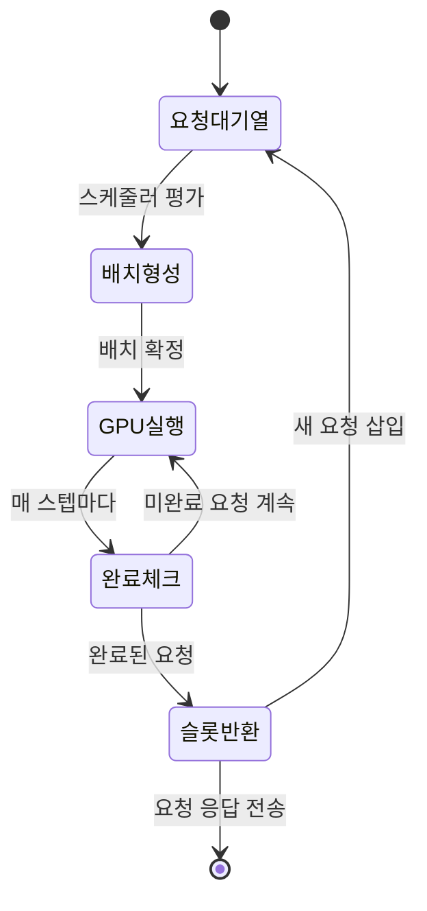
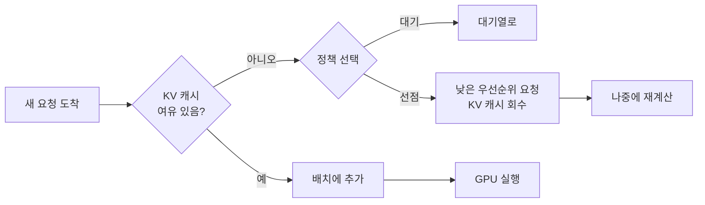
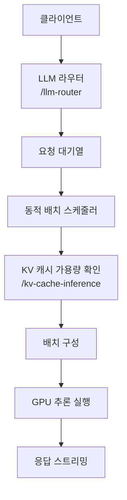

# 동적 배칭 (Dynamic Batching)

## 개요

동적 배칭(Dynamic Batching)은 LLM 추론 서빙에서 도착하는 요청들을 실시간으로 묶어 하나의 배치로 처리하는 기법이다. 정적 배칭(static batching)이 고정된 크기의 배치가 완성될 때까지 기다리는 것과 달리, 동적 배칭은 대기 중인 요청들을 현재 가능한 시점에 최대한 효율적으로 그룹화하여 GPU 활용률을 극대화한다.

동적 배칭은 [[model-serving]] 시스템의 핵심 구성 요소로, continuous batching(연속 배칭)과 함께 사용되어 프로덕션 LLM 서빙의 처리량을 수십 배 향상시킨다.

## 왜 동적 배칭이 필요한가

LLM 추론은 두 단계로 구성된다:
1. **Prefill**: 입력 토큰 전체를 한 번에 처리 (연산 집약적, compute-bound)
2. **Decode**: 토큰을 하나씩 자동회귀적으로 생성 (메모리 집약적, memory-bound)

정적 배칭의 문제:
- 짧은 요청과 긴 요청이 같은 배치에 있으면 짧은 요청은 끝난 후 긴 요청이 완료될 때까지 GPU 슬롯을 낭비
- 배치 크기를 미리 정해야 하므로 트래픽 변동에 대응 어려움
- 고정 배치가 채워질 때까지 기다리는 대기 지연 발생



동적 배칭(+ continuous batching)에서는 완료된 요청의 슬롯이 즉시 반환되고 새 요청이 진행 중인 배치에 삽입된다.

## 핵심 구성 요소

### 1. 배치 스케줄러

배치 스케줄러는 다음 사항을 실시간으로 결정한다:

- **어떤 요청을 다음 배치에 포함할 것인가** - 대기열에서 선택
- **배치 크기 상한** - GPU 메모리와 [[kv-cache-inference]] 용량에 따라 결정
- **우선순위 정책** - FCFS(First-Come-First-Served), 우선순위 큐, 최소 대기 시간 등

### 2. 우선순위 정책

| 정책 | 설명 | 적합한 상황 |
|------|------|------------|
| FCFS | 먼저 도착한 요청 우선 | 공정한 처리가 중요할 때 |
| Priority Queue | 요청 유형별 가중치 | 프리미엄/일반 사용자 구분 |
| Shortest Job First | 짧은 출력 길이 예측 우선 | 평균 지연 최소화 |
| Preemption | 낮은 우선순위 요청 선점 | 응급 요청 처리 |

### 3. 배치 크기 동적 조정

GPU 메모리는 KV 캐시 용량이 좌우한다. 스케줄러는 현재 실행 중인 요청의 시퀀스 길이 합산으로 남은 KV 캐시 슬롯을 계산하여 새 요청 수용 여부를 결정한다.



## Continuous Batching과의 관계

동적 배칭의 진화된 형태가 **연속 배칭(Continuous Batching)**이다. 둘의 차이는 다음과 같다.

| 항목 | 동적 배칭 | 연속 배칭 |
|------|-----------|-----------|
| 배치 교체 시점 | 전체 배치 완료 후 | 개별 요청 완료 시마다 |
| GPU 효율 | 높음 | **매우 높음** |
| 구현 복잡도 | 중간 | 높음 (반복 단위 관리) |
| 대표 구현 | TGI(초기), Triton | vLLM, SGLang, TGI(최신) |

vLLM이 채택한 iteration-level scheduling이 연속 배칭의 대표 구현으로, 각 forward pass(decode step) 완료마다 배치를 재구성한다.

## 우선순위 큐 기반 스케줄링

실제 프로덕션 환경에서는 단순 FCFS보다 우선순위 기반 스케줄링이 필요하다.

```python
# 개념적 우선순위 스케줄러 예시
from dataclasses import dataclass, field
from queue import PriorityQueue

@dataclass(order=True)
class Request:
    priority: int  # 낮을수록 높은 우선순위
    arrival_time: float = field(compare=False)
    input_tokens: int = field(compare=False)
    max_output_tokens: int = field(compare=False)

class DynamicBatchScheduler:
    def __init__(self, max_batch_tokens: int):
        self.queue = PriorityQueue()
        self.max_batch_tokens = max_batch_tokens

    def schedule(self) -> list[Request]:
        batch = []
        total_tokens = 0
        while not self.queue.empty():
            req = self.queue.get()
            if total_tokens + req.input_tokens <= self.max_batch_tokens:
                batch.append(req)
                total_tokens += req.input_tokens
            else:
                self.queue.put(req)  # 다음 스케줄링 시도로
                break
        return batch
```

## [[model-serving]] 시스템에서의 위치



## 구현 사례

- **vLLM**: PagedAttention 기반 KV 캐시 관리와 연속 배칭 통합
- **SGLang**: RadixAttention으로 prefix 공유 + 동적 배칭
- **TGI (Text Generation Inference)**: HuggingFace의 서빙 프레임워크
- **NVIDIA Triton Inference Server**: 범용 ML 모델용 동적 배칭 지원
- **Orca**: 연속 배칭 아이디어의 학술 원조 논문 (2022)

## 성능 지표

동적 배칭의 효과는 다음 지표로 측정한다:

- **처리량 (throughput)**: 초당 처리되는 요청 수 (req/s)
- **생성 처리량**: 초당 생성되는 토큰 수 (tok/s)
- **TTFT (Time to First Token)**: 요청에서 첫 토큰 생성까지 시간
- **TBT (Time Between Tokens)**: 토큰 간 생성 간격
- **GPU 활용률**: GPU 연산 유닛이 실제로 작동하는 비율

잘 구성된 동적 배칭은 정적 배칭 대비 GPU 활용률을 40-70% 향상시킬 수 있다.

## 관련 문서

- [[model-serving]] - 전체 LLM 서빙 아키텍처
- [[kv-cache-inference]] - 배치 크기 결정의 핵심 제약 요소
- [[continuous-batching]] - 동적 배칭의 진화형
- [[request-scheduling]] - 스케줄링 정책 상세
- [[prefill-decode-disaggregation]] - Prefill/Decode 분리로 배칭 효율 향상
