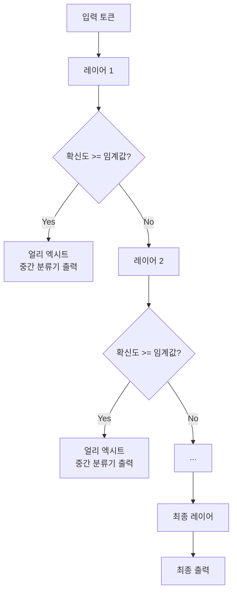

# 얼리 엑시트와 적응형 계산 (Early Exit & Adaptive Computation)

## 개요

얼리 엑시트(Early Exit)는 모든 토큰 또는 입력이 전체 모델 레이어를 거칠 필요가 없다는 아이디어에서 출발한다. 쉬운 토큰은 중간 레이어에서 일찍 출력하고, 어려운 토큰만 깊은 레이어까지 처리하는 적응형 계산(Adaptive Computation) 기법이다.

## 핵심 개념

Transformer 모델의 레이어별 표현은 점점 정교해지지만, 단순한 토큰은 이미 중간 레이어에서 충분한 확신(confidence)을 갖는다. 이 관찰을 이용해 불필요한 레이어 계산을 건너뛴다.

쉬운 입력은 빠르게 탈출하고, 어려운 입력은 전체 레이어를 거친다.

## 레이어별 분류기 헤드 학습

각 중간 레이어 이후에 작은 분류기(classifier head)를 부착하고, 최종 레이어와 동일한 목표로 학습시킨다.

- **Joint Training**: 모든 분류기 헤드를 동시에 훈련
- **Progressive Training**: 얕은 레이어부터 순차적으로 훈련
- 분류기 헤드 자체의 파라미터 수는 작음 (주로 선형 레이어)

확신도 측정:
- Softmax 최대 확률: $\text{confidence} = \max_c P(c | h_l)$
- Entropy: $H = -\sum_c P(c) \log P(c)$ (낮을수록 확신)

## CALM (Confident Adaptive Language Modeling)

Schuster et al. (2022). 생성(decoding) 단계에서 얼리 엑시트를 적용한 첫 번째 주요 연구.

- 각 토큰 생성 시 레이어별로 확신도를 평가
- 임계값 초과 시 해당 레이어에서 즉시 토큰 출력
- 실험 결과: 최대 3배 속도 향상, 성능 손실 1% 이내
- 임계값(threshold)이 속도-품질 트레이드오프를 결정하는 핵심 파라미터

## 배치 추론에서의 도전

개별 추론에서는 단순하지만, 배치(batch) 처리에서는 복잡하다.

**해결 방안:**
- **Confident Tokens Skip**: exit한 요청의 슬롯을 나머지 레이어에서 마스킹
- **Separate Batches**: exit 레이어를 예측하여 비슷한 요청끼리 배치
- **Speculative Exit**: 얼리 엑시트를 투기적 디코딩과 결합

## 다른 적응형 계산 기법과 비교

| 기법 | 적응 차원 | 메커니즘 |
|------|-----------|---------|
| Early Exit | 깊이 (레이어 수) | 중간 분류기 + 임계값 |
| MoE | 너비 (활성 파라미터) | 라우터 + 전문가 선택 |
| Mixture of Depths | 깊이 + 너비 | 토큰별 레이어 건너뜀 |
| Adaptive Attention | 어텐션 범위 | 슬라이딩 윈도우 크기 조절 |

## 실무 적용 현황

- 분류/임베딩 태스크: 적용 용이 (단일 forward pass)
- 생성(autoregressive) 태스크: CALM 등 연구 단계, 프로덕션 드문
- 인코더-디코더 모델: 인코더에 early exit 적용 더 자연스러움

## 관련 문서

- [[mixture-of-depths]] - 깊이 방향 희소화의 발전형
- [[model-pruning-inference]] - 정적 레이어 제거와 비교
- [[kv-cache]] - 생성 단계 최적화의 다른 축
