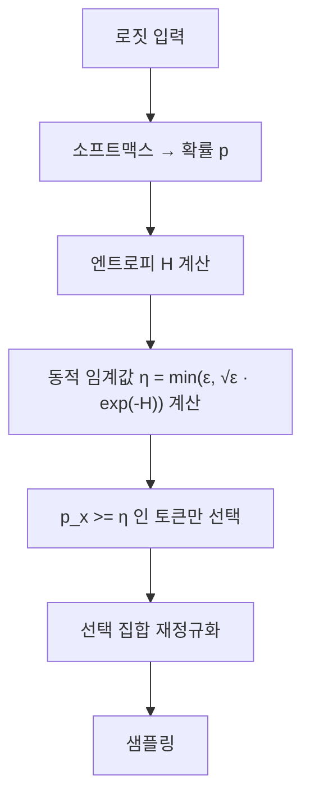
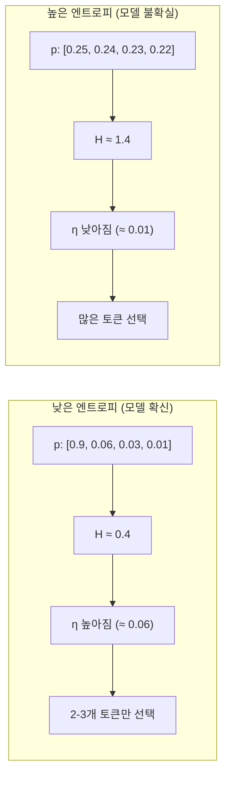

# Eta Sampling - 국소 적응 샘플링

## 배경과 문제 의식

Top-p (Nucleus) 샘플링은 누적 확률이 $p$ 이상인 토큰들을 선택한다. 이 방식의 약점은 **확률 분포의 형태를 무시한다**는 것이다.

- 분포가 균등할 때 (엔트로피 높음): Top-p가 너무 많은 토큰을 포함 → 일관성 저하
- 분포가 집중될 때 (엔트로피 낮음): Top-p가 너무 적은 토큰만 포함 → 다양성 부족

Eta Sampling은 모델의 **국소 엔트로피(local entropy)**에 따라 샘플링 임계값을 동적으로 조정하는 방식이다. 엔트로피가 높을 때는 임계값을 높여 보수적으로, 낮을 때는 임계값을 낮춰 더 넓게 탐색한다.

## 핵심 아이디어: 엔트로피 연동 임계값

기본 아이디어는 **각 생성 스텝마다 현재 확률 분포의 엔트로피를 측정하고**, 그에 비례해 최소 확률 임계값 $\eta$를 설정하는 것이다.

$$\eta = \min\left(\epsilon, \sqrt{\epsilon} \cdot e^{-H}\right)$$

여기서:
- $\epsilon$: 사용자가 설정하는 기본 임계값 하이퍼파라미터 (예: 0.09)
- $H$: 현재 확률 분포의 엔트로피 $H = -\sum_x p(x) \log p(x)$
- $e^{-H}$: 엔트로피가 높을수록 작아지는 감쇠 인자

엔트로피 $H$가 높으면 $e^{-H}$가 작아지고, $\eta$가 작아진다 → 더 많은 토큰 포함.  
엔트로피 $H$가 낮으면 $e^{-H}$가 커지고, $\eta$가 커진다 → 더 적은 토큰만 포함.

## 알고리즘



**구체적 단계**:

1. 현재 컨텍스트에서 확률 분포 $p(x)$ 계산
2. 현재 분포의 엔트로피 $H$ 계산
3. 동적 임계값 $\eta = \min(\epsilon, \sqrt{\epsilon} \cdot e^{-H})$ 계산
4. $p(x) \geq \eta$인 모든 토큰을 후보 집합에 포함
5. 후보 집합을 재정규화하여 샘플링

**직관**: 엔트로피가 낮으면 모델이 확신하고 있으므로 임계값을 높여 불필요한 토큰을 배제한다. 엔트로피가 높으면 모델이 불확실하므로 임계값을 낮춰 더 다양한 선택지를 허용한다.

## 코드 예시

```python
import torch
import torch.nn.functional as F
import math

def eta_sampling(
    logits: torch.Tensor,
    epsilon: float = 0.09,
    temperature: float = 1.0
) -> int:
    """
    Eta Sampling (국소 적응 샘플링) 구현.

    Args:
        logits: 모델 출력 로짓 (vocab_size,)
        epsilon: 기본 임계값 하이퍼파라미터 (0 < epsilon < 1)
        temperature: 샘플링 온도

    Returns:
        선택된 토큰 ID
    """
    # 온도 적용
    logits = logits / temperature
    probs = F.softmax(logits, dim=-1)

    # 현재 분포의 엔트로피 계산
    log_probs = torch.log(probs + 1e-10)
    entropy = -(probs * log_probs).sum().item()

    # 동적 임계값 eta 계산
    eta = min(epsilon, math.sqrt(epsilon) * math.exp(-entropy))

    # eta 이상의 확률을 가진 토큰만 선택
    mask = probs >= eta
    if not mask.any():
        # 최소 1개 보장 (가장 높은 확률 토큰)
        mask[probs.argmax()] = True

    # 선택된 토큰에서 재정규화 후 샘플링
    filtered_probs = probs * mask.float()
    filtered_probs = filtered_probs / filtered_probs.sum()

    return torch.multinomial(filtered_probs, num_samples=1).item()


def batch_eta_sampling_demo():
    """엔트로피 수준별 동적 임계값 변화 시뮬레이션"""
    import numpy as np

    epsilon = 0.09
    scenarios = [
        ("고확신 분포 (낮은 엔트로피)", [10.0, 0.5, 0.2, 0.1, 0.05]),
        ("균등 분포 (높은 엔트로피)", [1.0, 0.9, 0.8, 0.7, 0.6]),
        ("중간 분포", [3.0, 1.5, 0.8, 0.3, 0.1]),
    ]

    for name, raw_logits in scenarios:
        logits = torch.tensor(raw_logits)
        probs = F.softmax(logits, dim=0)
        log_probs = torch.log(probs + 1e-10)
        entropy = -(probs * log_probs).sum().item()
        eta = min(epsilon, math.sqrt(epsilon) * math.exp(-entropy))
        n_tokens = (probs >= eta).sum().item()

        print(f"{name}:")
        print(f"  엔트로피: {entropy:.3f}, eta: {eta:.5f}, 선택 토큰 수: {n_tokens}")
```

## Top-p와 Typical Sampling과의 비교

| 특성 | Top-p | Eta Sampling | Typical Sampling |
|------|-------|--------------|------------------|
| 선택 기준 | 누적 확률 임계 | 절대 확률 임계 (동적) | 엔트로피 거리 |
| 엔트로피 적응 | 없음 | 있음 (직접 연동) | 있음 (정렬 기준) |
| 구현 복잡도 | 낮음 | 낮음 | 중간 |
| 하이퍼파라미터 | p (0.9 권장) | epsilon (0.09 권장) | tau (0.9 권장) |
| 이론적 근거 | 직관 | 엔트로피 연동 임계 | 정보이론적 전형성 |

Eta Sampling은 Top-p의 단순함을 유지하면서도 엔트로피 연동이라는 이론적 개선을 더했다는 점에서 실용적 절충안으로 평가받는다.

## 엔트로피 수준에 따른 동작 시각화



## 실무 적용

**권장 epsilon 값**:
- `epsilon=0.09`: 논문에서 제안한 기본값
- `epsilon=0.002`: 더 보수적, 품질 우선
- `epsilon=0.3`: 더 탐색적, 다양성 우선

**지원 환경**:
- `llama.cpp`: `--eta-sampling` 플래그로 지원
- `text-generation-webui`: eta_cutoff 파라미터
- HuggingFace Transformers: 커스텀 LogitsProcessor로 구현 가능

**주의사항**: 매우 낮은 엔트로피에서 eta가 너무 높아져 유효 토큰이 0개가 되는 상황을 방지하는 예외 처리가 필요하다. 최소 1개 토큰은 항상 선택되도록 구현해야 한다.

## 관련 문서

- [[nucleus-top-p-sampling]] - 비교 대상인 기본 샘플링 방법
- [[typical-sampling]] - 엔트로피 기반의 또 다른 샘플링 전략
- [[mirostat-perplexity]] - 퍼플렉시티 제어 기반 샘플링
- [[min-p-sampling]] - 최대 확률 비율 기반 절대 임계값
- [[temperature-sampling]] - 온도 기반 분포 조정
- [[decoding-strategies]] - 디코딩 전략 전체 개요
- [[logits-processor-internals]] - 커스텀 로짓 프로세서 구현
