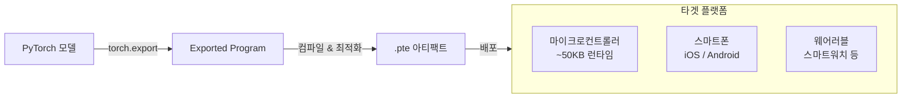
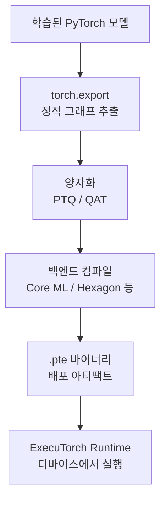

# ExecuTorch 1.0 GA

## 개요

ExecuTorch는 Meta가 개발한 PyTorch 기반의 온디바이스(on-device) 추론 프레임워크다. 마이크로컨트롤러(MCU)부터 스마트폰까지 엣지 디바이스에서 PyTorch 모델을 효율적으로 실행하기 위해 설계되었으며, 2024년 말 1.0 GA(General Availability)가 출시되었다.

## 핵심 설계 목표

## 주요 특성

### 초경량 런타임

- **베이스 런타임 풋프린트 50KB** - 임베디드 시스템에 탑재 가능한 크기
- 동적 메모리 할당 최소화 (정적 메모리 계획 지원)
- C++ 기반으로 OS 의존성 최소

### 광범위한 하드웨어 지원

12개 이상의 하드웨어 백엔드를 공식 지원한다:

| 백엔드 | 제조사 | 특징 |
|--------|--------|------|
| Core ML | Apple | Apple Silicon 최적화 |
| Metal Performance Shaders | Apple | GPU 가속 |
| Hexagon DSP | Qualcomm | NPU 가속 |
| ARM Compute Library | ARM | CPU 최적화 |
| Vulkan | 크로스플랫폼 | GPU |
| XNNPACK | Google | ARM CPU 최적화 |

### 지원 모델

- **Llama 3.2** - Meta 자체 온디바이스 LLM
- **Qwen3** - Alibaba 경량 모델
- **Phi-4** - Microsoft 소형 모델
- 비전 모델(Vision Transformer, ResNet 등)

## torch.export 기반 변환 파이프라인

`torch.export`는 PyTorch 모델을 동적 그래프가 아닌 정적 그래프로 추출해 컴파일 타임 최적화를 가능하게 한다. 기존 TorchScript 대비 더 풍부한 정적 분석이 가능하다.

## Meta 앱 적용 사례

Meta는 WhatsApp, Instagram 등 자사 앱에 ExecuTorch를 적용했으며 공개된 개선 지표:

- **암호화 처리**: 온디바이스에서 처리해 서버 전송 불필요, 프라이버시 향상
- **지연시간 감소**: 네트워크 왕복(round-trip) 제거로 응답 속도 개선
- **오프라인 동작**: 네트워크 없는 환경에서도 AI 기능 사용 가능

## ONNX Runtime / TensorFlow Lite와의 비교

| 항목 | ExecuTorch | ONNX Runtime Mobile | TFLite |
|------|-----------|--------------------|----|
| 기반 프레임워크 | PyTorch | ONNX | TensorFlow |
| 런타임 크기 | ~50KB | ~1MB+ | ~300KB+ |
| LLM 지원 | 공식 지원 | 제한적 | 제한적 |
| Meta 생태계 | 최적화 | 범용 | Google 생태계 |

## 관련 문서

- [[on-device-llm]] - 온디바이스 언어 모델 전반
- [[on-device-inference-stack]] - 엣지 AI 추론 기술 개요
- [[inference-distribution-tiers]] - ExecuTorch가 담당하는 로컬 디바이스 계층
- [[ai-inference-quantization-2026]] - ExecuTorch에서 활용하는 모델 경량화 기법
