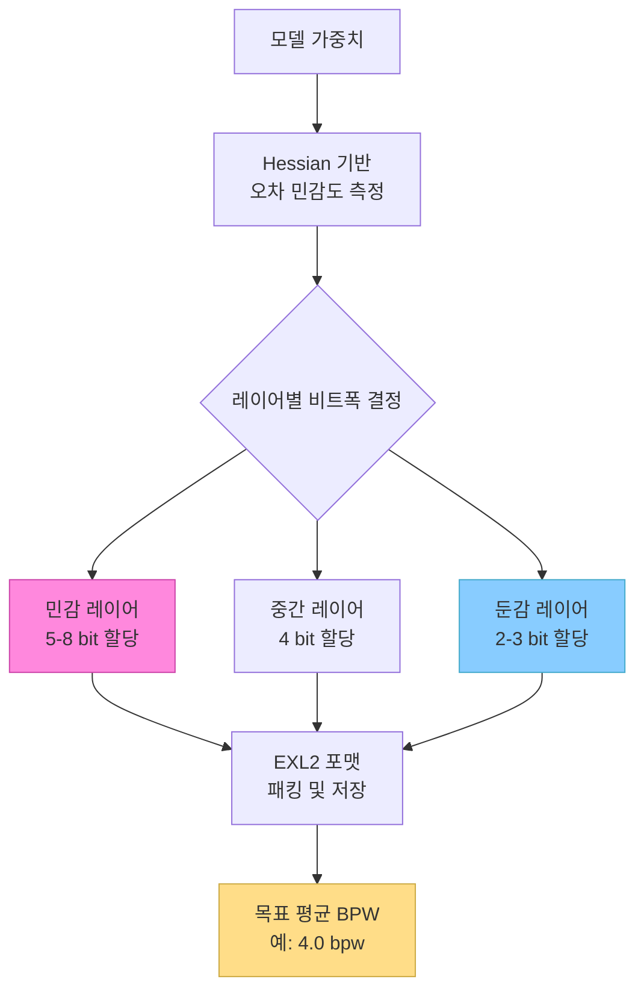
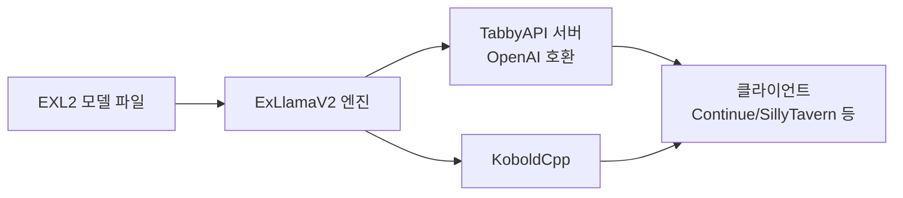

# EXL2 / ExLlamaV2 - 혼합 정밀도 양자화와 NVIDIA 최고 tok/s

## 개요

ExLlamaV2는 NVIDIA GPU 위에서 단일 사용자 로컬 추론을 위해 최적화된 고성능 LLM 추론 엔진이다. EXL2는 ExLlamaV2가 사용하는 독자적인 혼합 정밀도 양자화 포맷으로, 동일 VRAM 내에서 [[gptq-quantization]]이나 [[awq-quantization]] 대비 높은 생성 속도(tok/s)를 제공한다. 주요 사용 시나리오는 소비자급(RTX 시리즈) GPU에서 대형 모델을 고속으로 구동하는 것이다.

## EXL2 포맷의 핵심: 레이어별 혼합 비트폭

기존 양자화 방식([[gptq-quantization]], [[awq-quantization]])은 모델 전체에 고정된 비트폭(예: 4비트)을 적용한다. EXL2는 이와 달리 **레이어마다, 심지어 레이어 내 텐서마다 다른 비트폭**을 할당할 수 있다.

### 비트폭 할당 원리

각 가중치 행렬의 **오차 민감도(importance score)**를 Hessian 근사로 측정하고, 목표 평균 비트폭을 유지하면서 민감한 레이어에는 높은 비트(5~8bit), 덜 민감한 레이어에는 낮은 비트(2~3bit)를 배정한다.



목표 비트폭(bpw, bits per weight)을 예를 들어 4.0으로 설정하면, 중요한 레이어는 5-6 bpw, 덜 중요한 레이어는 2-3 bpw를 받아 평균 4.0 bpw를 유지한다.

## ExLlamaV2 엔진의 성능 요인

ExLlamaV2가 높은 tok/s를 달성하는 핵심 이유는 다음과 같다.

### 1. 전용 CUDA 커널

- EXL2 포맷에 최적화된 custom CUDA 역양자화(dequantization) 커널
- 비트 패킹/언패킹이 연산 파이프라인 내에서 효율적으로 처리
- Flash Attention 2 통합으로 Attention 연산 최소화

### 2. 단일 사용자 최적화

- vLLM 등 서빙 엔진이 다수 사용자 처리를 위한 continuous batching에 집중하는 반면, ExLlamaV2는 단일 스트림 생성 속도(latency)에 집중
- 배치 크기 1에서의 tok/s가 업계 최고 수준

### 3. FP16 부분 연산 혼용

- 양자화된 가중치를 역양자화한 후 FP16 행렬곱을 수행 - 정밀도 손실 최소화
- NVIDIA Tensor Core의 FP16 연산 유닛을 최대 활용

## GPTQ / AWQ와의 성능 비교

| 항목 | GPTQ | AWQ | EXL2 |
|------|------|-----|------|
| 비트폭 | 고정 (4bit) | 고정 (4bit) | 혼합 (2-8bit) |
| 단일 사용자 tok/s | 보통 | 보통 | **최고** |
| 다수 사용자 처리량 | 보통 | 보통 | 낮음 |
| 메모리 효율 | 좋음 | 좋음 | 유연 (bpw 조절) |
| 로딩 시간 | 보통 | 보통 | 빠름 |
| 포맷 호환성 | 넓음 | 넓음 | ExLlamaV2 전용 |

로컬 단일 사용자 환경(챗봇, 코딩 보조 등)에서는 EXL2가 유리하고, 프로덕션 서빙(다수 동시 요청)에서는 vLLM + GPTQ/AWQ가 적합하다.

## 지원 GPU 및 요구사항

- **필수**: NVIDIA GPU (CUDA 지원)
- **권장**: Ampere 이상 (RTX 30/40 시리즈, A100, H100)
- **AMD GPU**: 미지원 (ROCm 미지원)
- **Python**: 3.8 이상, CUDA 11.8 이상

```bash
# ExLlamaV2 설치
pip install exllamav2

# EXL2 모델 변환 (llama.cpp gguf와 별개 포맷)
python convert.py \
    --input_dir ./llama3-70b-hf \
    --output_dir ./llama3-70b-exl2-4bpw \
    --bits 4.0 \
    --cal_dataset wikitext
```

## HuggingFace Hub의 EXL2 모델

TheBlokeOAI(현 bartowski) 등 커뮤니티 사용자들이 인기 모델의 EXL2 변환본을 HuggingFace에 배포하고 있으며, 2.0 ~ 8.0 bpw 등 다양한 변형이 제공된다.

- 파일명 규칙: `model-name-2.5bpw-exl2`, `model-name-4.0bpw-exl2`
- `measurement.json` 파일 포함 - 레이어별 비트 할당 정보 확인 가능

## KoboldCpp, TabbyAPI와의 연계

EXL2 포맷은 ExLlamaV2 백엔드를 사용하는 여러 로컬 AI 프론트엔드 서버에서 기본 지원된다.



## 한계 및 주의사항

- 프로덕션 서빙(높은 동시 요청)에는 부적합 - vLLM, SGLang 사용 권장
- NVIDIA GPU 전용 - AMD, Apple Silicon 미지원
- EXL2 포맷 변환에는 원본 FP16 모델과 캘리브레이션 데이터셋 필요 (수 GB 추가 공간)
- llama.cpp의 GGUF 포맷과 상호 호환되지 않음

## 관련 문서

- [[gptq-quantization]] - 비교 기준이 되는 표준 PTQ 방식
- [[awq-quantization]] - 활성값 가중 양자화, EXL2와 유사한 목표
- [[quantization-model-compression]] - 양자화 방법론 전체 개요
- [[model-serving]] - 단일 사용자 vs 다수 사용자 서빙 아키텍처
- [[kv-cache-inference]] - 단일 사용자 서빙 시 KV 캐시 관리
