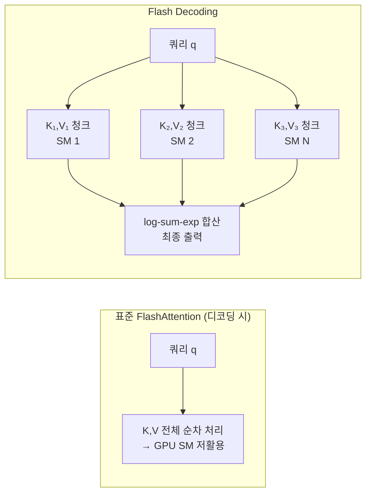

# Flash Decoding (KV 시퀀스 분할 병렬 디코딩)

## 개요

**Flash Decoding**은 [[flashattention-4-paper|FlashAttention]]의 원리를 LLM **디코딩(decode) 단계**에 최적화한 어텐션 알고리즘이다. 디코딩 시 쿼리(query)는 1개 토큰이지만 키(key)/값(value) 시퀀스는 전체 컨텍스트 길이에 달한다. Flash Decoding은 이 긴 KV 시퀀스를 여러 청크로 분할하여 **병렬 처리**하고 결과를 합산함으로써, 긴 컨텍스트에서의 디코딩 속도를 크게 향상시킨다. Together AI가 2023년 발표한 이 기법은 이후 FlashAttention-2/3 및 FlashInfer에 통합되었다.

## 문제: 디코딩 단계의 어텐션 병목

디코딩 단계의 어텐션 연산은 다음 특성을 가진다:

- **쿼리**: 1개 토큰 (또는 배치 크기 B개)
- **키/값**: 전체 컨텍스트 길이 $L$ (최대 수십만 토큰)

연산: $\text{Attention}(q, K, V) = \text{softmax}(qK^T / \sqrt{d}) \cdot V$

표준 FlashAttention은 **시퀀스 길이 방향**으로 타일링하여 SRAM 효율을 높이지만, 이 타일링이 단일 스레드블록(threadblock)에 순차적으로 처리된다. 배치 크기가 작고(디코딩 특성) 시퀀스가 길면, GPU의 SM(Streaming Multiprocessor)이 충분히 활용되지 않는다.



Flash Decoding은 KV를 N개 청크로 분할하여 N개의 SM이 병렬 처리하고, 수치적으로 안정적인 log-sum-exp 합산으로 결과를 통합한다.

## 핵심 알고리즘: 분할-합산

Flash Decoding의 수학적 기반은 **어텐션의 분해 가능성(decomposability)**이다.

어텐션 출력 $O = \text{softmax}(qK^T) \cdot V$를 시퀀스를 $N$ 청크로 분할한다:

$$O_i = \text{softmax}(qK_i^T) \cdot V_i, \quad M_i = \max(qK_i^T), \quad L_i = \sum_j \exp(qK_i^T_j - M_i)$$

각 청크의 $(O_i, M_i, L_i)$를 병렬로 계산한 후, **수치적으로 안정적인 합산**으로 전체 어텐션을 복원:

$$M = \max_i(M_i), \quad L = \sum_i L_i \cdot \exp(M_i - M)$$
$$O = \frac{1}{L} \sum_i O_i \cdot L_i \cdot \exp(M_i - M)$$

이 합산은 FlashAttention의 온라인 softmax 기법을 확장한 것으로, 수치 오차 없이 정확한 결과를 보장한다.

## 성능 향상 조건

Flash Decoding의 효과는 조건에 따라 크게 달라진다:

| 조건 | 속도 향상 |
|------|-----------|
| 컨텍스트 길이 1K, 배치 1 | 1.5-2x |
| 컨텍스트 길이 16K, 배치 1 | 5-8x |
| 컨텍스트 길이 128K, 배치 1 | 10-20x |
| 컨텍스트 길이 16K, 배치 32 | 1.5-2x (배치가 이미 SM 채움) |

**핵심 규칙**: 배치 크기가 작고 컨텍스트가 길수록 효과가 크다. 배치가 충분히 크면 표준 FlashAttention도 SM을 충분히 활용하므로 차이가 줄어든다.

## FlashInfer와의 통합

**[[flashinfer|FlashInfer]]**는 Flash Decoding을 포함한 다양한 최적화 어텐션 커널을 제공하는 라이브러리다. 페이지드(paged) KV 캐시, 희소(sparse) 어텐션, 제약 디코딩과 함께 동작하도록 설계되었다.

```python
import flashinfer

# Flash Decoding with paged KV cache
wrapper = flashinfer.BatchDecodeWithPagedKVCacheWrapper(
    workspace_buffer,
    "NHD",  # KV 레이아웃
)

# 디코딩 단계에서 어텐션 계산
output = wrapper.forward(
    q,          # [batch, n_heads, head_dim]
    kv_cache,   # 페이지드 KV 캐시
)
```

## 롱 컨텍스트 추론에서의 중요성

LLM의 컨텍스트 윈도우가 점점 길어지면서(32K, 128K, 1M 토큰) Flash Decoding의 중요성이 커지고 있다. 일반적인 100K 토큰 컨텍스트에서 Flash Decoding 없이는 어텐션 연산만으로도 수 초의 지연이 발생한다. Flash Decoding은 이를 밀리초 단위로 줄여 실시간 롱 컨텍스트 추론을 가능하게 한다.

## Multi-Query Attention (MQA)와 GQA와의 관계

**MQA(Multi-Query Attention)**와 **GQA(Grouped Query Attention)**는 키/값 헤드 수를 줄여 KV 캐시 메모리와 대역폭을 절감하는 기법이다. Flash Decoding과 MQA/GQA는 직교적(orthogonal)이며 함께 사용하면 시너지가 있다. MQA/GQA로 KV 크기를 줄이고, Flash Decoding으로 남은 KV의 병렬 처리 효율을 높인다.

## 프로덕션 적용 현황

- **vLLM**: FlashInfer 또는 내장 커널로 Flash Decoding 지원
- **SGLang**: 롱 컨텍스트 최적화에 Flash Decoding 활용
- **TensorRT-LLM**: Fused MHA with Flash Decoding variants

## 관련 문서

- [[kv-cache-inference]] - KV 캐시 메모리 관리와 어텐션 최적화
- [[flashattention-4-paper]] - Flash Decoding의 기반이 되는 FlashAttention 알고리즘
- [[flashinfer]] - Flash Decoding 커널을 제공하는 추론 라이브러리
- [[speculative-decoding]] - 디코딩 가속의 다른 접근법
- [[model-serving]] - Flash Decoding이 통합되는 서빙 시스템
