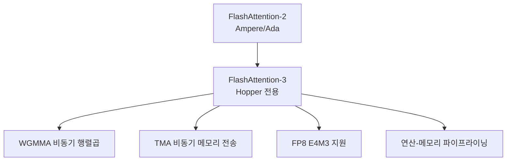

# FlashAttention-3

Dao (2024)의 Hopper GPU(H100) 특화 어텐션 커널. WGMMA(Warpgroup Matrix Multiply-Accumulate)와 TMA(Tensor Memory Accelerator) 비동기 명령을 활용해 FlashAttention-2 대비 **1.5-2x 가속**, FP8 지원으로 추가 속도 향상.

## FA-2에서 FA-3로의 진화

## Hopper 전용 최적화

| 기능 | FA-2 | FA-3 |
|------|------|------|
| 행렬곱 | WMMA (동기) | **WGMMA (비동기)** |
| 메모리 전송 | 직접 로드 | **TMA (하드웨어 가속)** |
| FP8 지원 | 없음 | **E4M3/E5M2** |
| 파이프라이닝 | 2단계 | **3단계 (로드-연산-저장)** |

핵심은 **연산과 메모리 전송의 완전 비동기화**: 현재 타일을 연산하면서 다음 타일을 미리 로드한다.

## FP8 어텐션

FP8 Q/K/V로 계산 시 메모리 대역폭 2x 절감. softmax는 FP32로 유지해 정확도 보존. [[kv-cache-quantization|KV 캐시 양자화]]와 결합하면 추가 절감.

## 성능

H100에서 시퀀스 길이 8K 기준:
- BF16: FA-2 대비 **1.5-1.8x**
- FP8: FA-2 BF16 대비 **2.0-2.5x**

## 관련 문서

- [[flashattention-4-paper]] -- FlashAttention-4 논문
- [[flash-attention]] -- FlashAttention 기초
- [[kv-cache-inference]] -- KV 캐시 추론
- [[model-serving]] -- 모델 서빙
