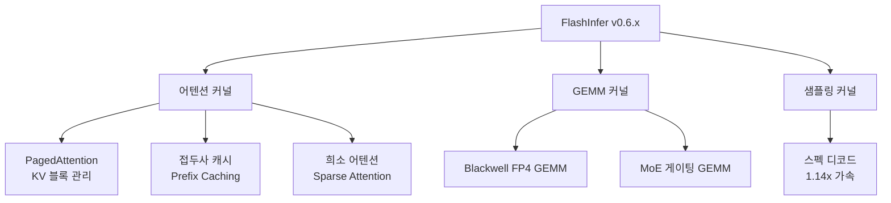

# FlashInfer Kernel Library for LLM Serving

vLLM, SGLang, TensorRT-LLM이 공유하는 어텐션(attention)·MoE·GEMM 커널 라이브러리. GPU 레벨 LLM 추론 최적화의 공용 기반 계층이다.

## 제품 정체성

워싱턴대와 NVIDIA가 협력 개발한 오픈소스 커널 라이브러리. PyTorch와 CUDA/HIP 위에서 어텐션·배치 추론 커널을 최적화하고, 다양한 서빙 프레임워크가 이를 플러그인으로 사용한다.

## 왜 중요한가

NVIDIA가 2026년부터 TensorRT-LLM의 최고 성능 커널을 FlashInfer에 직접 릴리스하기 시작했다. v0.6.x에서 Blackwell FP4 GEMM·스펙 디코드(speculative decoding) 1.14배 가속을 제공하며 MLSys 2026 커널 컨테스트 기반이 됐다.

## 핵심 커널 카탈로그



## 서빙 프레임워크별 통합 현황

| 프레임워크 | FlashInfer 통합 방식 | 버전 |
|-----------|--------------------|----|
| vLLM | 기본 어텐션 백엔드 | v0.4+ |
| SGLang | FlashInfer 우선 백엔드 | 전 버전 |
| TensorRT-LLM | 선택적 커널 교체 | 1.3+ |
| llm-d | vLLM 경유 간접 사용 | - |

## PagedAttention와 접두사 캐싱

FlashInfer의 PagedAttention 구현은 KV 캐시(KV cache)를 고정 크기 블록으로 분할 관리한다. 접두사 캐싱(prefix caching)은 동일한 시스템 프롬프트를 공유하는 요청들의 KV를 재계산 없이 재사용한다.

```
요청 A: [시스템 프롬프트] + [질문 A]
요청 B: [시스템 프롬프트] + [질문 B]
                 ↑
         KV 캐시 공유 (재계산 없음)
```

## ROCm / AMD 지원

AMD는 AITER(Attention Inference Tool for Extreme Routines)를 통해 FlashInfer의 고처리량 프리필(prefill) 어텐션을 ROCm 위에서 구현했다. MI300X 계열에서 H100 대비 경쟁력 있는 처리량을 달성.

## 실무 적용 관점

- **어텐션 백엔드 교체**: vLLM에서 `--attention-backend flashinfer`로 즉시 전환 가능
- **FP4 활용**: Blackwell GPU 보유 시 FP4 GEMM 커널로 메모리 대역폭(bandwidth) 병목 완화
- **스펙 디코딩**: 드래프트 모델(draft model) 설정이 가능한 환경에서 FlashInfer 스펙 디코드로 1.14배 추가 가속
- **MLSys 2026 컨테스트**: FlashInfer 커널 작성 역량이 업계 커널 엔지니어 채용 기준으로 부상

## 대표 레퍼런스

- [FlashInfer: Efficient and Customizable Attention Engine for LLM Inference Serving](https://arxiv.org/abs/2501.01005)
- [flashinfer-ai/flashinfer GitHub repository](https://github.com/flashinfer-ai/flashinfer)
- [Run High-Performance LLM Inference Kernels from NVIDIA Using FlashInfer](https://developer.nvidia.com/blog/run-high-performance-llm-inference-kernels-from-nvidia-using-flashinfer/)
- [MLSys 2026 FlashInfer AI Kernel Generation Contest](https://mlsys26.flashinfer.ai/)
- [FlashInfer on ROCm: High-Throughput Prefill Attention via AITER](https://rocm.blogs.amd.com/artificial-intelligence/flashinfer-release2/README.html)

## 관련 문서

- [[ai-hot-topics-2026-04|2026년 4월 AI 개발 핫토픽 100선]]
- [[vllm-v1-engine|vLLM V1 Engine on Blackwell]]
- [[sglang|SGLang on GB300 NVL72 with NVFP4]]
- [[lmcache-kv-cache-layer|LMCache-Based Distributed KV Cache Offloading]]
- [[vllm-rocm-platform|AMD ROCm as First-Class vLLM Platform]]
- [[kv-cache-compression|Chunk-Semantic KV Cache Compression]]
