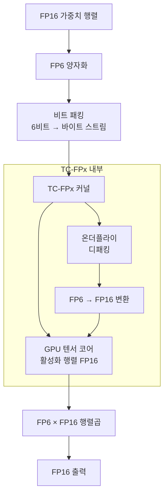
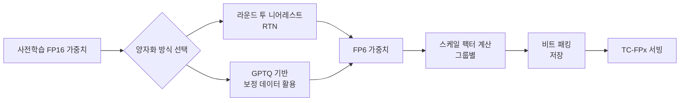

# FP6-LLM - 6비트 부동소수점 추론

## 개요

FP6-LLM은 LLM(대형 언어 모델) 추론을 위한 6비트 부동소수점(FP6) 양자화 및 서빙 프레임워크다. INT4의 정확도 수준을 유지하면서 INT8에 근접한 추론 속도를 달성하는 것이 핵심 목표다. 핵심은 **TC-FPx** 커널로, GPU 텐서 코어(Tensor Core)를 활용하면서도 임의의 부동소수점 비트폭을 지원한다.

기존 양자화 방식과 달리 FP6는 정수(INT) 포맷이 아닌 부동소수점 포맷을 사용하므로, 가중치 분포가 넓거나 아웃라이어(outlier)가 있는 LLM에서 정확도 손실을 줄일 수 있다.

## 왜 FP6인가

양자화 비트폭 선택은 정확도와 속도 사이의 트레이드오프다.

| 포맷 | 정확도 | 속도 | 메모리 |
|------|--------|------|--------|
| FP16 (기준) | 최고 | 느림 | 2x |
| INT8 | 매우 좋음 | 빠름 | 1x |
| FP6 | INT4 수준 이상 | INT8 근접 | 0.75x |
| INT4 | 낮음 | 가장 빠름 | 0.5x |

부동소수점 포맷은 지수부(exponent)와 가수부(mantissa)가 분리되어 있어, 정수보다 넓은 동적 범위(dynamic range)를 갖는다. LLM 가중치는 종 모양(bell-curve) 분포지만 극단값이 존재하는 경우가 많아, FP 포맷이 유리하다.

## TC-FPx 커널 아키텍처

TC-FPx(Tensor Core for Floating-Point x-bit)는 FP6-LLM의 핵심 혁신이다.



### 핵심 기술 요소

**비트 패킹과 언패킹 (Bit Packing/Unpacking)**
- 6비트 값을 GPU 메모리에 연속적으로 패킹해 메모리 전송 효율 극대화
- 커널 실행 중 온더플라이(on-the-fly)로 언패킹하여 연산 진행
- 4비트 그룹의 3개 값을 2바이트에 패킹하는 방식으로 75% 메모리 효율

**텐서 코어 활용**
- NVIDIA 텐서 코어는 FP16/BF16 행렬 연산에 최적화되어 있음
- FP6 값을 FP16으로 변환 후 텐서 코어에 공급하는 방식으로 고성능 유지
- CUDA warp 수준에서 패킹/언패킹 오버헤드를 숨김(latency hiding)

**그룹 양자화 (Group Quantization)**
- 가중치를 그룹(예: 64개 원소)으로 나눠 그룹별 스케일(scale)과 제로포인트(zero-point) 적용
- 그룹 크기가 작을수록 정확도 향상, 오버헤드 증가
- FP6에서는 그룹 크기 128이 정확도/속도 균형에 적합

## FP6 양자화 절차



**스케일 팩터 계산**
$$s = \frac{\max(|W|)}{2^{E-1} \cdot (2 - 2^{-M})}$$

여기서 $E$는 지수 비트, $M$은 가수 비트, $W$는 원래 가중치 행렬이다. FP6는 E2M3 또는 E3M2 포맷을 사용한다.

**E2M3 vs E3M2**
- E2M3 (지수 2비트, 가수 3비트): 정밀도 강조, 자연어 모델에 유리
- E3M2 (지수 3비트, 가수 2비트): 동적 범위 강조, 아웃라이어가 많은 모델에 유리

## 성능 특성

### 추론 속도

FP6-LLM은 NVIDIA A100 GPU 기준으로 다음과 같은 처리량(throughput)을 보인다.

- **FP16 대비**: 1.7-2.1x 처리량 향상
- **INT4 대비**: 속도는 약간 느리지만 정확도에서 우세
- **INT8 대비**: 비슷한 속도, 메모리 사용량 25% 감소

배치 크기(batch size)가 클수록 TC-FPx 커널의 텐서 코어 활용도가 높아져 성능 격차가 벌어진다.

### 정확도

Llama-2, OPT, BLOOM 등 주요 모델에서의 PPL(Perplexity) 비교:

| 모델 | FP16 | FP6 (E2M3) | INT4 |
|------|------|------------|------|
| Llama-2-7B | 5.47 | 5.52 | 5.68 |
| Llama-2-13B | 4.88 | 4.91 | 5.05 |
| OPT-6.7B | 10.86 | 10.93 | 11.21 |

FP6는 FP16 대비 PPL 저하가 INT4보다 절반 이하로, 실용적인 정확도를 유지한다.

## 실무 적용

```python
# FP6-LLM 추론 예시 (개념적 코드)
from fp6_llm import convert_to_fp6, FP6Linear

# 모델 로드 후 레이어별 FP6 변환
model = load_pretrained_model("meta-llama/Llama-2-7b-hf")

for name, module in model.named_modules():
    if isinstance(module, torch.nn.Linear):
        # FP6 변환: E2M3 포맷, 그룹 크기 128
        fp6_weight = convert_to_fp6(
            module.weight,
            format="E2M3",
            group_size=128
        )
        # TC-FPx 커널이 탑재된 레이어로 교체
        replace_with_fp6_linear(model, name, fp6_weight)

# 추론 실행 - TC-FPx 커널 자동 활성화
output = model.generate(input_ids, max_new_tokens=200)
```

**적합한 시나리오**
- INT4 양자화 시 허용 불가한 정확도 저하가 발생하는 경우
- INT8보다 메모리를 더 절약하고 싶은 경우
- A100/H100 등 최신 GPU 텐서 코어를 활용할 수 있는 환경

**주의사항**
- TC-FPx 커널은 특정 NVIDIA GPU(Ampere 이상)에 최적화됨
- AMD GPU나 구형 CUDA 버전에서는 폴백(fallback) 경로 필요
- 활성화(activation)는 여전히 FP16으로 처리 - 가중치 전용 양자화

## [[quantization-model-compression|양자화]] 기법과의 비교

| 기법 | 비트폭 | 포맷 | 캘리브레이션 필요 | 속도 |
|------|--------|------|-------------------|------|
| [[gptq-quantization\|GPTQ]] | 3-4비트 | INT | 필요 (보정 데이터) | 빠름 |
| [[awq-quantization\|AWQ]] | 4비트 | INT | 필요 | 빠름 |
| [[smoothquant\|SmoothQuant]] | 8비트 | INT | 필요 | 중간 |
| FP6-LLM | 6비트 | FP | 선택적 | INT8 수준 |
| [[nvfp4-quantization\|NV FP4]] | 4비트 | FP | 필요 | 매우 빠름 |

FP6는 INT4보다 정확하고 INT8과 비슷한 속도라는 포지셔닝이다. INT4로 가기 어려운 중간 지점을 노린다.

## 한계와 과제

- **하드웨어 의존성**: NVIDIA Ampere/Hopper 텐서 코어 전용 최적화, AMD 미지원
- **활성화 양자화 미지원**: 가중치 전용(W6A16)으로 활성화 병목은 해소하지 못함
- **에코시스템 미성숙**: vLLM, TGI 등 주류 서빙 스택의 네이티브 지원 미흡
- **커스텀 커널 의존**: 프로덕션 안정성과 유지보수 부담

## 관련 문서

- [[awq-quantization]] - 가중치 활성화 양자화, FP6의 대안
- [[gptq-quantization]] - 보정 기반 INT4 양자화
- [[nvfp4-quantization]] - NVIDIA FP4 양자화 (더 적극적 압축)
- [[smoothquant]] - 활성화-가중치 공동 양자화
- [[kv-cache-quantization]] - KV 캐시 양자화
- [[ai-inference-quantization-2026]] - 2026년 추론 양자화 동향
- [[omniquant-calibration]] - 학습 기반 양자화 (같은 큐)
- [[atom-int8-quant]] - INT8 추론 최적화 (같은 큐)
