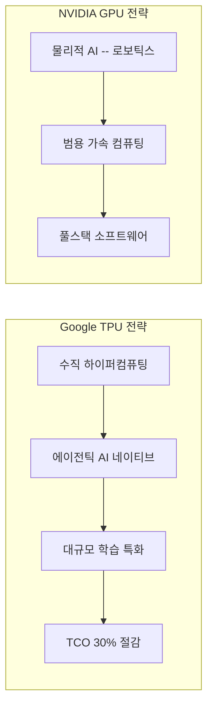

# Google TPU Ironwood / Trillium

Google의 7세대 TPU(Ironwood, TPU v7)와 6세대 TPU(Trillium, TPU v6). 듀얼 칩렛(Dual-Chiplet) 설계와 에이전틱 AI(Agentic AI) 네이티브 최적화를 최초로 지원하며, Anthropic의 100만 TPU 학습 클러스터 구성으로 대규모 AI 학습의 새로운 기준을 세웠다.

## 개요

Google TPU는 NVIDIA GPU 중심의 AI 하드웨어 시장에서 유일하게 대안적 위치를 확보한 커스텀 실리콘이다. 2026년 기준, TPU v7(Ironwood)은 범용 GPU와의 직접 경쟁보다 "수직 하이퍼컴퓨팅(Vertical Hypercomputing)" 전략을 통해 차별화를 추구한다. NVIDIA가 로보틱스/시뮬레이션 등 "물리적 AI(Physical AI)"에 집중하는 동안, Google은 에이전틱 AI와 대규모 학습 워크로드에 특화한 접근을 취한다.

## 핵심 사양

### TPU v7 Ironwood 칩 스펙

| 항목 | 사양 |
|------|------|
| 연산 성능 | 4,614 FP8 TFLOPS |
| HBM | 192 GB HBM3E (8 스택) |
| HBM 대역폭 | 7.37 TB/s |
| 칩렛 구성 | 듀얼 칩렛 (각 1 TensorCore + 2 SparseCore + 96 GB HBM) |
| ICI 대역폭 | 9.6 Tb/s (칩 간 인터커넥트) |
| 세대 대비 성능 | TPU v5p 대비 10배 피크 성능, TPU v6e 대비 4배 효율 |

### Ironwood 팟 (Pod) 구성

| 항목 | 사양 |
|------|------|
| 최대 가속기 수 | 9,216개 |
| 총 연산 성능 | 42.5 FP8 ExaFLOPS |
| 총 HBM 용량 | 1.77 PB |
| 네트워크 | OCS(Optical Circuit Switch) 기반 |

## 핵심 특징

### 에이전틱 AI 네이티브 최적화
TPU v7(Ironwood)과 v6(Trillium)은 에이전틱 AI 애플리케이션을 네이티브로 지원하는 최초의 AI 칩이다. 빠른 피드백 루프(Fast Feedback Loop)와 다단계 추론(Multi-Step Reasoning) 기능을 관리하도록 설계됐다.

### 듀얼 칩렛 설계
TPU v7은 듀얼 칩렛(Dual-Chiplet) 아키텍처를 채택했다. 각 칩렛은 1개의 TensorCore, 2개의 SparseCore, 96 GB HBM3E로 구성된 독립적 유닛이다. 이 설계로 단일 칩 한계를 넘어서는 성능 확장과 제조 수율(Yield) 개선, 열 관리 효율화를 동시에 달성한다.

### TCO 경쟁력
동급 NVIDIA 인프라 대비 **30% 낮은 TCO(Total Cost of Ownership)** 를 제공한다. OCS(Optical Circuit Switch) 기반의 초유연 네트워크 토폴로지를 통한 효율적 스케일아웃이 핵심 요인이다.

## 기술 상세

### 세대별 비교

| 세대 | 코드명 | 핵심 혁신 | FP8 성능 | 시기 |
|------|--------|-----------|----------|------|
| TPU v5p | - | 대규모 학습 최적화 | 459 TFLOPS | 2023 |
| TPU v6e | Trillium | 에이전틱 AI 최적화 도입 | ~1,150 TFLOPS | 2025 |
| TPU v7 | Ironwood | 듀얼 칩렛, 4배 효율 향상 | 4,614 TFLOPS | 2026 |

### Anthropic 대규모 학습 클러스터

Anthropic은 Google Cloud의 TPU를 활용한 100만 TPU 규모의 학습 클러스터를 구축하여 차세대 모델을 학습하고 있다. OCS 네트워크 토폴로지 덕분에 동급 NVIDIA 인프라 대비 TCO가 30% 낮아, 대규모 학습에서의 경제성이 핵심 선택 요인이다.

### 전략적 차별화

### 네트워크 아키텍처
OCS(Optical Circuit Switch)를 통해 TPU 간 네트워크 토폴로지를 동적으로 재구성할 수 있다. 9,216개 칩을 9.6 Tb/s ICI로 연결하여, 워크로드 특성에 따라 최적의 통신 패턴을 실시간으로 적용한다. 고정 토폴로지 대비 대역폭 효율을 크게 향상시키며, 특히 대규모 학습에서 all-reduce 통신 패턴 최적화에 유리하다.

### NVIDIA B200/GB200 대비 포지셔닝

TPU v7은 NVIDIA GB300과 직접 비교되는 포지션에 있다. Google은 자체 AI Hypercomputer 모델을 통해 Axion CPU + Ironwood TPU를 수직 통합하여, 단일 벤더 솔루션으로서의 장점을 극대화하고 있다.

| 비교 항목 | TPU v7 Ironwood | NVIDIA GB300 |
|----------|----------------|--------------|
| FP8 성능 (칩) | 4,614 TFLOPS | ~2,500 TFLOPS |
| HBM 용량 (칩) | 192 GB HBM3E | 192 GB HBM3E |
| 최대 Pod 규모 | 9,216 칩 | DGX SuperPOD |
| Pod 총 성능 | 42.5 ExaFLOPS | - |
| 주요 고객 | Anthropic, Google 내부 | OpenAI, Meta, xAI |
| 차별화 | OCS 네트워크, 에이전틱 AI | CUDA 생태계, 풀스택 SW |

### 소프트웨어 스택

TPU v7은 JAX/XLA 기반 소프트웨어 스택과 긴밀하게 코디자인되었다. CUDA 생태계에 종속되지 않는 대신, Google의 자체 ML 컴파일러 스택(XLA, GSPMD)을 통해 모델 병렬화와 최적화를 수행한다. PyTorch/XLA 브리지도 제공되어 PyTorch 워크로드의 이식도 가능하다.

## 관련 문서

- [[nvidia-vera-rubin]] -- 경쟁 플랫폼: NVIDIA Vera Rubin
- [[amd-mi400-helios]] -- 경쟁 플랫폼: AMD MI400
- [[custom-ai-chips-asic]] -- 커스텀 AI 칩 동향
- [[nvidia-groq-3-lpu]] -- NVIDIA의 추론 전용 가속기
- [Anthropic's Use of Google Cloud TPUs](https://www.anthropic.com/news/expanding-our-use-of-google-cloud-tpus-and-services)
- [TPU Hegemony Analysis (Smile.eu)](https://smile.eu/en/publications-and-events/hegemony-specialized-silicon-why-tpu-come-back-redefining-ai-2026)
- [Google TPU v7 Ironwood Chip (ServeTheHome)](https://www.servethehome.com/this-is-the-google-tpu-v7-ironwood-chip/)
