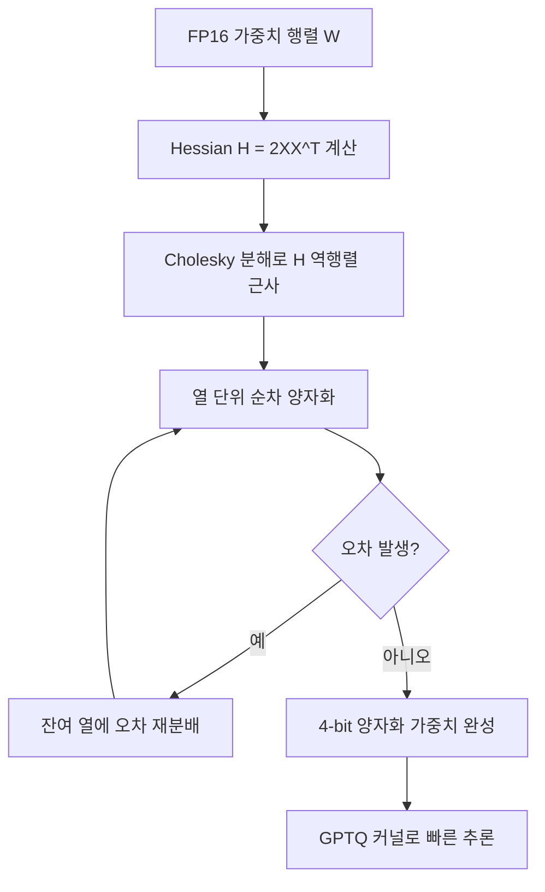

# GPTQ 양자화 (Hessian 기반 4-bit 양자화)

## 개요

**GPTQ(Generative Pre-trained Transformer Quantization)**는 대규모 언어 모델을 4-bit 정수 형태로 압축하는 사후 학습 양자화(Post-Training Quantization, PTQ) 기법이다. 2022년 Frantar et al.이 발표한 이 방법은 Hessian 정보를 활용해 각 레이어의 최적 양자화 오차를 최소화하며, 재학습 없이도 FP16 대비 품질 손실을 크게 줄인다. 현재 GPU 환경에서 사실상의 표준(de facto standard) PTQ 방법으로 자리잡고 있다.

## 핵심 원리: OBQ와 Hessian 기반 오차 보정

GPTQ는 **OBQ(Optimal Brain Quantization)** 프레임워크를 확장한다. 핵심 아이디어는 가중치를 순차적으로 양자화할 때, 이미 양자화된 가중치가 만들어낸 오차를 **나머지 가중치에 재분배(error compensation)**하여 레이어 전체의 출력 오차를 최소화하는 것이다.

수학적으로는 다음 문제를 푼다:

$$\text{argmin}_{\hat{W}} \| WX - \hat{W}X \|_F^2$$

여기서 $W$는 원본 가중치, $\hat{W}$는 양자화된 가중치, $X$는 입력 행렬이다. 이 목적함수의 Hessian은 $H = 2X X^T$이며, GPTQ는 이 Hessian의 역행렬을 이용해 오차를 효율적으로 전파한다.



위 흐름은 한 트랜스포머 레이어 내에서 GPTQ가 가중치를 압축하는 과정이다.

## GPU 표준으로서의 위치

GPTQ가 GPU 추론 표준으로 자리잡은 이유는 다음 세 가지다:

1. **높은 압축률**: FP16(2바이트)에서 INT4(0.5바이트)로 4배 압축. 70B 모델을 단일 A100 80GB에 올릴 수 있게 된다.
2. **우수한 품질 유지**: 그룹 단위 양자화(group-size=128) 적용 시 대부분 벤치마크에서 FP16과 거의 동등한 성능.
3. **실용적인 커널 지원**: AutoGPTQ, ExLlama, ExLlamaV2 등의 고속 CUDA 커널이 GPTQ 포맷을 직접 지원해 추론 속도가 빠르다.

| 설정 | 모델 크기 | VRAM 사용 | 품질 |
|------|-----------|-----------|------|
| FP16 | 140GB (70B) | 기준 | 기준 |
| GPTQ 4-bit, g128 | 35GB | 75% 절감 | ~98% |
| GPTQ 3-bit, g128 | 26GB | 81% 절감 | ~93% |

## 그룹 양자화 (Group Quantization)

모든 가중치에 하나의 스케일 팩터를 적용하면 정밀도 손실이 크다. GPTQ는 **그룹 양자화**를 통해 이를 완화한다. `group_size=128`이면 가중치 128개마다 별도의 스케일과 제로포인트를 사용한다. 그룹 크기가 작을수록 정밀도가 높아지지만 메모리 오버헤드가 증가한다.

## 실용적 적용

```python
# AutoGPTQ를 이용한 GPTQ 양자화 예시
from auto_gptq import AutoGPTQForCausalLM, BaseQuantizeConfig

quantize_config = BaseQuantizeConfig(
    bits=4,           # 4-bit 양자화
    group_size=128,   # 그룹 크기
    damp_percent=0.1, # Hessian 안정화 댐핑
)

model = AutoGPTQForCausalLM.from_pretrained(
    "meta-llama/Llama-3-70B",
    quantize_config=quantize_config,
)
model.quantize(calibration_dataset)
model.save_quantized("llama-3-70b-gptq")
```

보정(calibration) 데이터셋은 256~1024개 샘플이면 충분하며, 데이터셋 선택이 품질에 영향을 미친다.

## GPTQ vs. 다른 PTQ 방법

| 기법 | 핵심 아이디어 | 강점 | 약점 |
|------|-------------|------|------|
| GPTQ | Hessian 오차 보정 | 4-bit GPU 표준, 툴 생태계 | 칼리브레이션 시간 소요 |
| [[awq-quantization\|AWQ]] | 중요 가중치 보호 | 정확도 우수, 하드웨어 친화적 | 일부 아키텍처 제한 |
| GGUF/GGML | 단순 선형 양자화 | CPU 추론, llama.cpp 호환 | 정밀도 낮음 |
| SqueezeLLM | 희소 양자화 | 극소 모델 지원 | 느린 커널 |

## 한계와 발전 방향

- **칼리브레이션 의존성**: 보정 데이터의 분포가 실제 사용과 다르면 품질 저하가 발생할 수 있다.
- **활성화 양자화 미지원**: 가중치만 양자화하며 활성화는 FP16으로 남는다(W4A16). W4A8을 위해서는 추가 기법이 필요하다.
- **ExLlamaV2 커널**: GPTQ 포맷을 최적화한 ExLlamaV2는 전통적인 FP16 추론보다도 빠른 속도를 달성한다.

## 관련 문서
- [[marlin-kernel]] -- Marlin 커널
- [[exl2-exllamav2]] -- EXL2 / ExLlamaV2 - 혼합 정밀도 양자화와 NVIDIA 최고 tok/s

- [[quantization-model-compression]] - 양자화의 일반 개념과 기법 분류
- [[ai-inference-quantization-2026]] - 2026년 양자화 트렌드 개요
- [[awq-quantization]] - 중요 가중치 보호 기반의 대안적 4-bit 양자화
- [[nvfp4-quantization]] - NVIDIA NVFP4 부동소수점 양자화 기법
- [[turboquant]] - 양자화 가속 최적화 도구
