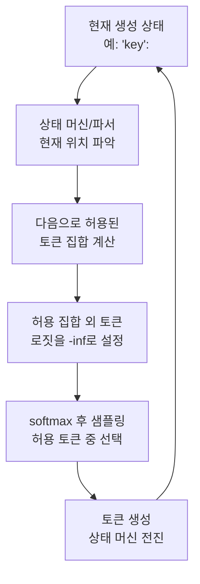

# 가이디드 디코딩 (Guided/Constrained Decoding)

## 개요

가이디드 디코딩(Guided Decoding)은 LLM이 특정 형식(JSON 스키마, 정규식, 문맥 자유 문법 등)에 맞는 출력만 생성하도록 매 토큰 생성 시 허용되지 않는 토큰의 로짓(logit)을 마스킹하는 기법이다. 구조화된 출력(Structured Output)을 보장하는 핵심 기술이다.

## 왜 필요한가

LLM에게 JSON을 요청해도 종종 유효하지 않은 JSON을 반환한다. 프롬프트 엔지니어링만으로는 100% 보장이 불가능하다.

```
문제:
- 후행 쉼표(trailing comma) 오류
- 따옴표 불일치
- 중첩 괄호 누락
- 임의 텍스트 혼입

해결: 문법적으로 불가능한 토큰을 디코딩 단계에서 물리적으로 차단
```

## 로짓 마스킹 동작 원리



위 흐름은 매 토큰 생성 스텝마다 반복된다.

## 주요 구현 비교

### Outlines

Python 라이브러리. 정규식, JSON Schema, Pydantic 모델을 상태 머신(FSM, Finite State Machine)으로 컴파일하여 마스킹.

- 상태 머신 기반: 정규식 → NFA → DFA 변환
- 어휘(vocabulary)와 상태 머신을 사전 교차하여 허용 토큰 인덱스 캐싱
- vLLM, llama.cpp 등과 통합

### XGrammar

Pushdown Automaton(PDA, 푸시다운 오토마톤) 기반. CFG(문맥 자유 문법) 전체를 지원.

- 스택 기반 문법 파싱: JSON 외에 임의 프로그래밍 언어 문법 지원
- 마스크 사전 계산으로 런타임 오버헤드 최소화
- TensorRT-LLM, SGLang과 통합

### llama.cpp GBNF

GBNF(GGML BNF) 형식의 사용자 정의 문법. 경량 엣지 환경에서 사용.

## 지원 형식

| 형식 | 도구 | 설명 |
|------|------|------|
| JSON Schema | Outlines, XGrammar | 스키마 정의 기반 구조화 출력 |
| Pydantic 모델 | Outlines | Python 타입 힌트에서 자동 추출 |
| 정규식 | Outlines | 전화번호, 날짜 등 패턴 |
| CFG / BNF | XGrammar, llama.cpp GBNF | 임의 문법 |
| 열거형(Enum) | 대부분 | 정해진 선택지만 허용 |

## Structured Output vs Constrained Decoding

| 구분 | Structured Output (API 레벨) | Constrained Decoding (커널 레벨) |
|------|------------------------------|----------------------------------|
| 구현 위치 | API 미들웨어 / 프롬프트 | 토큰 샘플링 직전 |
| 보장 수준 | 소프트 (대부분 맞음) | 하드 (100% 보장) |
| 예시 | OpenAI response_format | Outlines, XGrammar |
| 오버헤드 | 거의 없음 | 상태 계산 비용 |

## 성능 오버헤드

- 상태 머신 사전 컴파일: 최초 1회 수초 소요 (이후 캐시)
- 런타임 마스킹: 배치당 수 밀리초 이하 (캐싱 시)
- 복잡한 중첩 스키마: 상태 폭발 가능 (최적화 필요)

## 실무 권장

- JSON 출력 강제: JSON Schema + Outlines/XGrammar
- API 레벨에서 가능하면 먼저 시도 (OpenAI `response_format`, Anthropic 도구 호출)
- 커널 레벨 constrained decoding은 자체 서빙 환경에서 효과적

## 관련 문서

- [[beam-search-decoding]] - 디코딩 전략 비교
- [[repetition-penalty-logit-bias]] - 로짓 조작의 다른 활용
- [[xgrammar-2]] - XGrammar 상세 구현
- [[sglang]] - SGLang의 구조화 출력 지원
