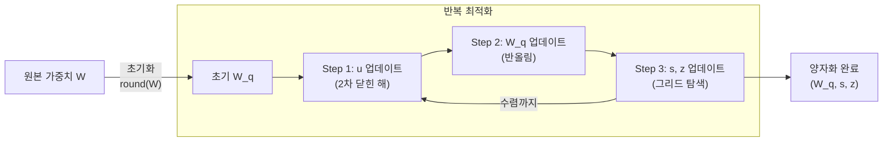
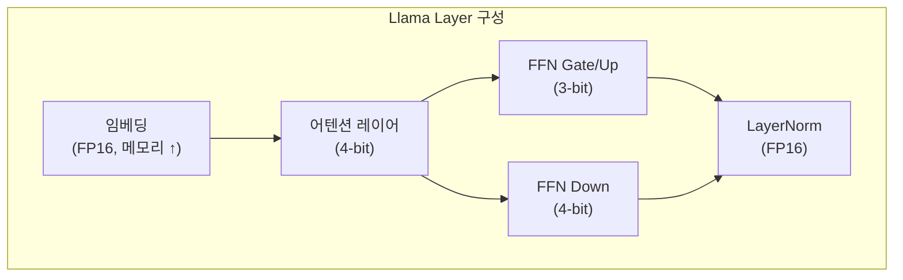

# HQQ - 반2차 양자화

HQQ(Half-Quadratic Quantization)는 Badri & Shaji (2023)가 제안한 학습 후 양자화(PTQ) 기법으로, **캘리브레이션 데이터 없이** 빠르게 LLM 가중치를 양자화한다. [[gptq-quantization]]이 헤시안 역행렬을 계산하고 캘리브레이션 데이터를 필요로 하는 반면, HQQ는 반2차(half-quadratic) 분리 최적화를 통해 순수 가중치 최적화만으로 유사한 성능을 달성한다.

## 배경 - 기존 양자화 기법의 한계

| 기법 | 캘리브레이션 | 속도 | 주요 한계 |
|------|------------|------|----------|
| [[gptq-quantization]] | 필요 (128~2048 샘플) | 느림 | 대규모 모델에서 수 시간 소요 |
| [[awq-quantization]] | 필요 | 보통 | 활성값 통계 수집 필요 |
| [[smoothquant]] | 필요 | 보통 | W8A8 위주, 저비트 어려움 |
| HQQ | **불필요** | 빠름 | 극단적 저비트(2bit)에서 품질 저하 |

HQQ는 캘리브레이션 데이터 없이 [[gptq-quantization]] 대비 **100배 빠른 양자화**를 달성한다.

## 핵심 아이디어 - 반2차 분리

### 양자화 문제 공식화

가중치 행렬 $W$를 $b$비트 정수로 양자화할 때, 재구성 오차를 최소화하는 스케일 $s$와 영점(zero-point) $z$를 찾는 문제:

$$\min_{W_q, s, z} \|W - \text{dequant}(W_q, s, z)\|_F^2$$

여기서 $\text{dequant}(W_q, s, z) = s \cdot W_q + z$.

### 반2차 분리 (Half-Quadratic Splitting)

직접 이산 최적화는 NP-hard이므로, HQQ는 **보조 변수 $u$**를 도입하여 문제를 분리한다:

$$\min_{W_q, u, s, z} \|W - u\|_F^2 + \rho \|u - \text{dequant}(W_q, s, z)\|_F^2$$

- $u$: 연속 보조 변수 (W에 가깝게 유지)
- $\rho$: 결합 강도 파라미터

이를 교대로 최적화:

1. **$u$ 고정, $W_q$ 최적화**: $\text{Round}(u - z) / s$ 로 단순 반올림
2. **$W_q$ 고정, $u$ 최적화**: 2차(quadratic) 문제 → 닫힌 형태 해 존재
3. **$s$, $z$ 최적화**: 1D 스케일/영점 그리드 탐색



### 수학적 상세

**u 업데이트 (닫힌 해):**
$$u^* = \frac{W + \rho \cdot \text{dequant}(W_q, s, z)}{1 + \rho}$$

**W_q 업데이트:**
$$W_q = \text{clip}\left(\text{Round}\left(\frac{u - z}{s}\right), 0, 2^b - 1\right)$$

**스케일/영점 초기화 (percentile 기반):**
$$s = \frac{\max(W) - \min(W)}{2^b - 1}, \quad z = -\min(W)$$

## 구현 예시

### 설치 및 기본 사용

```python
# pip install hqq
from hqq.core.quantize import BaseQuantizeConfig, HQQLinear
import torch

# 단일 레이어 양자화
linear = torch.nn.Linear(4096, 4096, bias=False)
quant_config = BaseQuantizeConfig(
    nbits=4,          # 비트 수 (2, 3, 4, 8)
    group_size=64,    # 그룹 크기 (채널별 독립 스케일)
)

# 인플레이스 양자화
HQQLinear.set_backend("torchao_int4")  # 추론 백엔드 선택
hqq_linear = HQQLinear(linear, quant_config, compute_dtype=torch.float16)
```

### 전체 LLM 양자화

```python
from hqq.models.hf.base import AutoHQQHFModel
from hqq.core.quantize import BaseQuantizeConfig

model_id = "meta-llama/Llama-3-8b"

# 비트별 혼합 정밀도 설정
quant_config = {
    # 어텐션 레이어: 더 높은 정밀도
    "self_attn.q_proj": BaseQuantizeConfig(nbits=4, group_size=64),
    "self_attn.k_proj": BaseQuantizeConfig(nbits=4, group_size=64),
    "self_attn.v_proj": BaseQuantizeConfig(nbits=4, group_size=64),
    "self_attn.o_proj": BaseQuantizeConfig(nbits=4, group_size=64),
    # FFN 레이어: 상대적으로 낮은 정밀도
    "mlp.gate_proj":    BaseQuantizeConfig(nbits=3, group_size=64),
    "mlp.up_proj":      BaseQuantizeConfig(nbits=3, group_size=64),
    "mlp.down_proj":    BaseQuantizeConfig(nbits=3, group_size=64),
}

# 모델 로드 및 양자화 (캘리브레이션 불필요)
model = AutoHQQHFModel.from_pretrained(model_id)
AutoHQQHFModel.quantize_model(
    model,
    quant_config=quant_config,
    compute_dtype=torch.float16,
    device="cuda",
)

# 저장
model.save_pretrained("./llama-3-8b-hqq")
```

### 추론 백엔드 선택

```python
from hqq.utils.patching import prepare_for_inference

# 다양한 추론 커널 지원
# - "torchao_int4": Apple Silicon + CUDA 범용
# - "bitblas": 고성능 CUDA 커널 (A100/H100 권장)
# - "cuda_fp16_had": Hadamard 변환 + FP16
prepare_for_inference(model, backend="bitblas")
```

## 성능 비교

### 양자화 속도 (Llama-2-70B 기준, A100)

| 기법 | 양자화 시간 | 캘리브레이션 |
|------|-----------|------------|
| [[gptq-quantization]] (W4) | ~3-4 시간 | 필요 (2048 샘플) |
| [[awq-quantization]] (W4) | ~1 시간 | 필요 |
| HQQ (W4) | **~2-3 분** | 불필요 |
| HQQ (W3) | ~3-4 분 | 불필요 |

### 모델 품질 (Llama-2-7B, WikiText-2 Perplexity, 낮을수록 좋음)

| 기법 | 비트 | Perplexity |
|------|------|-----------|
| FP16 기준 | 16 | 5.47 |
| [[gptq-quantization]] | 4 | 5.62 |
| [[awq-quantization]] | 4 | 5.60 |
| HQQ | 4 | 5.68 |
| [[gptq-quantization]] | 3 | 6.21 |
| HQQ | 3 | 6.09 |
| HQQ | 2 | 8.54 |

4비트에서는 GPTQ/AWQ가 약간 앞서나, 3비트에서는 HQQ가 오히려 경쟁력 있다. 핵심은 **캘리브레이션 없이** 이 수준의 품질을 달성한다는 점이다.

## 혼합 정밀도 양자화 (Mixed Precision)

HQQ는 레이어별로 다른 비트를 쉽게 적용할 수 있다:



```python
# 민감도 기반 혼합 정밀도 (OutlierTuned HQQ)
# 아웃라이어가 많은 레이어는 높은 비트 유지
sensitive_layers = ["model.layers.0", "model.layers.1", "model.layers.-1"]

for name, module in model.named_modules():
    if isinstance(module, torch.nn.Linear):
        if any(s in name for s in sensitive_layers):
            nbits = 4  # 민감 레이어: 4비트
        else:
            nbits = 3  # 나머지: 3비트
        quant_config[name] = BaseQuantizeConfig(nbits=nbits, group_size=64)
```

## PEFT (LoRA)와의 결합

HQQ로 양자화된 모델 위에 LoRA 파인튜닝 적용 (QLoRA 대안):

```python
from peft import get_peft_model, LoraConfig
from hqq.models.hf.base import AutoHQQHFModel

# 1. HQQ 양자화
model = AutoHQQHFModel.from_pretrained("llama-3-8b")
AutoHQQHFModel.quantize_model(model, quant_config=BaseQuantizeConfig(nbits=4))

# 2. LoRA 추가 (양자화 가중치는 고정, LoRA만 학습)
lora_config = LoraConfig(
    r=16,
    lora_alpha=32,
    target_modules=["q_proj", "v_proj"],
    lora_dropout=0.05,
)
model = get_peft_model(model, lora_config)

# HQQ 가중치는 고정, LoRA 파라미터만 학습
trainable_params = sum(p.numel() for p in model.parameters() if p.requires_grad)
print(f"학습 가능 파라미터: {trainable_params:,}")
```

## HQQ+ 확장

HQQ+는 캘리브레이션 데이터를 **선택적으로** 사용할 수 있는 확장 버전이다:

```python
# HQQ+: 소량의 캘리브레이션으로 추가 개선 (옵션)
from hqq.engine.hf import HQQModelForCausalLM

model = HQQModelForCausalLM.from_quantized("./llama-3-8b-hqq")

# 64 샘플로 스케일/영점 미세조정 (몇 분 추가)
# 완전한 캘리브레이션 없이 부분 개선 가능
```

## 실무 선택 가이드

```mermaid
flowchart TD
    Q1{캘리브레이션\n데이터 있음?} --> |없음| HQQ[HQQ 사용]
    Q1 --> |있음| Q2{속도 vs 품질\n우선순위?}

    Q2 --> |"품질 우선"| Q3{비트 수?}
    Q2 --> |"속도 우선"| HQQ

    Q3 --> |"4bit"| GPTQ_AWQ[GPTQ 또는 AWQ]
    Q3 --> |"3bit 이하"| HQQ3[HQQ (3bit에서 경쟁력)]

    HQQ --> Done1[빠른 배포]
    GPTQ_AWQ & HQQ3 --> Done2[품질 최적화 배포]
```

| 상황 | 권장 |
|------|------|
| 빠른 프로토타입/실험 | HQQ 4bit |
| 캘리브레이션 불가 환경 | HQQ |
| 최고 품질 필요 (4bit) | GPTQ 또는 AWQ |
| 3bit 저메모리 서빙 | HQQ 3bit |
| 엣지/온디바이스 배포 | HQQ 2-3bit + 혼합 정밀도 |

## 관련 문서

- [[gptq-quantization]] - 헤시안 기반 가중치 양자화
- [[awq-quantization]] - 활성값 가중 양자화
- [[smoothquant]] - 활성값 평활화 양자화
- [[ai-inference-quantization-2026]] - 최신 양자화 기법 비교
- [[exl2-exllamav2]] - 혼합 정밀도 양자화 추론
