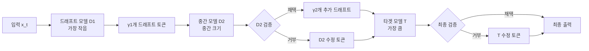

# Hydra 캐스케이딩 추측 디코딩 (Hydra Speculation Cascade)

## 개요

Hydra 캐스케이딩 추측 디코딩은 [[speculative-decoding]]의 확장 개념으로, 단일 드래프트 모델 대신 **여러 단계로 구성된 드래프트 모델 계층(cascade)**을 사용한다. 작은 모델이 초안을 생성하고, 중간 모델이 중간 검증 및 정제를 수행하며, 최종적으로 대형 타겟 모델이 최종 검증을 담당한다. 마치 그리스 신화의 히드라(Hydra)처럼 다중 헤드 구조를 가진다.

핵심 목표: 정확도-속도 트레이드오프(accuracy-speed tradeoff)를 계층적으로 제어하여, 단일 드래프트 모델 대비 더 높은 수용률과 더 큰 가속 배율을 동시에 달성한다.

## 표준 추측 디코딩의 한계

표준 추측 디코딩([[speculative-decoding]])은 드래프트 모델 하나와 타겟 모델 하나의 2단계 구조다. 이 구조에서 다음 트레이드오프가 존재한다:

- **작은 드래프트 모델**: 빠르게 드래프트를 생성하지만 수용률이 낮다
- **큰 드래프트 모델**: 수용률은 높지만 드래프팅 비용이 높아 가속 효과가 감소한다

최적의 드래프트 모델 크기를 단일로 고정하면 항상 이 트레이드오프에 갇히게 된다.

## 캐스케이드 구조



캐스케이드 구조: 각 단계는 이전 단계의 출력을 받아 추가 정제를 수행한다.

### 단계 설명

1. **드래프트 단계 (D1)**: 가장 작은 모델이 초기 $\gamma_1$개 토큰을 빠르게 생성한다. 비용이 매우 낮지만 수용률도 낮다.

2. **중간 검증 및 재드래프팅 (D2)**: 중간 크기 모델이 D1의 출력을 검증한다. 수용된 토큰에 이어 $\gamma_2$개 추가 드래프트 토큰을 생성하거나, 거부된 위치를 수정한다.

3. **최종 검증 (T)**: 대형 타겟 모델이 최종 시퀀스를 한 번의 병렬 패스로 검증하고 수용 여부를 결정한다.

## 단계별 수용률 모델

$K$단계 캐스케이드에서 각 단계의 수용률을 $\alpha_1, \alpha_2, \ldots, \alpha_K$라 하면, 전체 수용률은:

$$\alpha_{\text{cascade}} = \alpha_K + (1 - \alpha_K) \cdot \sum_{i=1}^{K-1} \prod_{j=i}^{K-1} \alpha_j \cdot \frac{C_i}{C_K}$$

여기서 $C_i$는 $i$번째 모델의 단위 연산 비용이다.

이 수식은 캐스케이드가 단순히 수용률을 더하는 게 아니라, 각 단계의 비용 대비 기여도를 통합적으로 반영함을 보여준다.

## 동적 캐스케이드 선택

고정된 캐스케이드 대신, 토큰 엔트로피(entropy)에 따라 적용할 단계를 동적으로 결정하는 방식도 있다:

```python
def hydra_cascade_decode(models, input_ids, config):
    """
    models: [d1_tiny, d2_medium, t_large] - 크기 순
    config: {'entropy_thresholds': [0.5, 1.5], 'gamma': [4, 2]}
    """
    draft_tokens = []
    for step in range(config['max_draft_steps']):
        # D1으로 드래프트
        logits_d1 = models[0](draft_context)
        entropy_d1 = compute_entropy(logits_d1)

        if entropy_d1 < config['entropy_thresholds'][0]:
            # 낮은 엔트로피: D1 드래프트 바로 사용
            draft_tokens.append(sample(logits_d1))
        elif entropy_d1 < config['entropy_thresholds'][1]:
            # 중간 엔트로피: D2로 정제
            logits_d2 = models[1](draft_context)
            draft_tokens.append(sample(logits_d2))
        else:
            # 높은 엔트로피: 타겟 모델 직접 사용
            break

    # 타겟 모델로 최종 검증
    return target_verify(models[-1], input_ids, draft_tokens)
```

엔트로피가 낮을수록 예측이 확실하므로 작은 모델만으로도 충분하고, 엔트로피가 높으면 큰 모델의 개입이 필요하다.

## [[medusa-multi-head-decoding]]과의 비교

Medusa는 단일 모델에 다중 예측 헤드를 추가하는 방식이고, Hydra는 여러 크기의 독립 모델을 계층적으로 활용한다:

| 항목 | Hydra 캐스케이드 | Medusa |
|------|----------------|--------|
| 모델 구조 | 다중 독립 모델 계층 | 단일 모델 + 다중 헤드 |
| 메모리 | 여러 모델 동시 로드 | 헤드 파라미터만 추가 |
| 수용률 제어 | 단계별 동적 제어 | 트리 크기로 제어 |
| 구현 복잡도 | 높음 | 중간 |

## [[eagle-3-speculative-decoding]]과의 비교

Eagle-3는 드래프트 모델을 타겟 모델의 특징(feature)에 조건화(condition)하여 수용률을 높이는 방식이다. Hydra는 이와 달리 독립적인 계층 구조를 통해 유연성을 확보한다:

- **Eagle-3**: 드래프트와 타겟이 강하게 결합 (높은 수용률)
- **Hydra**: 계층 독립성 유지 (높은 유연성 + 재사용성)

## SpecInfer와의 관계

SpecInfer(2023)는 Hydra와 유사한 "다중 추측 트리(multi-speculation tree)" 개념을 제안했다. Hydra는 이를 계층적 캐스케이드로 일반화한 것으로 볼 수 있다.

## 실무 고려사항

### 모델 선택 전략

캐스케이드를 구성할 때 모델 크기 비율이 중요하다. 경험적으로 다음 비율이 효과적이다:

| 단계 | 모델 크기 | 역할 |
|------|----------|------|
| D1 | 타겟의 5-10% | 빠른 초안 생성 |
| D2 | 타겟의 20-30% | 중간 필터링 |
| T | 100% | 최종 검증 |

### 배포 복잡성

다중 모델 서빙은 단일 모델 대비 인프라 복잡성이 높다. [[vllm-v1-engine]]이나 [[tensorrt-llm]] 같은 서빙 시스템에서 다중 모델을 효율적으로 관리하는 것이 필요하다.

### 캐시 공유

캐스케이드 내 모델들이 같은 모델 패밀리(예: LLaMA-1B, 8B, 70B)에서 왔다면, 임베딩 레이어의 KV 캐시를 부분적으로 공유할 수 있다.

## 주요 장점 요약

1. **유연한 트레이드오프**: 각 단계의 모델 크기와 드래프트 수를 조정하여 정확도-속도 균형을 세밀하게 제어
2. **동적 적응**: 토큰 엔트로피에 따라 단계 수를 동적으로 결정
3. **재사용성**: 각 단계 모델을 독립적으로 교체 또는 업그레이드 가능
4. **높은 수용률**: 중간 단계가 필터 역할을 해 타겟 모델의 최종 검증 부담을 줄임

## 한계

- **메모리 요구량 증가**: 여러 모델을 동시에 GPU에 로드해야 함
- **지연 시간 오버헤드**: 단계 간 데이터 전송 비용
- **최적화 복잡성**: 각 단계의 드래프트 수와 검증 임계값 튜닝이 복잡

## 관련 문서

- [[speculative-decoding]] - 추측 디코딩 기반 개념
- [[eagle-3-speculative-decoding]] - 드래프트-타겟 특징 조건화 방식
- [[medusa-multi-head-decoding]] - 단일 모델 다중 헤드 추측 디코딩
- [[self-speculative-decoding]] - 레이어 스킵 기반 자기 드래프팅
- [[tree-attention-decoding]] - 트리 구조 동시 검증
- [[blockwise-parallel-decoding]] - 블록단위 병렬 디코딩
- [[mirror-speculative-decoding]] - 미러 추측 디코딩
- [[vllm-v1-engine]] - vLLM 서빙 엔진
