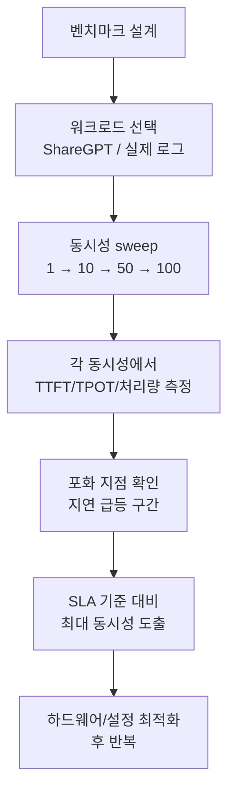

# LLM 추론 벤치마킹 (Inference Benchmarking)

## 개요

LLM 추론 시스템의 성능을 객관적으로 측정하기 위한 지표 체계와 방법론. 서빙 엔진 선택, 하드웨어 용량 계획, SLA 설정에 필수적인 기반 지식이다.

## 핵심 지표

### TTFT (Time To First Token, 첫 토큰까지의 시간)

요청 전송 후 첫 번째 응답 토큰을 받기까지의 시간. 사용자가 가장 먼저 체감하는 응답성 지표.

$$\text{TTFT} = T_{\text{first\_token}} - T_{\text{request\_sent}}$$

- Prefill 시간이 지배적 요소
- 프롬프트 길이에 비례
- SLA 기준: 대화형 서비스 < 500ms

### TPOT (Time Per Output Token, 출력 토큰당 시간)

두 번째 토큰부터 마지막 토큰까지 각 토큰 생성 소요 시간. 스트리밍 경험의 체감 속도.

$$\text{TPOT} = \frac{T_{\text{last\_token}} - T_{\text{first\_token}}}{\text{output tokens} - 1}$$

- Decode 단계의 성능 지표
- 메모리 대역폭에 의존적
- 인간 독서 속도: ~4 tokens/sec, 보통 목표 > 20 tokens/sec

### E2E 지연시간 (End-to-End Latency)

$$\text{E2E} = \text{TTFT} + \text{TPOT} \times (\text{output tokens} - 1)$$

### 처리량 (Throughput)

단위 시간당 처리하는 토큰 수 또는 요청 수.

- **tokens/sec**: 초당 생성 토큰 수 (시스템 전체 기준)
- **requests/sec (RPS)**: 초당 처리 요청 수
- 동시 사용자 수 증가에 따른 포화(saturation) 지점 식별 필요

## 지표 비교 표

| 지표 | 측정 대상 | SLA 기준 예시 | 지배 요소 |
|------|-----------|--------------|---------|
| TTFT | 응답 시작 속도 | < 500ms (대화형) | Prefill 시간, 큐 대기 |
| TPOT | 스트리밍 속도 | < 50ms/token | 메모리 대역폭, 배치 크기 |
| E2E Latency | 전체 완료 시간 | < 5s (단문) | TTFT + TPOT x N |
| Throughput | 시스템 용량 | 최대화 목표 | 배치 효율, GPU 활용률 |
| 동시 사용자 | 스케일 한계 | SLA 내 최대 | 메모리, 스케줄러 |

## 워크로드 분포

실제 프로덕션 요청은 길이가 다양하므로 현실적인 분포를 사용해야 한다.

### ShareGPT 데이터셋

실제 ChatGPT 대화를 수집한 공개 데이터셋. 추론 벤치마킹의 사실상 표준 워크로드.

- 입력 길이: 평균 ~100-200 토큰, 꼬리 분포 길음
- 출력 길이: 평균 ~200-400 토큰
- 다양한 태스크 혼재 (코드, 요약, Q&A 등)

## 벤치마킹 도구

### LLMPerf

Anyscale이 개발한 LLM 추론 성능 측정 도구.

- HTTP API 기반 블랙박스 측정
- TTFT, TPOT, E2E 자동 계산
- 동시 사용자 수(concurrency) sweep 지원
- OpenAI 호환 API면 어디서든 사용 가능

```bash
python token_benchmark_ray.py \
  --model "meta-llama/Llama-2-7b-chat-hf" \
  --mean-input-tokens 550 \
  --stddev-input-tokens 150 \
  --mean-output-tokens 150 \
  --stddev-output-tokens 10 \
  --num-concurrent-requests 5
```

### vLLM Benchmark Suite

vLLM 내장 벤치마킹 스크립트.

- `benchmark_serving.py`: 실제 서빙 서버 대상
- `benchmark_throughput.py`: 오프라인 처리량 측정
- ShareGPT 데이터셋 기본 지원

### 기타 도구

- **Nvidia GenAI-Perf**: TensorRT-LLM, Triton 전용
- **lm-evaluation-harness**: 품질(accuracy) 평가 중심

## 벤치마킹 방법론



## 주의사항

- **Warm-up**: 첫 몇 개 요청은 JIT/캐시 초기화 시간 포함 → 제외
- **통계적 안정성**: 최소 100+ 요청, P50/P95/P99 분포 보고
- **메모리 압박**: 긴 배치에서 OOM 발생 지점도 측정
- **네트워크 오버헤드**: 클라이언트-서버 RTT 분리 측정

## 관련 문서

- [[continuous-batching]] - 처리량 최적화의 핵심 기법
- [[request-scheduling]] - SLA 기반 스케줄링
- [[disaggregated-serving]] - Prefill/Decode 분리로 TTFT 최적화
- [[vllm-v1-engine]] - vLLM 벤치마킹 환경
