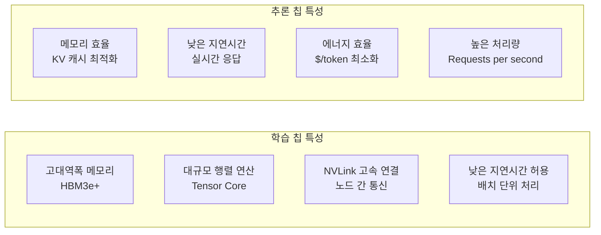
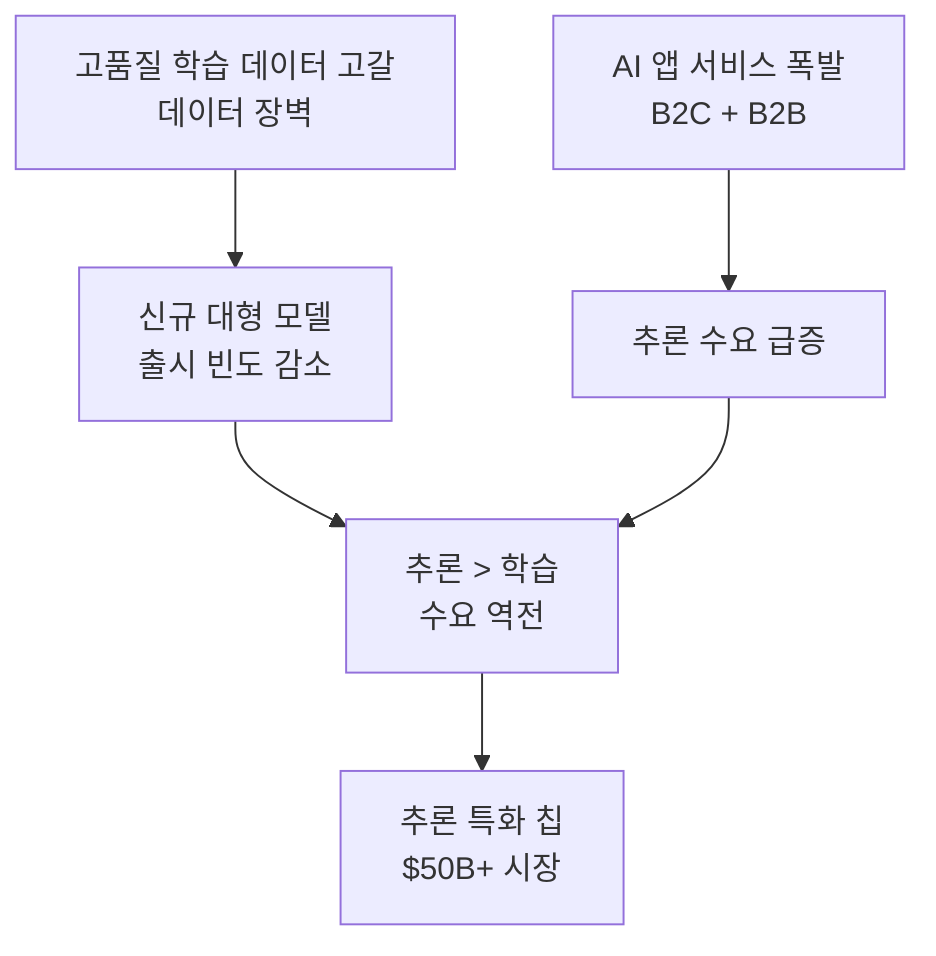

# 추론 칩 시장 역전 (Inference > Training Chip Demand)

## 개요

2026년 AI 가속기 시장에서 추론(inference) 워크로드 수요가 학습(training) 수요를 추월하는 역전이 일어나고 있다. NVIDIA GTC 2026의 핵심 주제가 "Inflection of Inference(추론의 변곡점)"였을 만큼, 이 전환은 AI 칩 산업의 구조적 변화를 의미한다.

## 시장 수치

- **추론 워크로드 비중**: 전체 AI 컴퓨트의 2/3 이상
- **추론 최적화 칩 시장 규모**: $50B+ (2026 추정)
- **성장 동력**: ChatGPT류 서비스의 사용자 폭발, 엔터프라이즈 AI 도입 가속

## 학습 vs 추론 칩 비교

학습과 추론의 요구사항이 서로 달라, **학습에 최적화된 GPU가 추론에는 과사양이거나 비효율적**인 경우가 많다.

## 추론 특화 칩/아키텍처

### Groq LPU (Language Processing Unit)

- 추론 전용 아키텍처: Tensor Streaming Processor
- SRAM 기반 (DRAM 접근 최소화)로 극저지연(ultra-low latency) 달성
- 메모리 대역폭이 아닌 컴퓨트 밀도 최적화
- Llama 3 70B 기준 초당 800토큰 이상 (2024 기준)

### Cerebras WSE-3

- 웨이퍼 스케일 엔진: 단일 칩에 900,000개 코어
- 온칩 SRAM 44GB로 대형 모델을 단일 칩에 적재 가능
- 네트워크 통신 지연 없는 단일 칩 추론

### NVIDIA Blackwell (B200/B300)

- 학습-추론 통합 아키텍처이나 추론 최적화 기능 강화
- FP4 추론 지원으로 토큰당 비용 감소
- NVLink 스위치로 다중 GPU 추론 효율 개선

### 엣지 추론 칩

- Apple Neural Engine (ANE): iPhone/Mac 온디바이스 추론
- Qualcomm Hexagon DSP: 안드로이드 온디바이스
- MediaTek APU: 중저가 안드로이드 시장

## 시장 전환 메커니즘

## 비용 구조 변화

| 단계 | 기존 (2023) | 현재 (2026) |
|------|------------|------------|
| 학습 비용 | 전체의 60% | 전체의 35% |
| 추론 비용 | 전체의 40% | 전체의 65% |
| 주요 비용 드라이버 | 모델 규모 | API 요청 수 |
| 최적화 방향 | 학습 효율 | 토큰당 비용 |

## 실무 시사점

- 추론 워크로드를 위해 고가의 학습 GPU(H100 등)를 풀타임 운용하는 것은 비효율적이 되어가고 있다.
- 추론 특화 서비스(Groq API, Cerebras Cloud 등)를 적극 활용하면 비용과 지연시간 동시 개선 가능.
- 온디바이스 추론으로 일부 워크로드를 이전하면 클라우드 추론 비용 절감 가능.

## 관련 문서

- [[inference-compute-economics]] - 추론 칩 시장 역전의 경제적 맥락
- [[inference-distribution-tiers]] - 다계층 추론 인프라 전략
- [[executorch]] - 엣지 추론 대표 프레임워크
- [[ai-inference-quantization-2026]] - 추론 비용 절감 핵심 기술
