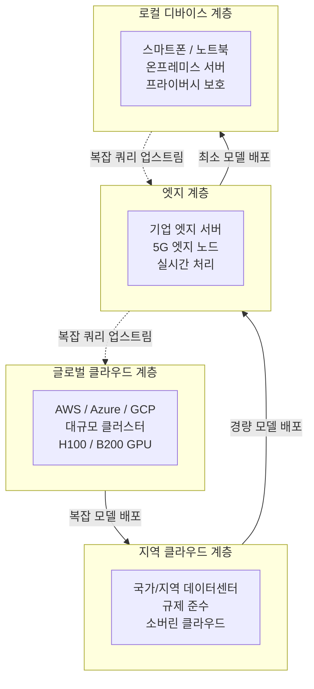
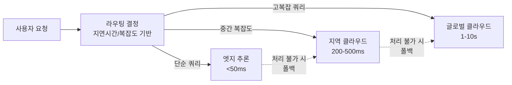

# 추론 분산 계층화 (Inference Distribution Tiers)

## 개요

AI 추론 인프라가 단일 클라우드 중심에서 **계층적 분산 구조**로 진화하고 있다. NVIDIA GTC 2026에서 "Sovereign Inference(주권 추론)" 개념이 핵심 주제로 등장하면서, 추론 워크로드를 규제·지연시간·프라이버시 요건에 따라 4개 계층에 분산 배치하는 아키텍처가 표준으로 부상하고 있다.

## 4계층 구조

## 계층별 특성

| 계층 | 모델 규모 | 지연시간 | 주요 사용 사례 | 규제 적합성 |
|------|-----------|---------|----------------|------------|
| 글로벌 클라우드 | 100B+ | 높음 (수초) | 복잡 추론, 연구 | 국경 불문 |
| 지역 클라우드 | 10B~100B | 중간 | 기업 비즈니스 | 국가별 준수 |
| 엣지 | 1B~10B | 낮음 (수십ms) | 실시간 처리 | 제한적 |
| 로컬 디바이스 | ~1B | 최저 | 프라이버시 민감 | 완전 로컬 |

## Sovereign Inference (주권 추론)

NVIDIA GTC 2026에서 소개된 개념으로, 각 국가 또는 조직이 **데이터를 자국/자사 인프라 밖으로 내보내지 않으면서 AI 추론**을 수행할 수 있는 능력이다.

### 배경

- **EU AI Act & GDPR**: 개인 데이터의 EU 외부 이전 제한
- **중국 데이터 현지화법**: AI 모델 및 데이터의 국내 보관 요구
- **미국 ITAR/EAR**: 방산·항공 데이터의 해외 처리 금지
- **금융 규제**: PCI-DSS, 바젤 III 등에서 데이터 거버넌스 요구

### 구현 방식

- 지역 클라우드(AWS GovCloud, Azure Government, Naver Cloud 등) 활용
- 온프레미스 GPU 클러스터 (Dell EMC, HPE 등)
- NVIDIA DGX Private Cloud

## 엣지-클라우드 하이브리드 라우팅

라우팅 기준:
- **쿼리 복잡도**: 단순 FAQ vs 다단계 추론
- **데이터 민감도**: 개인정보 포함 여부
- **지연시간 요구**: 실시간(게임/로봇) vs 비실시간(분석)
- **비용 예산**: 쿼리당 허용 비용

## 산업별 적용 패턴

| 산업 | 주 사용 계층 | 이유 |
|------|------------|------|
| 의료/병원 | 지역 클라우드 + 로컬 | HIPAA, 환자 데이터 현지화 |
| 금융 | 지역 클라우드 | 규제 준수, 감사 추적 |
| 제조/IoT | 엣지 | 실시간 제어, 네트워크 단절 대응 |
| 소비자 앱 | 글로벌 클라우드 + 로컬 | 규모 경제 + 프라이버시 |
| 방산/정부 | 에어갭(air-gap) 로컬 | 보안 요건 |

## 관련 문서

- [[executorch]] - 로컬 디바이스 계층 대표 프레임워크
- [[on-device-llm]] - 4계층 중 로컬 디바이스 상세
- [[inference-chip-market-shift]] - 계층화 수요를 이끄는 시장 전환
- [[inference-compute-economics]] - 계층별 비용 구조
