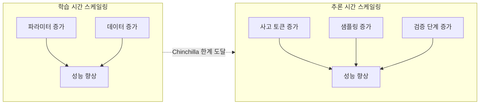

# 추론 시간 스케일링

학습 시점이 아닌 **추론 시점**에 더 많은 연산을 투입해 성능을 향상시키는 패러다임. OpenAI o1/o3, DeepSeek-R1 등 추론 모델의 핵심 원리이며, 2024년 AI 연구의 가장 큰 패러다임 전환 중 하나다.

## 학습 스케일링 vs 추론 스케일링

[[scaling-laws|학습 스케일링]]이 모델/데이터를 키우는 것이라면, 추론 스케일링은 **같은 모델에서 더 오래 생각하게** 하는 것이다.

## 주요 기법

### 1. Chain-of-Thought / Extended Thinking

모델이 답변 전 중간 추론 단계를 생성. [[extended-thinking|확장된 사고]]에서 사고 토큰 예산을 늘리면 성능이 로그-선형으로 향상된다.

### 2. Best-of-N Sampling

N개 후보를 생성하고 검증기(보상 모델)로 최선을 선택. [[best-of-n-sampling|Best-of-N]]은 가장 단순하지만 N에 비례해 비용 증가.

### 3. Tree Search (MCTS)

[[mcts-llm-reasoning|MCTS]]로 추론 경로를 트리 탐색. [[process-reward-model-detail|PRM]]으로 각 단계를 평가하며 유망한 경로를 확장한다.

### 4. 자기 반성 (Self-Refinement)

모델이 자신의 출력을 비판하고 수정하는 반복 루프. Reflexion, Self-Refine 패턴.

## 스케일링 법칙

추론 컴퓨트 $C_{infer}$와 성능 $P$의 관계:

$$P \propto \log(C_{infer})$$

학습 스케일링의 멱함수($P \propto C_{train}^{-\alpha}$)보다 효율이 낮지만, 모델 재학습 없이 기존 모델의 성능을 끌어올릴 수 있다는 점이 핵심 가치.

## 실무 고려사항

- **비용-성능 트레이드오프**: 10x 추론 컴퓨트로 작은 모델이 큰 모델을 이길 수 있는지 계산
- **지연시간**: 사고 토큰이 늘어나면 TTFT가 증가
- **검증기 품질**: Best-of-N과 MCTS의 성능은 검증기(PRM/ORM)의 품질에 크게 의존

## 관련 문서

- [[test-time-compute-scaling]] -- 테스트 타임 컴퓨트 스케일링
- [[extended-thinking]] -- 확장된 사고
- [[best-of-n-sampling]] -- Best-of-N Sampling
- [[mcts-llm-reasoning]] -- MCTS 기반 LLM 추론
- [[scaling-laws]] -- 스케일링 법칙
