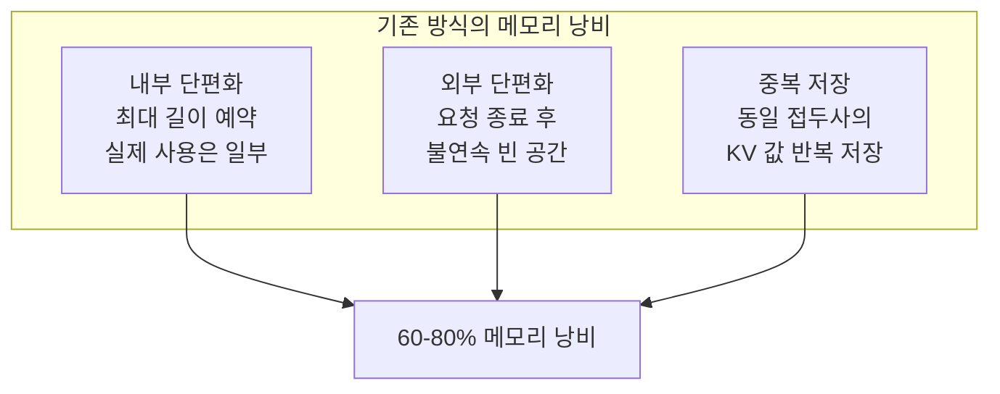
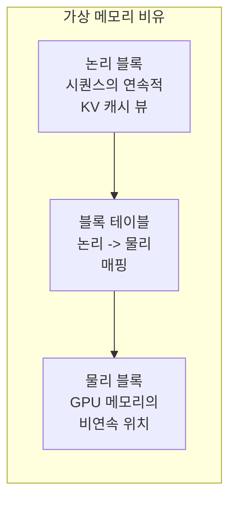
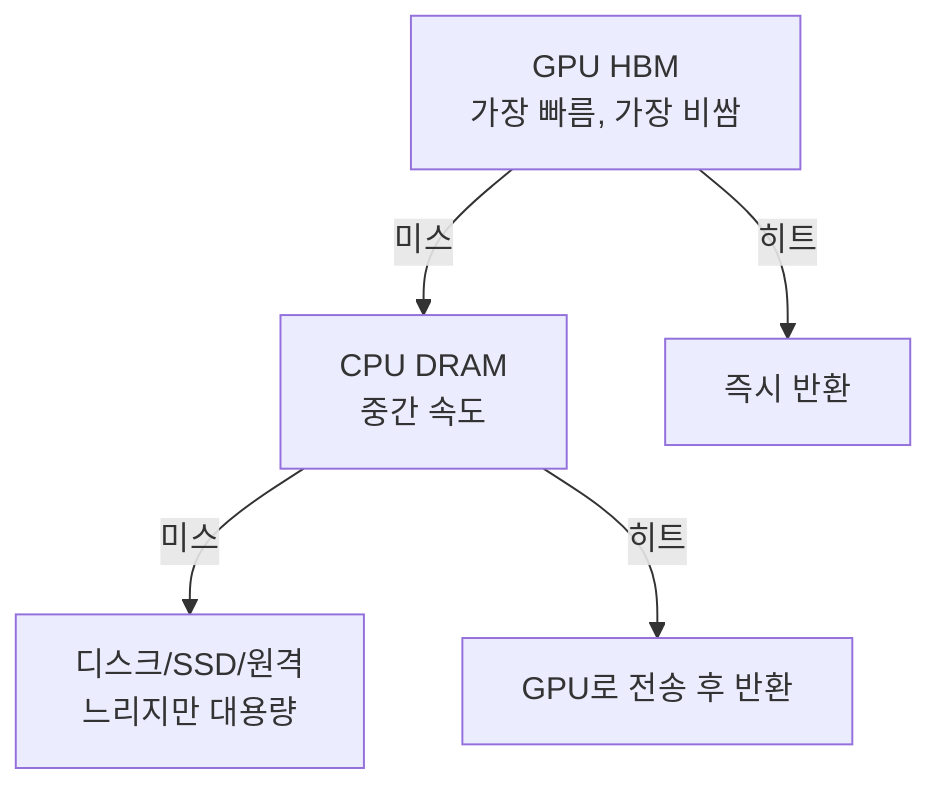

# KV 캐시 추론 최적화 (Paged Attention, 메모리 관리)

## 개요

이 문서는 [[kv-cache|KV 캐시]]의 개념과 비용 절감 원리를 다루는 기존 페이지와 달리, **추론 서빙 시스템에서 KV 캐시를 효율적으로 관리하는 기법**에 초점을 맞춘다. LLM 추론에서 KV 캐시는 GPU 메모리의 최대 소비원이며, 그 관리 방식이 처리량(throughput)과 지연시간(latency)을 직접 결정한다. Paged Attention(vLLM), Continuous Batching, Prefix Caching, 계층적 캐시 등의 기법이 이 문제를 해결한다.

## 문제: KV 캐시 메모리 낭비

자기회귀 추론에서 매 토큰 생성마다 이전 모든 토큰의 K, V 값을 참조해야 한다. 기존 시스템은 각 요청에 대해 **최대 시퀀스 길이만큼의 연속 메모리**를 미리 할당했다. 이로 인해 세 가지 낭비가 발생한다:

기존 시스템은 KV 캐시 메모리의 **60-80%를 낭비**했다. 이는 배치 크기를 제한하고, GPU 활용률을 낮추며, 처리량을 병목시킨다.

## Paged Attention

Kwon et al. (2023, SOSP)이 제안한 기법으로, 운영체제의 가상 메모리/페이징 개념을 KV 캐시 관리에 적용했다. vLLM 서빙 엔진의 핵심 메커니즘이다.

### 핵심 아이디어

1. **블록 단위 관리**: KV 캐시를 고정 크기 블록(기본 16 토큰)으로 분할
2. **논리-물리 매핑**: 시퀀스는 연속된 논리 블록으로 보이지만, 물리 블록은 GPU 메모리 어디에든 배치 가능
3. **동적 할당**: 새 토큰이 생성될 때만 블록을 할당하고, 요청 완료 시 즉시 해제
4. **외부 단편화 제거**: 블록이 비연속적이어도 되므로 메모리 단편화가 거의 없음

### 성능 개선

| 메트릭 | 기존 시스템 | Paged Attention (vLLM) |
|---|---|---|
| 메모리 낭비 | 60-80% | **4% 미만** |
| 처리량 | 기준 | **2-4x 향상** |
| 배치 크기 | 제한적 | 대폭 확대 가능 |

## Continuous Batching

전통적 정적 배칭은 배치 내 모든 요청이 완료될 때까지 새 요청을 받지 않는다. 길이가 다른 요청들이 섞이면 짧은 요청이 끝나도 긴 요청을 기다려야 하므로 GPU가 유휴 상태가 된다.

**Continuous Batching (iteration-level scheduling):**
- 매 디코딩 스텝마다 완료된 요청을 배치에서 제거하고 새 요청을 삽입
- GPU 유휴 시간을 최소화하여 처리량 극대화
- Orca(2022)에서 처음 제안되었고, vLLM, SGLang 등 현대 서빙 엔진의 표준

## Prefix Caching

동일한 시스템 프롬프트, 도구 정의, 예제 등 **공유 접두사**의 KV 캐시를 재사용하는 기법이다. [[kv-cache|기존 KV 캐시 문서]]에서 다루는 "접두사 무결성" 원칙의 시스템 수준 구현이다.

**구현 방식:**
- **해시 기반 매칭**: 토큰 시퀀스의 해시를 키로 사용하여 캐시된 블록을 조회
- **트리 구조**: 접두사를 트라이(trie) 구조로 관리하여 최장 공통 접두사를 효율적으로 탐색
- **Copy-on-Write**: Paged Attention의 물리 블록을 여러 요청이 공유하다가, 분기점에서 복사

**효과:** 에이전트 워크플로처럼 동일 시스템 프롬프트를 반복 사용하는 시나리오에서 TTFT를 대폭 줄이고 비용을 절감한다.

## 계층적 KV 캐시 관리

현대 서빙 시스템은 GPU 메모리만이 아닌 **다중 메모리 계층**을 활용한다:

- **GPU 캐시**: 활성 요청의 KV 캐시 저장 (1차)
- **CPU 캐시**: GPU에서 축출된 캐시를 CPU DRAM에 보관 (2차)
- **외부 저장소**: LMCache 같은 시스템은 Ceph/Redis 등 원격 저장소까지 확장

이 계층 구조는 [[kv-cache-compression|KV 캐시 압축]]과 결합하여 동일 메모리에 더 많은 캐시를 적재할 수 있다.

## KV 캐시와 어텐션 최적화의 교차점

KV 캐시 관리는 어텐션 아키텍처 선택과 밀접하게 연결된다:

| 어텐션 방식 | KV 캐시 영향 | 서빙 시 효과 |
|---|---|---|
| MHA | 캐시 크기 최대 | Paged Attention의 이점 극대화 |
| [[gqa-mqa\|GQA]] | 캐시 크기 감소 | 더 많은 요청 동시 처리 |
| [[multi-head-latent-attention\|MLA]] | 캐시 크기 최소 | 배치 크기 극대화 가능 |
| [[sparse-attention-patterns\|Sparse Attention]] | 참조 범위 감소 | 캐시 접근 패턴 변화 |

[[flashattention-4|FlashAttention]]은 KV 캐시의 크기가 아닌 **접근 방식**을 최적화하는 직교적 기법으로, Paged Attention과 함께 사용된다.

## Speculative Decoding과의 결합

[[eagle-3-speculative-decoding|EAGLE-3]] 같은 투기적 디코딩에서는 드래프트 모델이 여러 후보 토큰을 생성하고 타겟 모델이 검증한다. 이 과정에서 KV 캐시 관리가 복잡해진다:
- 드래프트 토큰의 KV 값을 임시 저장했다가 거부 시 롤백
- 트리 구조 검증(tree verification)에서의 분기별 캐시 관리
- vLLM, SGLang 모두 speculative decoding과 Paged Attention의 통합을 지원

## Disaggregated Serving과의 관계

[[disaggregated-serving|Prefill/Decode 분리 서빙]]에서는 prefill과 decode가 별도 GPU 풀에서 실행된다. 이때 prefill 노드에서 생성된 KV 캐시를 decode 노드로 **전송**해야 하며, NIXL/RDMA 기반 고속 전송이 핵심이 된다. KV 캐시 크기가 직접적으로 전송 지연과 네트워크 대역폭 소비를 결정하므로, [[gqa-mqa|GQA]], [[multi-head-latent-attention|MLA]], [[kv-cache-compression|KV 캐시 압축]]의 중요성이 더욱 부각된다.

## 관련 문서

- [[kv-cache]] -- KV 캐시의 개념, 비용 절감 원리, 접두사 무결성
- [[kv-cache-compression]] -- 의미 청크 단위 KV 압축 기법
- [[lmcache-kv-cache-layer]] -- 계층적 KV 캐시 구현체
- [[gqa-mqa]] -- 어텐션 헤드 공유로 KV 캐시 크기 축소
- [[multi-head-latent-attention]] -- 저랭크 압축으로 KV 캐시 극소화
- [[eagle-3-speculative-decoding]] -- 투기적 디코딩에서의 KV 캐시 관리
- [[disaggregated-serving]] -- PD 분리 시 KV 캐시 전송 문제
- [[flashattention-4]] -- KV 캐시 접근의 IO 최적화

## 참고 자료

- [Efficient Memory Management for Large Language Model Serving with PagedAttention (SOSP 2023)](https://arxiv.org/abs/2309.06180)
- [Paged Attention - vLLM Documentation](https://docs.vllm.ai/en/stable/design/paged_attention/)
- [How PagedAttention resolves memory waste of LLM systems (Red Hat)](https://developers.redhat.com/articles/2025/07/24/how-pagedattention-resolves-memory-waste-llm-systems)
