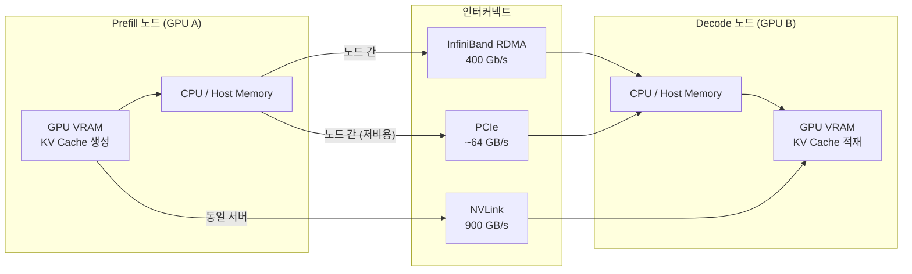
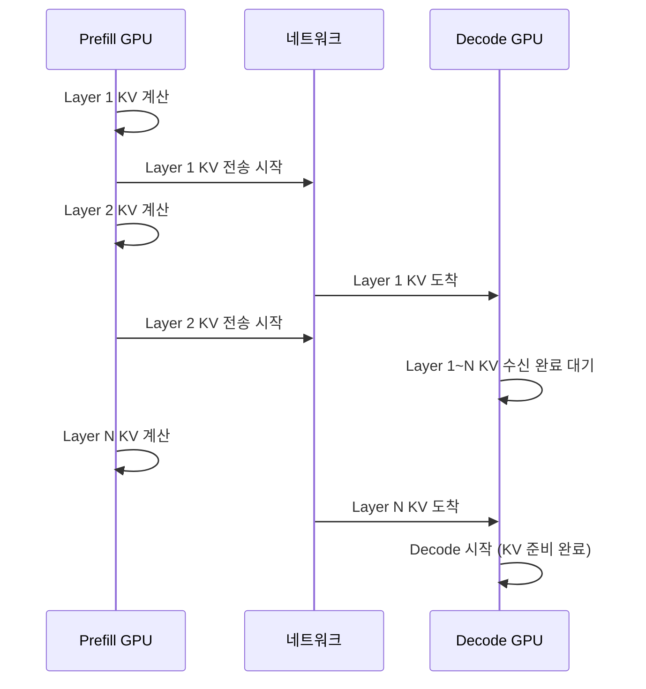

# KV 캐시 마이그레이션 (KV Cache Migration)

## 개요

KV 캐시 마이그레이션(KV Cache Migration)은 LLM 추론에서 프리필(Prefill) 단계를 처리한 GPU에서 생성한 KV 캐시(Key-Value Cache)를 디코딩(Decode) 단계를 담당하는 다른 GPU로 전송하는 기술이다. 이는 [[prefill-decode-disaggregation]](PD 분리, Prefill-Decode Disaggregation) 아키텍처에서 필수적인 구성 요소이며, 전송 방식으로는 RDMA(Remote Direct Memory Access), NVLink, PCIe 등을 활용한다.

## PD 분리와 마이그레이션의 필요성

[[prefill-decode-disaggregation]] 아키텍처에서는 프리필과 디코드를 서로 다른 역할의 GPU 풀에 할당한다.

| 역할 | 특성 | 병목 |
|------|------|------|
| Prefill GPU | 대규모 입력 병렬 처리 | 연산(FLOP) |
| Decode GPU | 소규모 자동회귀 생성 | 메모리 대역폭 |

프리필이 완료되면 그 결과물인 KV 캐시를 디코드 GPU로 **실시간으로** 옮겨야 한다. 이 전송이 병목이 되면 PD 분리의 이점(낮은 TTFT + 높은 처리량)이 상쇄된다.

## 전송 기술 비교



| 인터커넥트 | 대역폭 | 지연 | 적합 상황 |
|-----------|--------|------|----------|
| NVLink (H100 NVL) | ~900 GB/s | 수 us | 동일 서버 내 GPU |
| InfiniBand HDR/NDR | 50-200 GB/s | 수 us | 클러스터 내 노드 간 |
| RDMA over RoCE | 25-100 GB/s | 수~수십 us | 이더넷 기반 클러스터 |
| PCIe 5.0 | ~64 GB/s | 수십 us | 단일 서버 CPU 경유 |

## NIXL: 전용 KV 전송 라이브러리

NVIDIA는 [[nixl-kv-transfer]] (NIXL, NVIDIA Inference Transfer Library)를 발표하여 KV 캐시 전송을 최적화했다.

NIXL의 핵심 기능:
- **RDMA 직접 전송**: CPU 개입 없이 GPU VRAM에서 원격 GPU VRAM으로 직접 전송
- **비동기 파이프라이닝**: KV 캐시 전송과 디코딩을 겹쳐서 전송 지연 숨김
- **배치 전송**: 여러 레이어의 KV 캐시를 한 번의 전송 작업으로 처리

```python
# NIXL 기반 KV 캐시 전송 개념 (의사코드)
import nixl

# Prefill 노드에서
kv_cache = run_prefill(input_tokens)  # KV 캐시 생성

# 비동기 전송 시작
transfer_handle = nixl.transfer_async(
    src_gpu_ptr=kv_cache.data_ptr(),
    dst_node=decode_node_endpoint,
    dst_gpu_ptr=allocated_decode_slot,
    size_bytes=kv_cache.nbytes(),
    transport="rdma_roce"
)

# Decode 노드에서 전송 완료 대기 후 디코딩 시작
nixl.wait(transfer_handle)
run_decode(input_ids, kv_cache=allocated_decode_slot)
```

## 마이그레이션 파이프라이닝

전송 지연을 최소화하기 위해 KV 캐시 마이그레이션은 **레이어 단위 파이프라이닝**을 적용할 수 있다.



레이어별 파이프라이닝을 통해 마지막 레이어 계산과 초기 레이어 전송을 겹칠 수 있어 전체 대기 시간이 단축된다.

## LMCache와의 연계

[[lmcache]] 같은 분산 KV 캐시 레이어는 마이그레이션을 더 확장한다.

- Prefill 결과를 DRAM이나 SSD에 저장
- 동일 prefix를 가진 후속 요청에서 재계산 없이 재사용
- 여러 Decode 인스턴스가 동일 KV 캐시를 공유 가능 (prefix caching과 결합)

## 성능 영향 분석

KV 캐시 마이그레이션이 전체 지연에 미치는 영향:

- **모델 크기**: Llama-70B의 경우 단일 토큰 KV 캐시는 레이어당 약 40KB (FP16, 2048 토큰 시 ~320MB)
- **전송 시간**: InfiniBand 100 GB/s로 320MB 전송 시 약 3ms
- **목표**: 전송 시간 < 프리필 시간의 10%가 이상적

## 구현 사례

| 시스템 | 전송 방식 | 특징 |
|--------|-----------|------|
| NVIDIA Dynamo | NIXL (RDMA) | NIM 기반 PD 분리 최적화 |
| SGLang | TCP/RDMA | 선택 가능한 전송 백엔드 |
| llm-d | RDMA | Kubernetes 기반 분산 추론 |
| Mooncake | RDMA | 월형 PD 분리 아키텍처 |

## 한계 및 도전 과제

- **네트워크 비용**: 고속 InfiniBand 클러스터 구성 비용이 높음
- **클러스터 동질성**: Prefill/Decode GPU 비율 최적화가 워크로드에 따라 달라짐
- **오류 처리**: 전송 중 장애 시 재계산 필요 - 체크포인팅 설계 중요
- **보안**: KV 캐시에는 사용자 입력 데이터가 포함 - 암호화 전송 고려

## 관련 문서

- [[prefill-decode-disaggregation]] - PD 분리 아키텍처 전체 설명
- [[nixl-kv-transfer]] - NVIDIA 전용 KV 전송 라이브러리
- [[kv-cache-inference]] - KV 캐시 기본 개념 및 관리
- [[lmcache]] - 분산 KV 캐시 공유 레이어
- [[disaggregated-serving]] - 분산 서빙 전반
