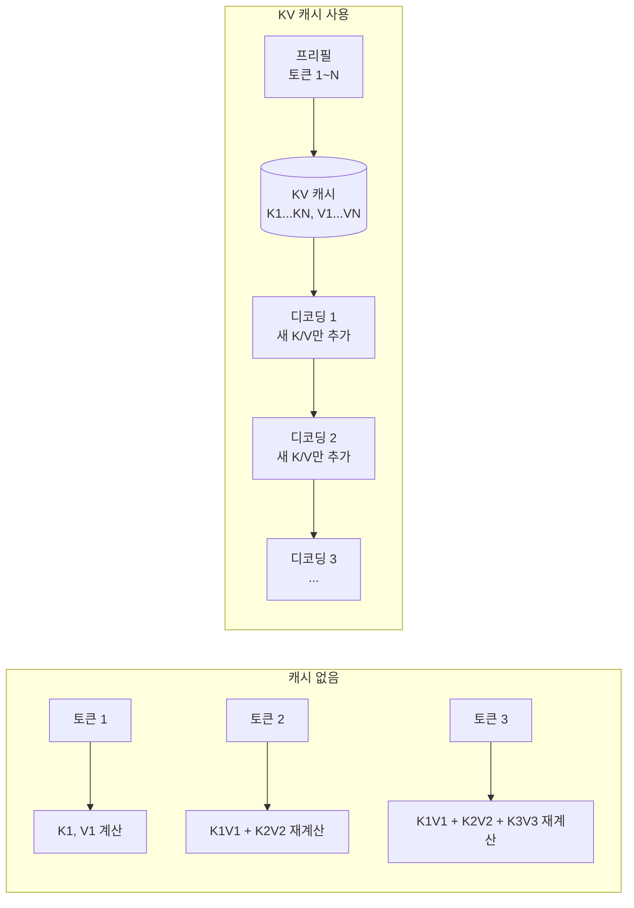
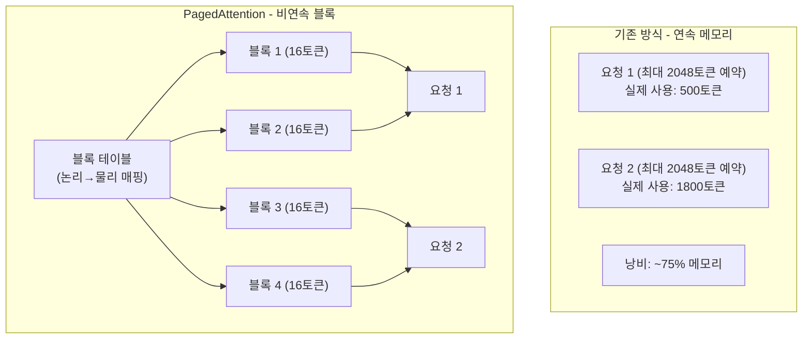
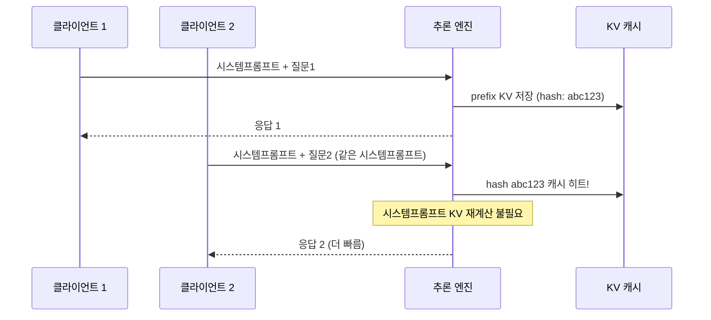
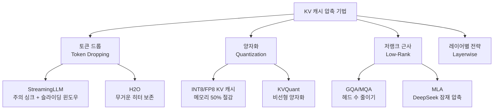
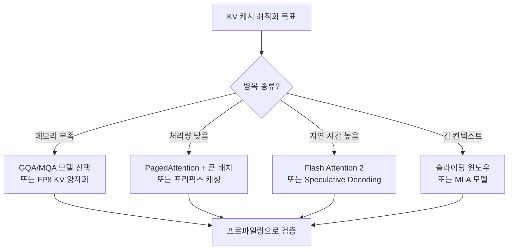

# KV 캐시 최적화 (KV Cache Optimization)

KV 캐시(Key-Value Cache)는 트랜스포머 자기회귀(autoregressive) 추론에서 이전 토큰들의 어텐션 키(K)와 값(V) 행렬을 재사용하여 반복 계산을 피하는 메커니즘이다. KV 캐시 없이는 $n$번째 토큰 생성 시 1~$n-1$번째 토큰 모두에 대해 K, V를 재계산해야 해서 $O(n^2)$ 시간 복잡도가 된다.

현대 LLM 서비스에서 KV 캐시 관리는 처리량(throughput), 지연 시간(latency), 비용의 핵심 병목이다.

## KV 캐시 기본 원리



KV 캐시를 사용하면 디코딩 단계가 $O(1)$ 시간(이미 캐시된 K, V를 읽기만 함)으로 줄어든다. 단, 시퀀스 길이 $L$에 비례하는 메모리가 필요하다.

### 메모리 사용량 계산

레이어 수 $n_l$, 헤드 수 $n_h$, 헤드 차원 $d_h$, 배치 크기 $B$, 시퀀스 길이 $L$에 대해:

$$\text{KV 캐시 크기} = 2 \times n_l \times n_h \times d_h \times B \times L \times \text{bytes\_per\_element}$$

예: Llama-3-70B (80레이어, 8 KV헤드, 헤드차원 128, FP16)에서 배치 1, 4K 시퀀스:
$$2 \times 80 \times 8 \times 128 \times 1 \times 4096 \times 2 \approx 1.3\text{ GB}$$

배치 크기 32이면 단순 선형으로 약 42GB - 모델 가중치와 별도로 필요하다.

---

## PagedAttention

**PagedAttention**은 vLLM이 2023년 도입한 기술로, OS의 가상 메모리 페이징 개념을 KV 캐시 관리에 적용한다. 기존 방식은 시퀀스별로 연속된 GPU 메모리 블록을 할당해 단편화(fragmentation)가 심했다.



PagedAttention의 핵심 이점:
- **메모리 낭비 4% 미만** (기존 60-80% 낭비 대비)
- **물리 블록 공유**: 동일 프리픽스(시스템 프롬프트 등)를 여러 요청이 공유 가능 → Copy-on-Write
- **높은 배치 크기**: 메모리 효율 향상으로 동시 처리 요청 수 증가 → 처리량 2-4배 향상

---

## Prefix Caching (프리픽스 캐싱)

동일한 시스템 프롬프트, 문서 컨텍스트, 퓨샷 예시를 여러 요청이 공유하는 경우, 해당 부분의 KV를 한 번만 계산하고 캐시에 저장해 재활용한다.



vLLM의 자동 프리픽스 캐싱은 KV 블록의 해시값으로 중복 프리픽스를 감지한다. 긴 시스템 프롬프트(수천 토큰)를 가진 서비스에서 TTFT(Time to First Token)를 60-80% 단축할 수 있다.

---

## Radix Tree KV Cache

프리픽스 캐싱을 더 정교하게 구현한 방법이 Radix Tree(기수 트리) 기반 캐시다. [[radix-tree-kv-cache]] 참조. 토큰 시퀀스를 트리 경로로 표현하여:
- 공유 프리픽스를 자동으로 트리 노드로 통합
- LRU(Least Recently Used) 방식으로 오래된 노드 제거
- SGLang, Mooncake 등에서 활용

---

## KV 캐시 압축 (KV Cache Compression)

시퀀스가 길어질수록 KV 캐시 메모리가 선형으로 증가한다. 이를 줄이는 여러 기법이 있다.



### GQA (Grouped Query Attention)

[[kv-cache-inference]]에서 다루는 GQA는 여러 쿼리 헤드가 같은 KV 헤드를 공유한다. 기존 MHA(Multi-Head Attention) 대비 KV 캐시를 $n_h / n_{kv}$ 배 줄인다.

| 방식 | 쿼리 헤드 | KV 헤드 | 특징 |
|------|-----------|---------|------|
| MHA | $n_h$ | $n_h$ | 전체 독립 헤드 |
| GQA | $n_h$ | $n_h / g$ (그룹 수) | 그룹당 공유 |
| MQA | $n_h$ | 1 | 모든 쿼리가 같은 KV |

Llama-3는 GQA를 채택해 70B 모델에서 KV 헤드 수를 64→8로 줄였다.

---

## 슬라이딩 윈도우 어텐션 (Sliding Window Attention)

매 토큰이 전체 과거 토큰을 어텐션하는 대신 가장 최근 $W$개 토큰만 참조한다. KV 캐시 크기가 $O(W)$로 고정된다.

```python
# 슬라이딩 윈도우 어텐션 마스크 생성 예시
import torch

def sliding_window_mask(seq_len: int, window_size: int) -> torch.Tensor:
    """현재 위치에서 window_size 이전까지만 어텐션 허용."""
    mask = torch.ones(seq_len, seq_len, dtype=torch.bool)
    for i in range(seq_len):
        mask[i, max(0, i - window_size + 1):i + 1] = False  # False = 마스킹 안 함
    return mask.triu(diagonal=0)  # 미래 토큰은 여전히 마스킹
```

Mistral-7B가 채택했으나, 긴 의존성을 놓치는 문제가 있어 일부 레이어에만 적용하거나 글로벌 어텐션과 혼합하는 방식이 권장된다.

---

## MLA (Multi-Head Latent Attention) - DeepSeek 방식

[[kv-cache-compression]]의 최신 접근법으로, DeepSeek-V2/V3에서 도입한 **잠재 압축(Latent Compression)** 방식이다. KV를 직접 저장하는 대신 저차원 잠재 벡터(latent vector)만 저장하고 필요 시 복원한다.

$$c_{KV} = W_{DKV} h_t \in \mathbb{R}^{d_c}$$

$$[K_t, V_t] = [W_{UK} c_{KV}, W_{UV} c_{KV}]$$

- $d_c \ll d_h \times n_h$: 잠재 벡터 차원이 원래 KV보다 훨씬 작음
- 저장: $c_{KV}$ (작음) + $K_t^R$ (RoPE용 소형 키)
- DeepSeek-V2에서 MHA 대비 KV 캐시를 **93.3% 감소**시키면서 성능 유지

---

## Speculative Decoding과 KV 캐시

추측 디코딩(Speculative Decoding)은 작은 드래프트 모델(draft model)이 먼저 여러 토큰을 생성하고 큰 모델이 병렬 검증하는 방식이다. 이때 드래프트 토큰 전체에 대한 KV를 한꺼번에 계산해 배치 효율을 높인다. 검증에 실패한 토큰의 KV는 버리고 롤백한다.

---

## 프레임워크별 KV 캐시 구현

| 프레임워크 | 핵심 기술 | 특징 |
|-----------|-----------|------|
| **vLLM** | PagedAttention + 자동 프리픽스 캐싱 | 가장 널리 사용, 동적 배치 |
| **SGLang** | Radix Tree 캐시 | 복잡한 프로그래밍 패턴에 강점 |
| **TensorRT-LLM** | Paged KV Cache | NVIDIA GPU 최적화 |
| **HuggingFace TGI** | Flash Attention 2 + 페이지 캐시 | 쉬운 배포 |
| **llama.cpp** | 고정 길이 KV 버퍼 | CPU/엣지 배포 |

---

## 실무 최적화 가이드



### KV 캐시 크기 vs 배치 크기 트레이드오프

```python
# GPU 메모리 예산 계산 예시
def estimate_kv_cache_memory_gb(
    n_layers: int,
    n_kv_heads: int,
    head_dim: int,
    seq_len: int,
    batch_size: int,
    dtype_bytes: int = 2  # FP16 = 2 bytes
) -> float:
    """KV 캐시 메모리 사용량 추정 (GB)."""
    total_bytes = (
        2              # K와 V
        * n_layers
        * n_kv_heads
        * head_dim
        * seq_len
        * batch_size
        * dtype_bytes
    )
    return total_bytes / (1024 ** 3)

# Llama-3-8B (32레이어, 8 KV헤드, 128 헤드차원)
# 배치 32, 시퀀스 4096
mem = estimate_kv_cache_memory_gb(32, 8, 128, 4096, 32)
print(f"KV 캐시: {mem:.2f} GB")  # 약 8.6 GB
```

---

## 관련 문서

- [[paged-attention]] - PagedAttention 상세 동작 원리와 vLLM 구현
- [[kv-cache-inference]] - KV 캐시 기초 개념 및 MHA/GQA/MQA 비교
- [[kv-cache-compression]] - KV 캐시 압축 기법 심화 (H2O, SnapKV, KVQuant)
- [[radix-tree-kv-cache]] - Radix Tree 기반 프리픽스 캐싱 구현
- [[transformer-architecture]] - 트랜스포머 전체 아키텍처에서 KV 캐시 위치
