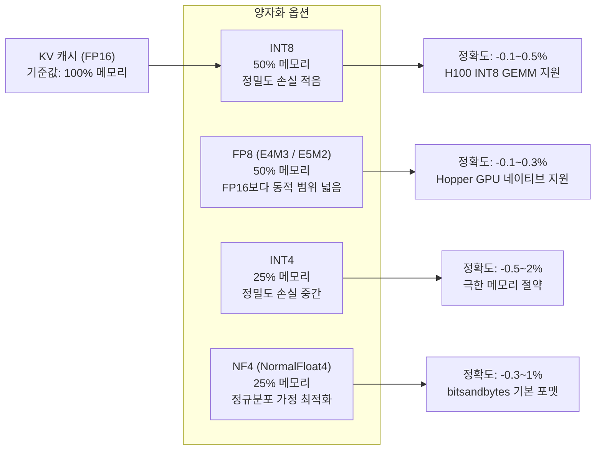
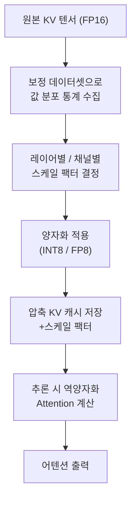

# KV 캐시 양자화 (KV Cache Quantization)

## 개요

**KV 캐시 양자화(KV Cache Quantization)**는 트랜스포머 모델 추론 시 어텐션(attention)의 Key-Value 행렬을 저정밀도 데이터 타입으로 압축하여 GPU 메모리 사용량을 줄이는 기법이다. 모델 가중치 양자화([[quantization-model-compression]])와는 별개로, 실행 중 동적으로 생성되는 KV 캐시 텐서를 압축 대상으로 한다. 긴 컨텍스트 처리와 높은 배치 동시성을 달성하기 위한 핵심 기법이다.

## 왜 KV 캐시가 문제인가

자기회귀 디코딩에서 KV 캐시는 시퀀스가 길어질수록 선형적으로 성장한다. Llama-3 70B 모델에서 FP16으로 KV 캐시를 유지하면:

$$\text{KV 메모리} = 2 \times L \times H \times D \times S \times \text{sizeof(FP16)}$$

- $L$: 레이어 수 (예: 80)
- $H$: KV 헤드 수 (예: 8, GQA 적용 시)
- $D$: 헤드 차원 (예: 128)
- $S$: 시퀀스 길이 (예: 8192 토큰)

8192 토큰 컨텍스트에서 단일 요청의 KV 캐시만 약 10GB를 차지한다. 배치 처리 시 이 값에 배치 크기를 곱해야 한다. KV 캐시 양자화로 메모리를 절반 또는 1/4로 줄이면 같은 GPU에서 훨씬 많은 동시 요청을 처리하거나 더 긴 컨텍스트를 지원할 수 있다.

## 양자화 포맷 비교



### INT8 KV 캐시

가장 보편적인 선택이다. 각 KV 텐서를 채널(또는 토큰)별로 스케일 팩터를 계산하여 INT8로 변환한다:

$$Q = \text{round}\left(\frac{X}{\text{scale}}\right), \quad \text{scale} = \frac{\max(|X|)}{127}$$

채널별(per-channel) 양자화가 토큰별(per-token) 양자화보다 정확도 손실이 적다.

### FP8 KV 캐시

NVIDIA Hopper(H100, H200) GPU는 FP8 연산을 하드웨어에서 직접 지원한다. E4M3 포맷(지수 4비트, 가수 3비트)은 INT8보다 더 넓은 동적 범위를 제공하여 Attention 값의 분포를 더 잘 표현한다. vLLM 0.4+, TensorRT-LLM에서 FP8 KV 캐시를 지원한다.

### NF4 KV 캐시

QLoRA에서 도입된 NF4(Normal Float 4)는 정규분포를 따르는 값에 최적화된 4비트 부동소수점 표현이다. 실제 KV 텐서의 값 분포가 정규분포에 가까울 때 INT4 대비 더 나은 정확도를 보인다. bitsandbytes 라이브러리의 기본 포맷이다.

## 구현 예시: vLLM

```python
from vllm import LLM, SamplingParams

# FP8 KV 캐시 양자화로 서버 초기화
llm = LLM(
    model="meta-llama/Llama-3-70b-instruct",
    kv_cache_dtype="fp8",          # "auto" | "fp8" | "fp8_e4m3" | "int8"
    gpu_memory_utilization=0.95,
    max_model_len=32768,           # FP16 대비 2배 긴 컨텍스트 가능
)

sampling_params = SamplingParams(temperature=0.7, max_tokens=512)
outputs = llm.generate(["한국의 역사를 요약해줘"], sampling_params)
```

## 정확도 손실 완화: 스케일링 전략

KV 양자화의 정확도 손실을 최소화하기 위한 보정 기법:



KV 캐시는 추론 시 동적으로 생성되므로 모델 가중치처럼 오프라인 보정이 어렵다. 대신 런타임에 슬라이딩 윈도우로 통계를 추적하거나, 처음 몇 개 레이어는 FP16을 유지하는 혼합 정밀도 접근을 사용한다.

## KV 캐시 양자화와 압축의 차이

KV 캐시를 줄이는 접근은 양자화 외에도 다양하다:

| 기법 | 원리 | 페이지 |
|------|------|--------|
| KV 양자화 | 정밀도 감소 | 이 페이지 |
| KV 드롭핑 | 덜 중요한 토큰 KV 제거 | [[kv-cache-compression]] |
| RadixTree 공유 | 동일 접두사 KV 재사용 | [[radix-tree-kv-cache]] |
| 분리형 KV 저장 | CPU/호스트 메모리 오프로드 | [[kv-cache-inference]] |

[[kv-cache-inference]]에서 KV 캐시 메모리 관리 전반을 참조한다.

## 관련 문서

- [[kv-cache-inference]] - KV 캐시 메모리 관리 전반 (Paged Attention 등)
- [[quantization-model-compression]] - 모델 가중치 양자화 (비교 개념)
- [[kv-cache-compression]] - KV 드롭핑 및 기타 압축 기법
- [[radix-tree-kv-cache]] - RadixTree 기반 KV 공유
