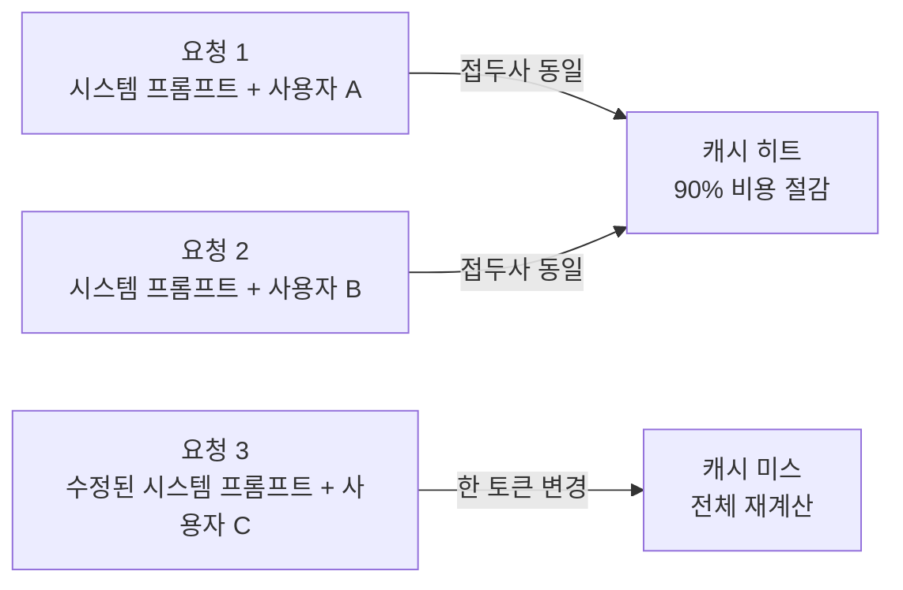

# KV Cache (Key-Value 캐시)

## 정의

**KV Cache** (Key-Value Cache)는 LLM 추론 과정에서 계산된 **[[multi-head-latent-attention|Transformer]] 어텐션의 Key와 Value 가중치**를 저장하는 메커니즘이다. 프롬프트 접두사가 이전 요청과 일치하면 캐시를 재사용하여 토큰 재계산을 피할 수 있다.

[[context-engineering]] 시대에 KV-캐시 히트율은 **프로덕션 핵심 메트릭**으로 부상했다.

## 왜 중요한가

### 비용 절감

프롬프트 접두사가 캐시에 있으면 **토큰당 비용이 약 90% 감소**한다. 시스템 프롬프트, 도구 정의, 장기 요약 같은 긴 접두사를 재사용할 수 있으면 에이전트 호출당 비용이 크게 낮아진다.

### 지연 감소

접두사 토큰들의 어텐션을 재계산하지 않으므로 첫 토큰 생성까지의 지연(Time to First Token, TTFT)이 대폭 줄어든다.

## 결정적 제약: 접두사 무결성

**접두사의 단 한 토큰이라도 바뀌면 캐시가 완전히 무효화된다.** 타임스탬프, 세션 ID, 사용자명 같은 작은 변동 요소가 접두사에 섞이면 캐시가 전혀 작동하지 않는다.

## 설계 원칙: Stable Prefix + Variable Suffix

Google ADK 아키텍처가 대표하는 설계 패턴:

| 위치 | 구성 요소 | 특징 |
|---|---|---|
| **Stable Prefix** (안정 접두사) | 시스템 프롬프트, 에이전트 정체성, 도구 정의, 장기 요약 | 요청 간 불변, 캐시 재사용 가능 |
| **Variable Suffix** (가변 접미사) | 최신 사용자 입력, 새 도구 출력, 대화 history 끝부분 | 요청마다 다름, 캐시 무효화 없이 추가 |

### 구현 체크리스트

- 시스템 프롬프트에 타임스탬프, 랜덤 seed, 사용자 식별자 **금지**
- 도구 정의는 요청 중간이 아닌 **가장 앞**에 배치
- 대화 history는 **앞부터** 쌓고 새 메시지는 **뒤**에 추가
- 세션 정보가 필요하면 변수 부분(접미사)에 배치

## 컨텍스트 엔지니어링과의 관계

[[context-engineering]]의 4전략 (Write/Select/Compress/Isolate)은 모두 KV 캐시 효율과 연관된다:

- **Write**: 안정적이고 재사용 가능한 시스템 프롬프트 구조화
- **Select**: 관련 없는 정보를 배제하여 접두사 안정성 유지
- **Compress**: 긴 대화를 요약하여 접두사로 "승격"시켜 재사용 가능하게 만듦
- **Isolate**: 서브에이전트마다 고유한 접두사 캐시를 활용

## 실무 메트릭

하네스 엔지니어링 시대에도 KV-캐시 히트율은 살아남는다. 프로덕션에서 모니터링해야 할 핵심 메트릭:

- **Cache hit rate**: 전체 요청 중 캐시 히트 비율
- **Prefix stability**: 접두사가 얼마나 자주 변경되는가
- **TTFT (Time to First Token)**: 캐시 히트/미스에 따른 지연 차이
- **Cost per task**: 캐시 효율이 반영된 실질 비용

## 관련 문서
- [[speculative-speculative-decoding]]
- [[mirror-speculative-decoding]]
- [[turboquant]]
- [[sparse-attention-patterns]]
- [[long-context-scaling]]
- [[mixture-of-experts]]

- [[evolution-of-agentic-patterns]] — KV 캐시가 핵심 메트릭으로 떠오른 맥락
- [[context-engineering]] — 컨텍스트 엔지니어링 4전략과의 연결
- [[llm-as-os]] — RAM(컨텍스트 창)의 비용 최적화 계층
- [[lost-in-the-middle]] — 컨텍스트 위치에 따른 별도 현상 (관련이지만 다른 문제)
- [[prompt-engineering]] — KV 캐시를 고려하지 않던 초기 패러다임

## 지식 갭

- [ ] Lost-in-the-Middle 전용 페이지 (Liu et al., 2023 논문 paper 타입)
- [ ] [[vllm-v1-engine|vLLM]] / TensorRT-LLM 같은 실제 KV 캐시 구현체 비교
- [ ] Paged Attention 같은 메모리 관리 기법
- [ ] PagedAttention / prefix caching 상세
